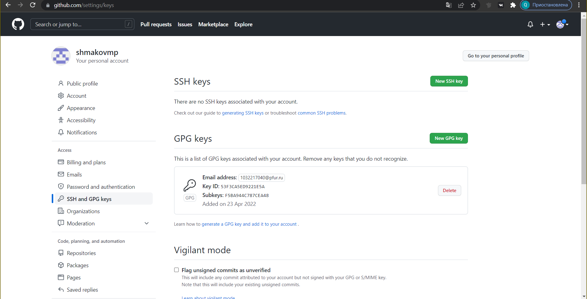

---
## Front matter
title: "ОТЧЕТ ПО ЛАБОРАТОРНОЙРАБОТЕ №2"
subtitle: "дисциплина: Операционные системы"
author: "Шмаков Максим Павлович"

## Generic otions
lang: ru-RU
toc-title: "Содержание"

## Bibliography
bibliography: bib/cite.bib
csl: pandoc/csl/gost-r-7-0-5-2008-numeric.csl

## Pdf output format
toc: true # Table of contents
toc-depth: 2
lof: true # List of figures
lot: true # List of tables
fontsize: 12pt
linestretch: 1.5
papersize: a4
documentclass: scrreprt
## I18n polyglossia
polyglossia-lang:
  name: russian
  options:
	- spelling=modern
	- babelshorthands=true
polyglossia-otherlangs:
  name: english
## I18n babel
babel-lang: russian
babel-otherlangs: english
## Fontsman
mainfont: PT Serif
romanfont: PT Serif
sansfont: PT Sans
monofont: PT Mono
mainfontoptions: Ligatures=TeX
romanfontoptions: Ligatures=TeX
sansfontoptions: Ligatures=TeX,Scale=MatchLowercase
monofontoptions: Scale=MatchLowercase,Scale=0.9
## Biblatex
biblatex: true
biblio-style: "gost-numeric"
biblatexoptions:
  - parentracker=true
  - backend=biber
  - hyperref=auto
  - language=auto
  - autolang=other*
  - citestyle=gost-numeric
## Pandoc-crossref LaTeX customization
figureTitle: "Рис."
tableTitle: "Таблица"
listingTitle: "Листинг"
lofTitle: "Список иллюстраций"
lotTitle: "Список таблиц"
lolTitle: "Листинги"
## Misc options
indent: true
header-includes:
  - \usepackage{indentfirst}
  - \usepackage{float} # keep figures where there are in the text
  - \floatplacement{figure}{H} # keep figures where there are in the text
---
1. Цель работы
2. Задание 
3. Выполнение лабораторной работы
4. Вывод

# Цель работы

- Изучить идеологию и применение средств контроля версий.
- Освоить умения по работе с git.

# Задание

- Создать базовую конфигурацию для работы с git.
- Создать ключ SSH.
- Создать ключ PGP.
- Настроить подписи git.
- Зарегистрироваться на Github.
- Создать локальный каталог для выполнения заданий по предмету.

# Выполнение лабораторной работы

1. Создайте учётную запись на [https://github.com](https://github.com).
2. Заполните основные данные на [https://github.com](https://github.com).(рис. [-@fig:001])(рис. [-@fig:002])

{ #fig:001 width=70% }

{ #fig:002 width=70% }

Установка git-flow в Fedora Linux (рис. [-@fig:003])

{ #fig:003 width=70% }

Установка gh в Fedora Linux (рис. [-@fig:004])

{ #fig:004 width=70% }

Базовая настройка git
- Зададим имя и email владельца репозитория:
- Настроим utf-8 в выводе сообщений git (рис. [-@fig:005]):

{ #fig:005 width=70% }

Создайте ключи ssh
- по алгоритму rsa с ключём размером 4096 бит:
- по алгоритму ed25519(рис. [-@fig:006]):

{ #fig:006 width=70% }

Создайте ключи pgp
- Генерируем ключ
- Из предложенных опций выбираем:
- тип RSA and RSA;
- размер 4096;
- выберите срок действия; значение по умолчанию— 0 (срок действия не истекает никогда).
- GPG запросит личную информацию, которая сохранится в ключе:
- Имя (не менее 5 символов).
- Адрес электронной почты.
- При вводе email убедитесь, что он соответствует адресу, используемому на GitHub.
- Комментарий. Можно ввести что угодно или нажать клавишу ввода, чтобы оставить это поле пустым. (рис. [-@fig:007])(рис. [-@fig:008])

{ #fig:007 width=70% }

{ #fig:008 width=70% }

Добавление PGP ключа в GitHub
– Выводим список ключей и копируем отпечаток приватного ключа (рис. [-@fig:009]):

{ #fig:009 width=70% }

– Cкопируйте ваш сгенерированный PGP ключ в буфер обмена: (рис. [-@fig:010])

{ #fig:010 width=70% }

– Перейдите в настройки GitHub (https://github.com/settings/keys), нажмите на кнопку New GPG key и вставьте полученный ключ в поле ввода. (рис. [-@fig:011])(рис. [-@fig:012])

{ #fig:011 width=70% }

{ #fig:012 width=70% }

Настройка автоматических подписей коммитов git
– Используя введёный email, укажите Git применять его при подписи коммитов (рис. [-@fig:013]):

{ #fig:013 width=70% }

Настройка gh
– Для начала необходимо авторизоваться (рис. [-@fig:014])

{ #fig:014 width=70% }

Создание репозитория курса на основе шаблона
– Необходимо создать шаблон рабочего пространства.
– Например, для 2021–2022 учебного года и предмета «Операционные системы» (код предмета os-intro) создание репозитория примет следующий вид (рис. [-@fig:015])(рис. [-@fig:016]):

{ #fig:015 width=70% }

{ #fig:016 width=70% }

Настройка каталога курса
– Перейдите в каталог курса(рис. [-@fig:017]):

{ #fig:017 width=70% }

– Отправьте файлы на сервер (рис. [-@fig:018])(рис. [-@fig:019])

{ #fig:019 width=70% }

# Контрольные вопросы:

1. Что такое системы контроля версий (VCS) и для решения каких задач они предназначаются? 
Система контроля версий Git представляет собой набор программ командной строки. Доступ к ним можно получить из терминала посредством ввода команды git с различными опциями. Системы контроля версий (Version Control System, VCS)применяются при работе нескольких человек над одним проектом.

2. Объясните следующие понятия VCS и их отношения: хранилище, commit, история, рабочая копия. 
В классических системах контроля версий используется централизованная модель, предполагающая наличие единого репозитория для хранения файлов. Выполнение большинства функций по управлению версиями осуществляется специальным сервером. Участник проекта (пользователь) перед началом работы посредством определённых команд получает нужную ему версию файлов. После внесения изменений, пользователь размещает новую версию в хранилище. При этом предыдущие версии не удаляются из центрального хранилища и к ним можно вернуться в любой момент. Сервер может сохранять неполную версию изменённых файлов, а производить так называемую дельта-компрессию—сохранять только изменения между последовательными версиями, что позволяет уменьшить объём хранимых данных.
Системы контроля версий также могут обеспечивать дополнительные, более гибкие функциональные возможности. Например, они могут поддерживать работу с несколькими версиями одного файла, сохраняя общую историю изменений до точки ветвления версий и собственные истории изменений каждой ветви. Кроме того, обычно доступна информация о том, кто из участников, когда и какие изменения вносил. Обычно такого рода информация хранится в журнале изменений, доступ к которому можно ограничить.

3. Что представляют собой и чем отличаются централизованные и децентрализованные VCS? Приведите примеры VCS каждого вида. 
Централизованные системы — это системы, которые используют архитектуру клиент / сервер, где один или несколько клиентских узлов напрямую подключены к центральному серверу. Пример - Wikipedia.
В децентрализованных системах каждый узел принимает свое собственное решение. Конечное поведение системы является совокупностью решений отдельных узлов. Пример — Bitcoin.
В классических системах контроля версий используется централизованная модель, предполагающая наличие единого репозитория для хранения файлов. Выполнение большинства функций по управлению версиями осуществляется специальным сервером.

4. Опишите действия с VCS при единоличной работе с хранилищем. 
Создадим локальный репозиторий. Сначала сделаем предварительную конфигурацию, указав имя и email владельца репозитория:
git config --global user.name"Имя Фамилия"
git config --global user.email"work@mail"
и настроив utf-8 в выводе сообщений git:
git config --global quotepath false
Для инициализации локального репозитория, расположенного, например, в каталоге ~/tutorial, необходимо ввести в командной строке:
cd
mkdir tutorial
cd tutorial
git init

5. Опишите порядок работы с общим хранилищем VCS. 
Для последующей идентификации пользователя на сервере репозиториев необходимо сгенерировать пару ключей (приватный и открытый):
ssh-keygen -C"Имя Фамилия <work@mail>"
Ключи сохраняться в каталоге~/.ssh/.
Скопировав из локальной консоли ключ в буфер обмена
cat ~/.ssh/id_rsa.pub | xclip -sel clip вставляем ключ в появившееся на сайте поле.

6. Каковы основные задачи, решаемые инструментальным средством git? 
У Git две основных задачи: первая — хранить информацию о всех изменениях в вашем коде, начиная с самой первой строчки, а вторая — обеспечение удобства командной работы над кодом.

7. Назовите и дайте краткую характеристику командам git. 
Основные команды git:
Наиболее часто используемые команды git: – создание основного дерева репозитория :git init–получение обновлений (изменений) текущего дерева из центрального репозитория: git pull–отправка всех произведённых изменений локального дерева в центральный репозиторий:git push–просмотр списка изменённых файлов в текущей директории: git status–просмотр текущих изменения: git diff–сохранение текущих изменений:–добавить все изменённые и/или созданные файлы и/или каталоги: git add .–добавить конкретные изменённые и/или созданные файлы и/или каталоги: git add имена_файлов – удалить файл и/или каталог из индекса репозитория (при этом файл и/или каталог остаётся в локальной директории): git rm имена_файлов – сохранение добавленных изменений: – сохранить все добавленные изменения и все изменённые файлы: git commit -am 'Описание коммита'–сохранить добавленные изменения с внесением комментария через встроенный редактор: git commit–создание новой ветки, базирующейся на текущей: git checkout -b имя_ветки–переключение на некоторую ветку: git checkout имя_ветки (при переключении на ветку, которой ещё нет в локальном репозитории, она будет создана и связана с удалённой) – отправка изменений конкретной ветки в центральный репозиторий: git push origin имя_ветки–слияние ветки стекущим деревом:git merge --no-ff имя_ветки–удаление ветки: – удаление локальной уже слитой с основным деревом ветки:git branch -d имя_ветки–принудительное удаление локальной ветки: git branch -D имя_ветки–удаление ветки с центрального репозитория: git push origin :имя_ветки

8. Приведите примеры использования при работе с локальным и удалённым репозиториями. 
Использования git при работе с локальными репозиториями (добавления текстового документа в локальный репозиторий):
git add hello.txt
git commit -am 'Новый файл’

9. Что такое и зачем могут быть нужны ветви (branches)? 
Проблемы, которые решают ветки git:
    • нужно постоянно создавать архивы с рабочим кодом
    • сложно "переключаться" между архивами
    • сложно перетаскивать изменения между архивами
    • легко что-то напутать или потерять

10. Как и зачем можно игнорировать некоторые файлы при commit?
Во время работы над проектом так или иначе могут создаваться файлы, которые не требуется добавлять в последствии в репозиторий. Например, временные файлы, создаваемые редакторами, или объектные файлы, создаваемые компиляторами. Можно прописать шаблоны игнорируемых при добавлении в репозиторий типов файлов в файл.gitignore с помощью сервисов. Для этого сначала нужно получить списоки меняющихся шаблонов: curl -L -s https://www.gitignore.io/api/list
Затем скачать шаблон, например, для C и C++
curl -L -s https://www.gitignore.io/api/c >> .gitignore
curl -L -s https://www.gitignore.io/api/c++ >> .gitignore

# Выводы

Я освоил работу в git и изучил идеологию и применения средств контроля версий.

