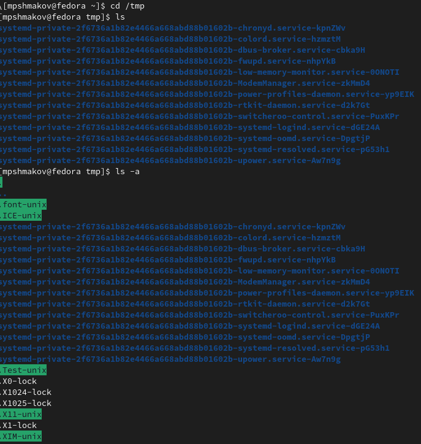
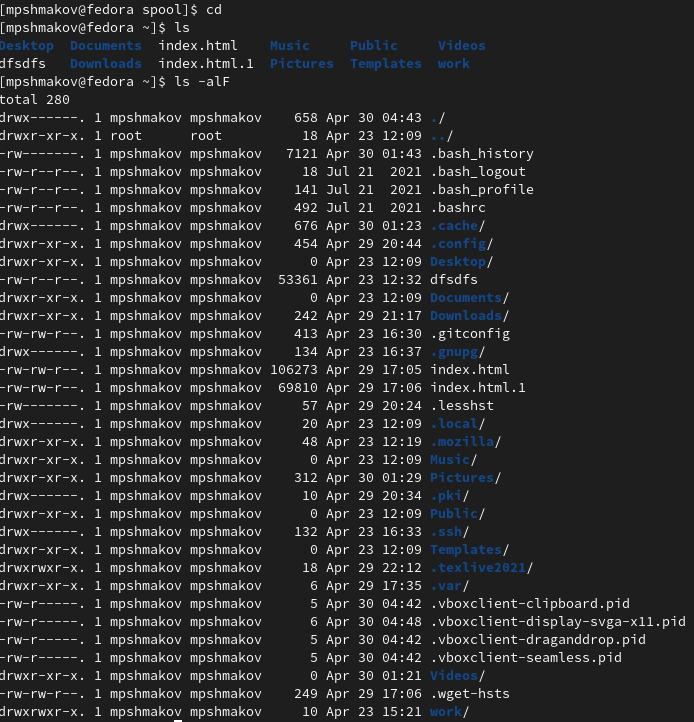
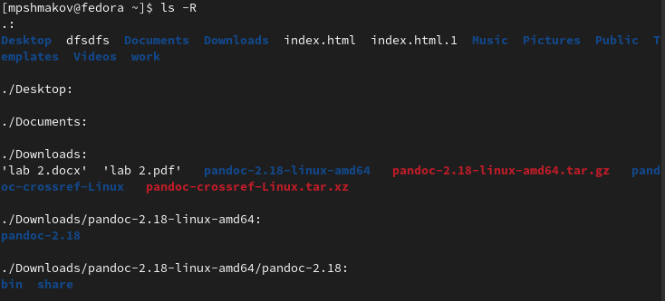
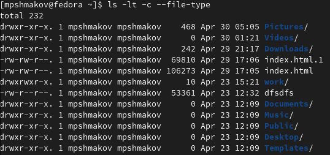
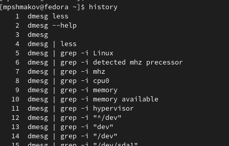
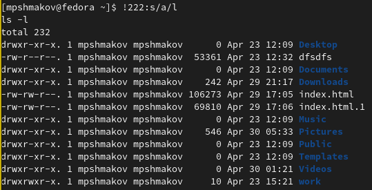

---
## Front matter
lang: ru-RU
title: Отчет по лабораторной работе №4
author: |
	Шмаков Максим\inst{1}
institute: |
	\inst{1}RUDN University, Moscow, Russian Federation
date: NEC--2022, 30 апреля , Москва

## Formatting
toc: false
slide_level: 2
theme: metropolis
header-includes: 
 - '\metroset{progressbar=frametitle,sectionpage=progressbar,numbering=fraction}'
 - '\makeatletter'
 - '\beamer@ignorenonframefalse'
 - '\makeatother'
aspectratio: 43
section-titles: true
---

# Цель работы

Приобретение практических навыков взаимодействия пользователя с системой посредством командной строки.

## 1. Определите полное имя вашего домашнего каталога. Далее относительно этого каталога будут выполняться последующие упражнения. (рис. [-@fig:001])

{ #fig:001 width=70% }

## 2. Выполните следующие действия:

 1. Перейдите в каталог /tmp.
  2. Выведите на экран содержимое каталога /tmp. Для этого используйте команду ls с различными опциями. Поясните разницу в выводимой на экран информации. (рис. [-@fig:002]) 
  
  С "-а" мы перестаем игнорировать результаты начинающиеся с ".".
  { #fig:002 width=70% }

## 2. Выполните следующие действия:

  3. Определите, есть ли в каталоге /var/spool подкаталог с именем cron? (рис. [-@fig:003]) 
  
  Нет, его тут нет.
    { #fig:003 width=70% }
  
  4. Перейдите в Ваш домашний каталог и выведите на экран его содержимое. Определите, кто является владельцем файлов и подкаталогов? (рис. [-@fig:004])
  
  С помощью "ls -alF" я могу узнать, что владельцем файлов и подкаталогов являюсь я, и одним каталогом владеет суперюзер (root root).
    { #fig:004 width=70% }

## 3. Выполните следующие действия:

1. В домашнем каталоге создайте новый каталог с именем newdir.
  2. В каталоге ~/newdir создайте новый каталог с именем morefun. (рис. [-@fig:005])
  
   { #fig:005 width=70% }

## 3. Выполните следующие действия:

3. В домашнем каталоге создайте одной командой три новых каталога с именами letters, memos, misk. Затем удалите эти каталоги одной командой. (рис. [-@fig:006]) (рис. [-@fig:007])
  
  { #fig:006 width=70% }
  { #fig:007 width=70% }
  
## 3. Выполните следующие действия:

 4. Попробуйте удалить ранее созданный каталог ~/newdir командой rm. Проверьте, был ли каталог удалён. (рис. [-@fig:008])
  
  { #fig:008 width=70% }
  
  5. Удалите каталог ~/newdir/morefun из домашнего каталога. Проверьте, был ли каталог удалён.
  
  Этот каталог был удален в предыдущем задании.

## 4. С помощью команды man определите, какую опцию команды ls нужно использовать для просмотра содержимое не только указанного каталога, но и подкаталогов, входящих в него. (рис. [-@fig:009]) (рис. [-@fig:010])

Прописываю команду "man ls" и среди списка нахожу "-R", которая мне подходит по описанию.
{ #fig:009 width=70% }
{ #fig:010 width=70% }

## 5. С помощью команды man определите набор опций команды ls, позволяющий отсортировать по времени последнего изменения выводимый список содержимого каталога с развёрнутым описанием файлов. (рис. [-@fig:011]) (рис. [-@fig:012]) (рис. [-@fig:013])

Долго всматриваясь в список всех команд, я пришел к такой комбинации "ls -lt -c --file-type".
{ #fig:011 width=70% }
{ #fig:012 width=70% }
{ #fig:013 width=70% }

## 6. Используйте команду man для просмотра описания следующих команд: cd, pwd, mkdir, rmdir, rm. Поясните основные опции этих команд. (рис. [-@fig:014])

{ #fig:014 width=70% }
cd -l - показывает имена всех readline функций.
cd -V - показывает нынешние readline имена и значения.

mkdir -m - задаются права доступа к новуму каталогу.
mkdir -v - печатает сообщение для каждого созданного каталога.

## 6. Используйте команду man для просмотра описания следующих команд: cd, pwd, mkdir, rmdir, rm. Поясните основные опции этих команд. (рис. [-@fig:014])

pwd -L - использует pwd в среде даже есть присутствуют symlinks.
pwd -P - обходит все symlinks.

rm -r - удаляет каталоги вместе с их содержимым
rm -d - удаляет пустые каталоги

rmdir -p - удаляет все написанные каталоги, например "rmdir -p a/b/c" это то же самое что и "rmdir a/b/c a/b a"
rmdir -v - выводит диагностику для каждого использованного каталога.

## 7. Используя информацию, полученную при помощи команды history, выполните модификацию и исполнение нескольких команд из буфера команд. (рис. [-@fig:015]) (рис. [-@fig:016]) (рис. [-@fig:017]) (рис. [-@fig:018]) (рис. [-@fig:019])

 
{ #fig:015 width=70% }

{ #fig:016 width=70% }
{ #fig:017 width=70% }

## 7. Используя информацию, полученную при помощи команды history, выполните модификацию и исполнение нескольких команд из буфера команд. (рис. [-@fig:015]) (рис. [-@fig:016]) (рис. [-@fig:017]) (рис. [-@fig:018]) (рис. [-@fig:019])

{ #fig:018 width=70% }
{ #fig:019 width=70% }

# Вывод

В ходе работы я научился взаимодействовать с системой с помощью командной строки.

