---
## Front matter
title: "Отчет по лабораторной работе №4"
subtitle: "дисциплина: операционные системы"
author: "Шмаков Максим Павлович"

## Generic otions
lang: ru-RU
toc-title: "Содержание"

## Bibliography
bibliography: bib/cite.bib
csl: pandoc/csl/gost-r-7-0-5-2008-numeric.csl

## Pdf output format
toc: true # Table of contents
toc-depth: 2
lof: true # List of figures
lot: true # List of tables
fontsize: 12pt
linestretch: 1.5
papersize: a4
documentclass: scrreprt
## I18n polyglossia
polyglossia-lang:
  name: russian
  options:
	- spelling=modern
	- babelshorthands=true
polyglossia-otherlangs:
  name: english
## I18n babel
babel-lang: russian
babel-otherlangs: english
## Fonts
mainfont: PT Serif
romanfont: PT Serif
sansfont: PT Sans
monofont: PT Mono
mainfontoptions: Ligatures=TeX
romanfontoptions: Ligatures=TeX
sansfontoptions: Ligatures=TeX,Scale=MatchLowercase
monofontoptions: Scale=MatchLowercase,Scale=0.9
## Biblatex
biblatex: true
biblio-style: "gost-numeric"
biblatexoptions:
  - parentracker=true
  - backend=biber
  - hyperref=auto
  - language=auto
  - autolang=other*
  - citestyle=gost-numeric
## Pandoc-crossref LaTeX customization
figureTitle: "Рис."
tableTitle: "Таблица"
listingTitle: "Листинг"
lofTitle: "Список иллюстраций"
lotTitle: "Список таблиц"
lolTitle: "Листинги"
## Misc options
indent: true
header-includes:
  - \usepackage{indentfirst}
  - \usepackage{float} # keep figures where there are in the text
  - \floatplacement{figure}{H} # keep figures where there are in the text
---

# Цель работы

Приобретение практических навыков взаимодействия пользователя с системой посредством командной строки.

# Задание

1. Определите полное имя вашего домашнего каталога. Далее относительно этого каталога будут выполняться последующие упражнения.
2. Выполните следующие действия:
  1. Перейдите в каталог /tmp.
  2. Выведите на экран содержимое каталога /tmp. Для этого используйте команду ls с различными опциями. Поясните разницу в выводимой на экран информации.
  3. Определите, есть ли в каталоге /var/spool подкаталог с именем cron?
  4. Перейдите в Ваш домашний каталог и выведите на экран его содержимое. Определите, кто является владельцем файлов и подкаталогов?
3. Выполните следующие действия:
  1. В домашнем каталоге создайте новый каталог с именем newdir.
  2. В каталоге ~/newdir создайте новый каталог с именем morefun.
  3. В домашнем каталоге создайте одной командой три новых каталога с именами letters, memos, misk. Затем удалите эти каталоги одной командой.
  4. Попробуйте удалить ранее созданный каталог ~/newdir командой rm. Проверьте, был ли каталог удалён.
  5. Удалите каталог ~/newdir/morefun из домашнего каталога. Проверьте, был ли каталог удалён.
4. С помощью команды man определите, какую опцию команды ls нужно использовать для просмотра содержимое не только указанного каталога, но и подкаталогов, входящих в него.
5. С помощью команды man определите набор опций команды ls, позволяющий отсортировать по времени последнего изменения выводимый список содержимого каталога с развёрнутым описанием файлов.
6. Используйте команду man для просмотра описания следующих команд: cd, pwd, mkdir, rmdir, rm. Поясните основные опции этих команд.
7. Используя информацию, полученную при помощи команды history, выполните модификацию и исполнение нескольких команд из буфера команд.

# Выполнение лабораторной работы

1. Определите полное имя вашего домашнего каталога. Далее относительно этого каталога будут выполняться последующие упражнения. (рис. [-@fig:001])

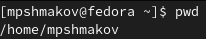{ #fig:001 width=70% }

2. Выполните следующие действия:
  1. Перейдите в каталог /tmp.
  2. Выведите на экран содержимое каталога /tmp. Для этого используйте команду ls с различными опциями. Поясните разницу в выводимой на экран информации. (рис. [-@fig:002]) 
  
  С "-а" мы перестаем игнорировать результаты начинающиеся с ".".
  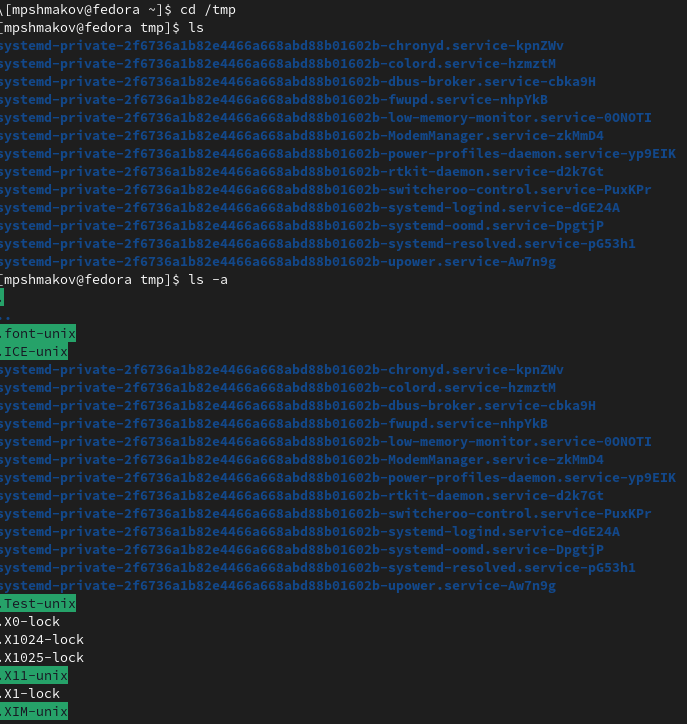{ #fig:002 width=70% }
  
  3. Определите, есть ли в каталоге /var/spool подкаталог с именем cron? (рис. [-@fig:003]) 
  
  Нет, его тут нет.
    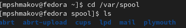{ #fig:003 width=70% }
  
  4. Перейдите в Ваш домашний каталог и выведите на экран его содержимое. Определите, кто является владельцем файлов и подкаталогов? (рис. [-@fig:004])
  
  С помощью "ls -alF" я могу узнать, что владельцем файлов и подкаталогов являюсь я, и одним каталогом владеет суперюзер (root root).
    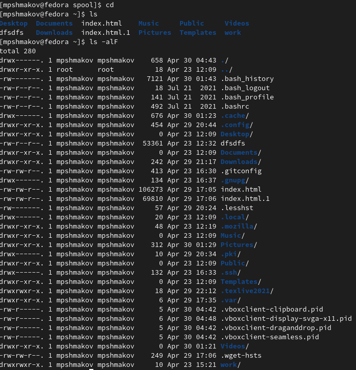{ #fig:004 width=70% }
  
3. Выполните следующие действия:
  1. В домашнем каталоге создайте новый каталог с именем newdir.
  2. В каталоге ~/newdir создайте новый каталог с именем morefun. (рис. [-@fig:005])
  
   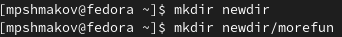{ #fig:005 width=70% }
  
  3. В домашнем каталоге создайте одной командой три новых каталога с именами letters, memos, misk. Затем удалите эти каталоги одной командой. (рис. [-@fig:006]) (рис. [-@fig:007])
  
  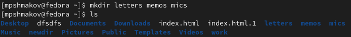{ #fig:006 width=70% }
  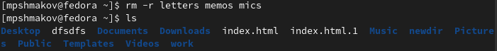{ #fig:007 width=70% }
  
  4. Попробуйте удалить ранее созданный каталог ~/newdir командой rm. Проверьте, был ли каталог удалён. (рис. [-@fig:008])
  
  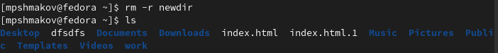{ #fig:008 width=70% }
  
  5. Удалите каталог ~/newdir/morefun из домашнего каталога. Проверьте, был ли каталог удалён.
  
  Этот каталог был удален в предыдущем задании.
  
4. С помощью команды man определите, какую опцию команды ls нужно использовать для просмотра содержимое не только указанного каталога, но и подкаталогов, входящих в него. (рис. [-@fig:009]) (рис. [-@fig:010])

Прописываю команду "man ls" и среди списка нахожу "-R", которая мне подходит по описанию.
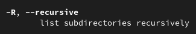{ #fig:009 width=70% }
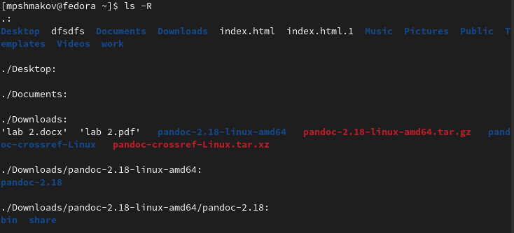{ #fig:010 width=70% }

5. С помощью команды man определите набор опций команды ls, позволяющий отсортировать по времени последнего изменения выводимый список содержимого каталога с развёрнутым описанием файлов. (рис. [-@fig:011]) (рис. [-@fig:012]) (рис. [-@fig:013])

Долго всматриваясь в список всех команд, я пришел к такой комбинации "ls -lt -c --file-type".
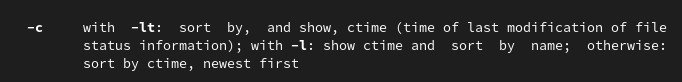{ #fig:011 width=70% }
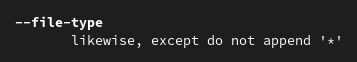{ #fig:012 width=70% }
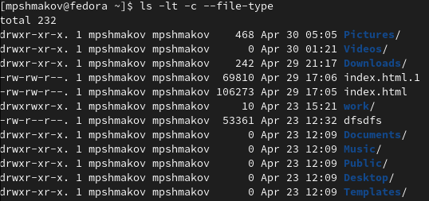{ #fig:013 width=70% }

6. Используйте команду man для просмотра описания следующих команд: cd, pwd, mkdir, rmdir, rm. Поясните основные опции этих команд. (рис. [-@fig:014])

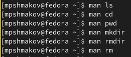{ #fig:014 width=70% }
cd -l - показывает имена всех readline функций.
cd -V - показывает нынешние readline имена и значения.

mkdir -m - задаются права доступа к новуму каталогу.
mkdir -v - печатает сообщение для каждого созданного каталога.

pwd -L - использует pwd в среде даже есть присутствуют symlinks.
pwd -P - обходит все symlinks.

rm -r - удаляет каталоги вместе с их содержимым
rm -d - удаляет пустые каталоги

rmdir -p - удаляет все написанные каталоги, например "rmdir -p a/b/c" это то же самое что и "rmdir a/b/c a/b a"
rmdir -v - выводит диагностику для каждого использованного каталога.

7. Используя информацию, полученную при помощи команды history, выполните модификацию и исполнение нескольких команд из буфера команд. (рис. [-@fig:015]) (рис. [-@fig:016]) (рис. [-@fig:017]) (рис. [-@fig:018]) (рис. [-@fig:019])
 
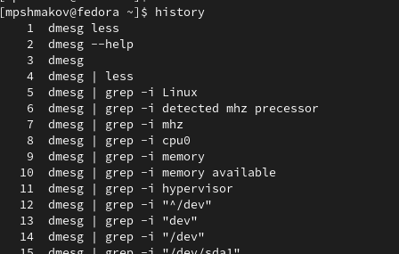{ #fig:015 width=70% }

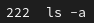{ #fig:016 width=70% }
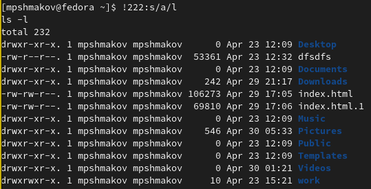{ #fig:017 width=70% }

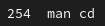{ #fig:018 width=70% }
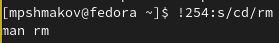{ #fig:019 width=70% }

# Выводы

В ходе работы я научился взаимодействовать с системой с помощью командной строки.

