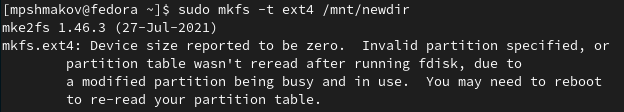

---
## Front matter
lang: ru-RU
title: Отчет по лабораторной работе №5
author: |
	Шмаков Максим\inst{1}
institute: |
	\inst{1}RUDN University, Moscow, Russian Federation
date: 2022, 4 мая , Москва

## Formatting
toc: false
slide_level: 2
theme: metropolis
header-includes: 
 - \metroset{progressbar=frametitle,sectionpage=progressbar,numbering=fraction}
 - '\makeatletter'
 - '\beamer@ignorenonframefalse'
 - '\makeatother'
aspectratio: 43
section-titles: true
---

# Цель работы

Ознакомление с файловой системой Linux, её структурой, именами и содержанием каталогов. Приобретение практических навыков по применению команд для работы с файлами и каталогами, по управлению процессами (и работами), по проверке использования диска и обслуживанию файловой системы.

## 1. Выполните все примеры, приведённые в первой части описания лабораторной работы.

Создаю текстовый файл с помощью конманды touch. Далее с помощью команды cat просматриваю содержимое файла. (рис. [-@fig:001])

{ #fig:001 width=70% }

## 1. Выполните все примеры, приведённые в первой части описания лабораторной работы.

Для просмотра файла постранично использую команду less. (рис. [-@fig:002]) (рис. [-@fig:003]) 

{ #fig:002 width=70% }
{ #fig:003 width=70% }

## 1. Выполните все примеры, приведённые в первой части описания лабораторной работы.

Для просмотра первых строчек использую команду head, для последних - tail. (рис. [-@fig:004])

{ #fig:004 width=70% }

## 2. Выполните следующие действия, зафиксировав в отчёте по лабораторной работе используемые при этом команды и результаты их выполнения:

1. Скопируйте файл /usr/include/sys/io.h в домашний каталог и назовите его equipment. Если файла io.h нет, то используйте любой другой файл в каталоге /usr/include/sys/ вместо него. 
  
  Копирую и проверяю результат с помощью ls. (рис. [-@fig:005])
  
  { #fig:005 width=70% }

## 2. Выполните следующие действия, зафиксировав в отчёте по лабораторной работе используемые при этом команды и результаты их выполнения:

2. В домашнем каталоге создайте директорию ~/ski.plases.
  
  Создаю и проверяю результат с помощью ls. (рис. [-@fig:006])
  
  { #fig:006 width=70% }
  
## 2. Выполните следующие действия, зафиксировав в отчёте по лабораторной работе используемые при этом команды и результаты их выполнения:

3. Переместите файл equipment в каталог ~/ski.plases.
  
  Перемещаю и проверяю результат с помощью ls. (рис. [-@fig:007])
  
  { #fig:007 width=70% }
  
## 2. Выполните следующие действия, зафиксировав в отчёте по лабораторной работе используемые при этом команды и результаты их выполнения:

4. Переименуйте файл ~/ski.plases/equipment в ~/ski.plases/equiplist.
  
  Переименовываю с помощью mv и проверяю результат с помощью ls. (рис. [-@fig:008])
  
  { #fig:008 width=70% }
  
## 2. Выполните следующие действия, зафиксировав в отчёте по лабораторной работе используемые при этом команды и результаты их выполнения:

5. Создайте в домашнем каталоге файл abc1 и скопируйте его в каталог ~/ski.plases, назовите его equiplist2.
  
  Создаю и копирую abc1, проверяю результат с помощью ls. (рис. [-@fig:009]) (рис. [-@fig:010])
  
  { #fig:009 width=70% }
  
  { #fig:010 width=70% }
  
## 2. Выполните следующие действия, зафиксировав в отчёте по лабораторной работе используемые при этом команды и результаты их выполнения:

 6. Создайте каталог с именем equipment в каталоге ~/ski.plases.
  
  Создаю и проверяю результат с помощью ls. (рис. [-@fig:011])
  
  { #fig:011 width=70% }
  
## 2. Выполните следующие действия, зафиксировав в отчёте по лабораторной работе используемые при этом команды и результаты их выполнения:

7. Переместите файлы ~/ski.plases/equiplist и equiplist2 в каталог ~/ski.plases/equipment.
  
  Перемещаю и проверяю результат с помощью ls. (рис. [-@fig:012])
  
  { #fig:012 width=70% }
  
## 2. Выполните следующие действия, зафиксировав в отчёте по лабораторной работе используемые при этом команды и результаты их выполнения:

8. Создайте и переместите каталог ~/newdir в каталог ~/ski.plases и назовите его plans.
  
  Создаю и перемещаю newdir, проверяю результат с помощью ls. (рис. [-@fig:013])
  
  { #fig:013 width=70% }

## 3. Определите опции команды chmod, необходимые для того, чтобы присвоить перечисленным ниже файлам выделенные права доступа, считая, что в начале таких прав нет:

1. drwxr--r-- ... australia (рис. [-@fig:014]) (рис. [-@fig:015])
  
  { #fig:014 width=70% }
  { #fig:015 width=70% }

## 3. Определите опции команды chmod, необходимые для того, чтобы присвоить перечисленным ниже файлам выделенные права доступа, считая, что в начале таких прав нет:

2. drwx--x--x ... play  (рис. [-@fig:016])
  
  { #fig:016 width=70% }
  
## 3. Определите опции команды chmod, необходимые для того, чтобы присвоить перечисленным ниже файлам выделенные права доступа, считая, что в начале таких прав нет:

3. -r-xr--r-- ... my_os  (рис. [-@fig:017])
  
  { #fig:017 width=70% }
  
## 3. Определите опции команды chmod, необходимые для того, чтобы присвоить перечисленным ниже файлам выделенные права доступа, считая, что в начале таких прав нет:

4. -rw-rw-r-- ... feathers (рис. [-@fig:018])
  
  { #fig:018 width=70% }
  
## 4. Проделайте приведённые ниже упражнения, записывая в отчёт по лабораторной работе используемые при этом команды:

1. Просмотрите содержимое файла /etc/password.(рис. [-@fig:019])
  
  Хоть мне выдало ошибку, хочу отметить что passwd существует, но в задании спрашивается именно password, поэтому так.
  
  { #fig:019 width=70% }
  
## 4. Проделайте приведённые ниже упражнения, записывая в отчёт по лабораторной работе используемые при этом команды:

2. Скопируйте файл ~/feathers в файл ~/file.old.
  
  Копирую и проверяю результат с помощью ls.  (рис. [-@fig:020])
  
  { #fig:020 width=70% }
  
## 4. Проделайте приведённые ниже упражнения, записывая в отчёт по лабораторной работе используемые при этом команды:

3. Переместите файл ~/file.old в каталог ~/play. 
  
  Перемещаю и проверяю результат с помощью ls. (рис. [-@fig:021])
  
  { #fig:021 width=70% }
  
## 4. Проделайте приведённые ниже упражнения, записывая в отчёт по лабораторной работе используемые при этом команды:

4. Скопируйте каталог ~/play в каталог ~/fun. 
  
  Копирую и проверяю результат с помощью ls. (рис. [-@fig:022])
  
  { #fig:022 width=70% }
  
## 4. Проделайте приведённые ниже упражнения, записывая в отчёт по лабораторной работе используемые при этом команды:

5. Переместите каталог ~/fun в каталог ~/play и назовите его games.
  
  Перемещаю и проверяю результат с помощью ls. (рис. [-@fig:023])
  
  { #fig:023 width=70% }
  
## 4. Проделайте приведённые ниже упражнения, записывая в отчёт по лабораторной работе используемые при этом команды:

6. Лишите владельца файла ~/feathers права на чтение. (рис. [-@fig:024])
  
  { #fig:024 width=70% }
  
## 4. Проделайте приведённые ниже упражнения, записывая в отчёт по лабораторной работе используемые при этом команды:

7. Что произойдёт, если вы попытаетесь просмотреть файл ~/feathers командой cat? (рис. [-@fig:025])
  
  { #fig:025 width=70% }
  
## 4. Проделайте приведённые ниже упражнения, записывая в отчёт по лабораторной работе используемые при этом команды:

8. Что произойдёт, если вы попытаетесь скопировать файл ~/feathers? (рис. [-@fig:026])
  
  { #fig:026 width=70% }
  
## 4. Проделайте приведённые ниже упражнения, записывая в отчёт по лабораторной работе используемые при этом команды:

9. Дайте владельцу файла ~/feathers право на чтение. (рис. [-@fig:027])
  
  { #fig:027 width=70% }
  
## 4. Проделайте приведённые ниже упражнения, записывая в отчёт по лабораторной работе используемые при этом команды:

10. Лишите владельца каталога ~/play права на выполнение. (рис. [-@fig:028])
  
  { #fig:028 width=70% }
  
## 4. Проделайте приведённые ниже упражнения, записывая в отчёт по лабораторной работе используемые при этом команды:

11. Перейдите в каталог ~/play. Что произошло? (рис. [-@fig:029])
  
  { #fig:029 width=70% }
  
## 4. Проделайте приведённые ниже упражнения, записывая в отчёт по лабораторной работе используемые при этом команды:

 12. Дайте владельцу каталога ~/play право на выполнение. (рис. [-@fig:030])
  
  { #fig:030 width=70% }
  
## 5. Прочитайте man по командам mount, fsck, mkfs, kill и кратко их охарактеризуйте, приведя примеры.

mount - подключает файловую систему.
Попробую подключить свою файловую систему ramfs:  (рис. [-@fig:031])
  
{ #fig:031 width=70% }
  
## 5. Прочитайте man по командам mount, fsck, mkfs, kill и кратко их охарактеризуйте, приведя примеры.

Проверю, что она подлючилась с помощью команды mount:  (рис. [-@fig:032])
  
{ #fig:032 width=70% }

## 5. Прочитайте man по командам mount, fsck, mkfs, kill и кратко их охарактеризуйте, приведя примеры.

fsck - проверить и починить файловую систему в Linux.
Для примера проверю подключен ли мой жесткий диск: (рис. [-@fig:033])
  
Да, подлючен.
{ #fig:033 width=70% }

## 5. Прочитайте man по командам mount, fsck, mkfs, kill и кратко их охарактеризуйте, приведя примеры.

mkfs - построить файловую систему в Linux.
Попробую построить файловую систему ext4 типа: (рис. [-@fig:034])
  
{ #fig:034 width=70% }

## 5. Прочитайте man по командам mount, fsck, mkfs, kill и кратко их охарактеризуйте, приведя примеры.

kill - убить процесс.
Для примера посмотрю активные процессы и попробую убить одного из них: 
Прописываю команду ps -fu mpshmakov, чтобы посмотреть актинвые процессы: (рис. [-@fig:035])
  
{ #fig:035 width=70% }

## 5. Прочитайте man по командам mount, fsck, mkfs, kill и кратко их охарактеризуйте, приведя примеры.

Попробую убить все процессы firefox:  (рис. [-@fig:036])
  
{ #fig:036 width=70% }

## 5. Прочитайте man по командам mount, fsck, mkfs, kill и кратко их охарактеризуйте, приведя примеры.

Пропишу еще раз ps -fu mpshmakov, чтобы проверить результат: (рис. [-@fig:037])
 
{ #fig:037 width=70% }

# Выводы

В ходе работы я ознакомился с файловой системой Linux,  её структурой, именами и содержанием каталогов. Научился приминять команды для работы с файлами и каталогами, по управлению процессами, по проверке использования диска и обслуживанию файловой системы.

