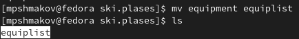
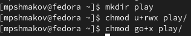

---
## Front matter
title: "Отчет по лабораторной работе №5"
subtitle: "дисциплина: операционные системы"
author: "Шмаков Максим Павлович"

## Generic otions
lang: ru-RU
toc-title: "Содержание"

## Bibliography
bibliography: bib/cite.bib
csl: pandoc/csl/gost-r-7-0-5-2008-numeric.csl

## Pdf output format
toc: true # Table of contents
toc-depth: 2
lof: true # List of figures
lot: true # List of tables
fontsize: 12pt
linestretch: 1.5
papersize: a4
documentclass: scrreprt
## I18n polyglossia
polyglossia-lang:
  name: russian
  options:
	- spelling=modern
	- babelshorthands=true
polyglossia-otherlangs:
  name: english
## I18n babel
babel-lang: russian
babel-otherlangs: english
## Fonts
mainfont: PT Serif
romanfont: PT Serif
sansfont: PT Sans
monofont: PT Mono
mainfontoptions: Ligatures=TeX
romanfontoptions: Ligatures=TeX
sansfontoptions: Ligatures=TeX,Scale=MatchLowercase
monofontoptions: Scale=MatchLowercase,Scale=0.9
## Biblatex
biblatex: true
biblio-style: "gost-numeric"
biblatexoptions:
  - parentracker=true
  - backend=biber
  - hyperref=auto
  - language=auto
  - autolang=other*
  - citestyle=gost-numeric
## Pandoc-crossref LaTeX customization
figureTitle: "Рис."
tableTitle: "Таблица"
listingTitle: "Листинг"
lofTitle: "Список иллюстраций"
lotTitle: "Список таблиц"
lolTitle: "Листинги"
## Misc options
indent: true
header-includes:
  - \usepackage{indentfirst}
  - \usepackage{float} # keep figures where there are in the text
  - \floatplacement{figure}{H} # keep figures where there are in the text
---

# Цель работы

Ознакомление с файловой системой Linux, её структурой, именами и содержанием каталогов. Приобретение практических навыков по применению команд для работы с файлами и каталогами, по управлению процессами (и работами), по проверке использования диска и обслуживанию файловой системы.

# Задание

1. Выполните все примеры, приведённые в первой части описания лабораторной работы.
2. Выполните следующие действия, зафиксировав в отчёте по лабораторной работе используемые при этом команды и результаты их выполнения:
  1. Скопируйте файл /usr/include/sys/io.h в домашний каталог и назовите его equipment. Если файла io.h нет, то используйте любой другой файл в каталоге /usr/include/sys/ вместо него.
  2. В домашнем каталоге создайте директорию ~/ski.plases.
  3. Переместите файл equipment в каталог ~/ski.plases.
  4. Переименуйте файл ~/ski.plases/equipment в ~/ski.plases/equiplist.
  5. Создайте в домашнем каталоге файл abc1 и скопируйте его в каталог ~/ski.plases, назовите его equiplist2.
  6. Создайте каталог с именем equipment в каталоге ~/ski.plases.
  7. Переместите файлы ~/ski.plases/equiplist и equiplist2 в каталог ~/ski.plases/equipment.
  8. Создайте и переместите каталог ~/newdir в каталог ~/ski.plases и назовите его plans.
3. Определите опции команды chmod, необходимые для того, чтобы присвоить перечисленным ниже файлам выделенные права доступа, считая, что в начале таких прав нет:
  1. drwxr--r-- ... australia
  2. drwx--x--x ... play
  3. -r-xr--r-- ... my_os
  4. -rw-rw-r-- ... feathers 
  При необходимости создайте нужные файлы.
4. Проделайте приведённые ниже упражнения, записывая в отчёт по лабораторной работе используемые при этом команды:
  1. Просмотрите содержимое файла /etc/password.
  2. Скопируйте файл ~/feathers в файл ~/file.old.
  3. Переместите файл ~/file.old в каталог ~/play.
  4. Скопируйте каталог ~/play в каталог ~/fun.
  5. Переместите каталог ~/fun в каталог ~/play и назовите его games.
  6. Лишите владельца файла ~/feathers права на чтение.
  7. Что произойдёт, если вы попытаетесь просмотреть файл ~/feathers командой cat?
  8. Что произойдёт, если вы попытаетесь скопировать файл ~/feathers?
  9. Дайте владельцу файла ~/feathers право на чтение.
  10. Лишите владельца каталога ~/play права на выполнение.
  11. Перейдите в каталог ~/play. Что произошло?
  12. Дайте владельцу каталога ~/play право на выполнение.
5. Прочитайте man по командам mount, fsck, mkfs, kill и кратко их охарактеризуйте, приведя примеры.

# Выполнение лабораторной работы

1. Выполните все примеры, приведённые в первой части описания лабораторной работы.

Создаю текстовый файл с помощью конманды touch. Далее с помощью команды cat просматриваю содержимое файла. (рис. [-@fig:001])

{ #fig:001 width=70% }

Для просмотра файла постранично использую команду less. (рис. [-@fig:002]) (рис. [-@fig:003]) 

{ #fig:002 width=70% }
{ #fig:003 width=70% }

Для просмотра первых строчек использую команду head, для последних - tail. (рис. [-@fig:004])

{ #fig:004 width=70% }

2. Выполните следующие действия, зафиксировав в отчёте по лабораторной работе используемые при этом команды и результаты их выполнения:
  1. Скопируйте файл /usr/include/sys/io.h в домашний каталог и назовите его equipment. Если файла io.h нет, то используйте любой другой файл в каталоге /usr/include/sys/ вместо него. 
  
  Копирую и проверяю результат с помощью ls. (рис. [-@fig:005])
  
  { #fig:005 width=70% }
  
  2. В домашнем каталоге создайте директорию ~/ski.plases.
  
  Создаю и проверяю результат с помощью ls. (рис. [-@fig:006])
  
  { #fig:006 width=70% }
  
  3. Переместите файл equipment в каталог ~/ski.plases.
  
  Перемещаю и проверяю результат с помощью ls. (рис. [-@fig:007])
  
  { #fig:007 width=70% }
  
  4. Переименуйте файл ~/ski.plases/equipment в ~/ski.plases/equiplist.
  
  Переименовываю с помощью mv и проверяю результат с помощью ls. (рис. [-@fig:008])
  
  { #fig:008 width=70% }
  
  5. Создайте в домашнем каталоге файл abc1 и скопируйте его в каталог ~/ski.plases, назовите его equiplist2.
  
  Создаю и копирую abc1, проверяю результат с помощью ls. (рис. [-@fig:009]) (рис. [-@fig:010])
  
  { #fig:009 width=70% }
  
  { #fig:010 width=70% }
  
  6. Создайте каталог с именем equipment в каталоге ~/ski.plases.
  
  Создаю и проверяю результат с помощью ls. (рис. [-@fig:011])
  
  { #fig:011 width=70% }
  
  7. Переместите файлы ~/ski.plases/equiplist и equiplist2 в каталог ~/ski.plases/equipment.
  
  Перемещаю и проверяю результат с помощью ls. (рис. [-@fig:012])
  
  { #fig:012 width=70% }
  
  8. Создайте и переместите каталог ~/newdir в каталог ~/ski.plases и назовите его plans.
  
  Создаю и перемещаю newdir, проверяю результат с помощью ls. (рис. [-@fig:013])
  
  { #fig:013 width=70% }

3. Определите опции команды chmod, необходимые для того, чтобы присвоить перечисленным ниже файлам выделенные права доступа, считая, что в начале таких прав нет:
  1. drwxr--r-- ... australia (рис. [-@fig:014]) (рис. [-@fig:015])
  
  { #fig:014 width=70% }
  { #fig:015 width=70% }
  
  2. drwx--x--x ... play  (рис. [-@fig:016])
  
  { #fig:016 width=70% }
  
  3. -r-xr--r-- ... my_os  (рис. [-@fig:017])
  
  { #fig:017 width=70% }
  
  4. -rw-rw-r-- ... feathers (рис. [-@fig:018])
  
  { #fig:018 width=70% }
  
4. Проделайте приведённые ниже упражнения, записывая в отчёт по лабораторной работе используемые при этом команды:
  1. Просмотрите содержимое файла /etc/password.(рис. [-@fig:019])
  
  Хоть мне выдало ошибку, хочу отметить что passwd существует, но в задании спрашивается именно password, поэтому так.
  
  { #fig:019 width=70% }
  
  2. Скопируйте файл ~/feathers в файл ~/file.old.
  
  Копирую и проверяю результат с помощью ls.  (рис. [-@fig:020])
  
  { #fig:020 width=70% }
  
  3. Переместите файл ~/file.old в каталог ~/play. 
  
  Перемещаю и проверяю результат с помощью ls. (рис. [-@fig:021])
  
  { #fig:021 width=70% }
  
  4. Скопируйте каталог ~/play в каталог ~/fun. 
  
  Копирую и проверяю результат с помощью ls. (рис. [-@fig:022])
  
  { #fig:022 width=70% }
  
  5. Переместите каталог ~/fun в каталог ~/play и назовите его games.
  
  Перемещаю и проверяю результат с помощью ls. (рис. [-@fig:023])
  
  { #fig:023 width=70% }
  
  6. Лишите владельца файла ~/feathers права на чтение. (рис. [-@fig:024])
  
  { #fig:024 width=70% }
  
  7. Что произойдёт, если вы попытаетесь просмотреть файл ~/feathers командой cat? (рис. [-@fig:025])
  
  { #fig:025 width=70% }
  
  8. Что произойдёт, если вы попытаетесь скопировать файл ~/feathers? (рис. [-@fig:026])
  
  { #fig:026 width=70% }
  
  9. Дайте владельцу файла ~/feathers право на чтение. (рис. [-@fig:027])
  
  { #fig:027 width=70% }
  
  10. Лишите владельца каталога ~/play права на выполнение. (рис. [-@fig:028])
  
  { #fig:028 width=70% }
  
  11. Перейдите в каталог ~/play. Что произошло? (рис. [-@fig:029])
  
  { #fig:029 width=70% }
  
  12. Дайте владельцу каталога ~/play право на выполнение. (рис. [-@fig:030])
  
  { #fig:030 width=70% }
  
5. Прочитайте man по командам mount, fsck, mkfs, kill и кратко их охарактеризуйте, приведя примеры.

mount - подключает файловую систему.
Попробую подключить свою файловую систему ramfs:  (рис. [-@fig:031])
  
{ #fig:031 width=70% }
  
Проверю, что она подлючилась с помощью команды mount:  (рис. [-@fig:032])
  
{ #fig:032 width=70% }

fsck - проверить и починить файловую систему в Linux.
Для примера проверю подключен ли мой жесткий диск: (рис. [-@fig:033])
  
Да, подлючен.
{ #fig:033 width=70% }

mkfs - построить файловую систему в Linux.
Попробую построить файловую систему ext4 типа: (рис. [-@fig:034])
  
{ #fig:034 width=70% }

kill - убить процесс.
Для примера посмотрю активные процессы и попробую убить одного из них: 
Прописываю команду ps -fu mpshmakov, чтобы посмотреть актинвые процессы: (рис. [-@fig:035])
  
{ #fig:035 width=70% }

Попробую убить все процессы firefox:  (рис. [-@fig:036])
  
{ #fig:036 width=70% }

Пропишу еще раз ps -fu mpshmakov, чтобы проверить результат: (рис. [-@fig:037])
 
{ #fig:037 width=70% }

# Контрольные вопросы

1. 
  1. procfs — специальная файловая система, используемая в UNIX-подобных операционных системах. Позволяет получить доступ к информации из ядра о системных процессах. Необходима для выполнения таких команд как ps, w, top. 
  2.  sysfs — виртуальная файловая система в операционной системе Linux. Экспортирует в пространство пользователя информацию ядра Linux о присутствующих в системе устройствах и драйверах.
  3. devtmpfs - это файловая система с автоматическими узлами устройств, заполняемыми ядром. Это означает, что вам не нужно ни запускать udev, ни создавать статический макет / dev с дополнительными, ненужными и отсутствующими узлами устройств. Вместо этого ядро ​​заполняет соответствующую информацию на основе известных устройств.
  4. securityfs — используется BIOS TPM символьным драйвером и IMA, поставщик целостности.
  5. tmpfs — используется для хранения файлов в оперативной памяти (ОЗУ).
  6. SELinux — это система принудительного контроля доступа, реализованная на уровне ядра.
  7. Hugetlbfs - это механизм выделения огромных страниц для программ, которые могут использовать преимущества огромных страниц.
  8. debugfs — используется для отладочных целей, в первую очередь для разработки ядра Linux.
  9. TraceFS — новая файловая система для ядра Linux, ориентированная на подсистему трассировки.
  10. Configfs - это виртуальная файловая система на основе ОЗУ, предоставляемая ядром Linux 2.6.
  
2. 
  1. procfs:
  Структура:
  BSD
Каждый каталог верхнего уровня содержит следующие файлы:

* ctl — файл только для записи, поддерживающий множество операций, которые записываются в него в виде строк:
* attach — останавливает целевой процесс и подготавливает вызывающий его процесс для выполнения отладки целевого.
* detach — продолжает выполнение целевого процесса и снимает его из-под контроля процесса-отладчика (последний не обязан быть вызывающим процессом).
* run — продолжает выполнение целевого процесса до поступления сигнала, достижения точки останова или завершения целевого процесса.
* step — выполняет одну команду целевой программы, не генерируя иных сигналов.
* wait — ожидает когда целевой процесс достигнет стабильного состояния, готового для отладки. Целевой процесс должен быть в этом состоянии до того как будут разрешены другие команды.
* dbregs — отладочные регистры, соответствующие struct dbregs в <machine/reg.h>. dbregs сейчас применяется лишь в архитектуре i386.
* etype — тип выполняемого файла к которому идет обращение в file.
* file — символьная ссылка на файл, из которого читался текст процесса. Это может использоваться для получения доступа к таблице идентификаторов процесса или для запуска новой копии процесса. Если файл не найден, то целевое направление принимает значение «unknown».
* fpregs — регистры с плавающей запятой, соответствующие struct fpregs в <machine/reg.h>. fpregs используется только на машинах с различными множествами универсальных регистров и регистров с плавающей запятой.
* map — карта виртуальной памяти процесса.
* mem — полный образ виртуальной памяти процесса. Можно обратиться лишь к тому адресу, который существует в процессе. Чтение и запись в этот файл изменяют процесс. Запись в текстовый сегмент применяется лишь для этого процесса (изменения не повлияют на другие копии этого процесса).
* note — используется для отправки сигнала процессу. Не применяется.
* notepg — используется для отправки сигнала группе процессов. Не применяется.
* regs — позволяет доступ на чтение и запись к множеству регистров процесса. Данный файл содержит структуру двоичных данных struct regs описанную в <machine/reg.h>. regs доступен на запись только когда процесс остановлен.
* rlimit — файл, доступный только на чтение, содержащий текущий и максимальный размер. Каждая строка имеет формат rlimit current max, где −1 обозначает бесконечность.
* status — статус процесса. Файл доступен только для чтения и содержит единственную строку, состоящую из полей, разделённых пробелами:
  * имя команды
  * id процесса
  * id родительского процесса
  * id группы процесса
  * id сессии
  * major, minor управляемого терминала, или −1, −1 в ином случае
  * список флагов процесса: ctty если это управляемый терминал, sldr если процесс управляет сессией, noflags если ни один из вышеперечисленных флагов не установлен
  * время запуска процесса в секундах и микросекундах, разделённых запятой
  * время пользователя в секундах и микросекундах, разделённых запятой
  * системное время в секундах и микросекундах, разделённых запятой
  * время ожидания сообщения
  * мандат процесса, состоящий из id фактического пользователя и списка групп (первый элемент которого является id фактической группы), разделённых запятой
  * имя хоста, в пределах которого запущен процесс, или «-» если процесс запущен без ограничений

  2. sysfs
  Структура sysfs выражает соотношения структур данных ядра. Названия подкаталогов /sys следующие:

* devices/
полностью соответствует внутреннему дереву устройств ядра, а символические ссылки в подкаталогах (когда они есть, разумеется) указывают на шину устройства, принадлежность его к определённому классу, соответствующий загруженный драйвер и т. п. Дерево может быть достаточно сложным и отражает связь между устройствами.

* bus/ 
представляет собой перечень шин, зарегистрированных в ядре. Каталог каждой шины содержит подкаталоги devices/ и drivers/. Причём, devices/ — это символьные ссылки на каталоги всех устройств, описанных в системе (реально расположенных в /sys/devices/…).

* drivers/
каталоги драйверов, загруженных для устройств, присутствующих на данной шине. Каждый такой каталог содержит, как минимум, пару файлов-атрибутов bind и unbind, предназначенных для управления драйвером, а когда драйвер обнаруживает «своё» устройство, то в каталоге появляется символьная ссылка на каталог этого устройства.

* block/
содержит каталоги всех блочных устройств, присутствующих в настоящее время в системе. В данном случае под устройством понимается совокупность физического устройства и драйвера. То есть, если при подключении USB-драйва некоторое новое устройство в /sys/devices/ появится всегда (можно говорить о наличии физического устройства), то появление каталога /sys/block/sda зависит ещё и от наличия в памяти необходимых драйверов (usb-storage, sd_mod и т. д. — включая все драйверы, необходимые для поддержки usb).

* class/ 
отражает группировку устройств в классы. Всякое подключенное устройство создаст новый подкаталог в дереве /sys/class. Как и в предыдущем случае, подразумевается наличие и устройства, и его драйвера.

  3. devtmpfs
  Структура та же самая, что и в tmpfs.
  
  4. tmpfs
  Структура:
gid — root group id.
uid — root user id.
mode — разрешения в восьмеричном формате.
inodes — максимальное количество дескрипторов.
size — максимального размера (в байтах) для файловой системы.

  5. selinusxfs
  Архитектура 
  В самом начале своего появления SELinux была реализована в виде патча. В данном случае было непросто настраивать политику безопасности. С появлением механизмов LSM, настройка и управление безопасностью значительно упростились (политика и механизмы усиления безопасности были разделены), SELinux была реализована в виде подгружаемых модулей ядра. Перед доступом к внутренним объектам операционной системы производится изменение кода ядра. Это реализуется при помощи специальных функций (перехватчиков системных вызовов), так называемых функций «хуков» (англ. hook functions). Функции-перехватчики хранятся в некоторой структуре данных, их целью является выполнение определенных действий по обеспечению безопасности, основанных на заранее установленной политике. Сам модуль включает в себя шесть главных компонентов: сервер безопасности; кэш вектора доступа (англ. Access Vector Cache, AVC); таблицы сетевых интерфейсов; код сигнала сетевого уведомления; свою виртуальную файловую систему (selinuxfs) и реализацию функций-перехватчиков.

Кэш вектора доступа используется для кэширования вычисленных результатов (хранения готовых решений управления доступом), полученных из сервера безопасности. Нужно это для того, чтобы минимизировать накладные расходы на производительность со стороны механизмов безопасности SELinux. Интерфейс кэша вектора доступа для сервера безопасности определен в заголовочном файле include/avc_ss.h.
Таблица сетевых интерфейсов отображает сетевые устройства в контексты безопасности. Поддержка отдельных таблиц необходима ввиду того, что поле безопасности сетевых устройств было исключено из проекта. Сетевые устройства добавляются в таблицу, когда впервые оказываются в поле видимости функций-перехватчиков (засекаются ими) и удаляются из неё, когда устройство настраивается или перезагружается политика безопасности в связи с перенастройкой. Это возможно благодаря callback-функциям, которые регистрируют изменения конфигурации устройства и перезагрузку политик безопасности. Код таблицы сетевых интерфейсов можно найти в файле netif.c.
Код события сетевого уведомления позволяет модулю SELinux уведомлять процессы операционной системы в случае, когда политика безопасности была перезагружена. Эти уведомления используются пространством пользователя для поддержки совместимости с ядром. Этот механизм возможен благодаря библиотеке SELinux. Код события сетевого уведомления можно найти в файле netlink.c.
Псевдофайловая система SELinux экспортирует API-функции политики сервера безопасности в процессы операционной системы. Изначально API-функции ядра SELinux были разделены на три компонента (атрибуты процесса, файловые атрибуты, политика API) как часть изменений для внесения в версию ядра Linux 2.6. Также SELinux предоставляет поддержку политики API вызовов. Все три компонента API нового ядра инкапсулированы в библиотеку API SELinux (libselinux). Код псевдофайловой системы можно найти в файле selinuxfs.c.
Реализация функций перехватчиков управляет информационной безопасностью связанной с внутренними объектами ядра и реализацией контроля доступа SELinux для каждой операции внутри ядра. Функции перехватчики вызывают сервер безопасности и кэш вектора доступа для получения решений политики безопасности и применения этих решений для маркировки по каким-либо признакам и контроля объектов ядра. Код этих функций перехватчиков расположен в файле hooks.c, а структуры данных, связанные с внутренними объектами, определены в файле include/objsec.h.

  6. debugfs
  debugfs_create_file – для создания дебаговой файловой системы.
  debugfs_create_dir – чтобы создать каталог внутри дебаговой файловой системы.
  debugfs_create_symlink – чтобы создать symlink внутри файловой системы.
  debugfs_remove – чтобы удалить дебаговую файловую систему.
  
  Чтобы узнать, какие файловые системы существуют на жёстком диске моего компьютера, использую команду «df -Th». На моем компьютере есть следующие файловые системы: devtmpfs, tmpfs, ext4, iso9660. devtmpfs позволяет ядру создать экземпляр tmpfs с именем devtmpfs при инициализации ядра, прежде чем регистрируется какое-либо устройство с драйверами. Каждое устройство с майором / минором будет предоставлять узел устройства в devtmpfs. devtmpfs монтируется на /dev и содержит специальные файлы устройств для всех устройств. tmpfs − временное файловое хранилище во многих Unix-подобных ОС. Предназначена для монтирования файловой системы, но размещается в ОЗУ вместо ПЗУ. Подобная конструкция является RAM диском. Данная файловая система также предназначенная для быстрого и ненадёжного хранения временных данных. Хорошо подходит для /tmp и массовой сборки пакетов/образов. Предполагает наличие достаточного объёма виртуальной памяти. Файловая система tmpfs предназначена для того, чтобы использовать часть физической памяти сервера как обычный дисковый раздел, в котором можно сохранять данные (чтение и запись). Поскольку данные размещены в памяти, то чтение или запись происходят во много раз быстрее, чем с обычного HDD диска. ext4 − имеет обратную совместимость с предыдущими версиями ФС. Эта версия была выпущена в 2008 году. Является первой ФС из «семейства» Ext, использующая механизм «extent file system», который позволяет добиться меньшей фрагментации файлов и увеличить общую производительность файловой системы. Кроме того, в Ext4 реализован механизм отложенной записи (delayed allocation − delalloc), который так же уменьшает фрагментацию диска и снижает нагрузку на CPU. С другой стороны, хотя механизм отложенной записи и используется во многих ФС, но в силу сложности своей реализации он повышает вероятность утери данных.
Характеристики:
максимальный размер файла: 16 TB;
максимальный размер раздела: 16 TB;
максимальный размер имени файла: 255 символов.
Рекомендации по использованию:
наилучший выбор для SSD;
наилучшая производительность по сравнению с предыдущими Etx-системами;
она так же отлично подходит в качестве файловой системы для серверов баз данных, хотя сама система и моложе Ext3.
ISO 9660 − стандарт, выпущенный Международной организацией по стандартизации, описывающий файловую систему для дисков CD-ROM. Также известен как CDFS (Compact Disc File System). Целью стандарта является обеспечить совместимость носителей под разными операционными системами, такими, как Unix, Mac OS, Windows.

2. Файловая система Linux/UNIX физически представляет собой пространство раздела диска разбитое на блоки фиксированного размера, кратные размеру сектора − 1024, 2048, 4096 или 8120 байт. Размер блока указывается при создании файловой системы. В файловой структуре Linux имеется один корневой раздел − / (он же root, корень). Все разделы жесткого диска (если их несколько) представляют собой структуру подкаталогов, "примонтированных" к определенным каталогам.
/ − корень
Это главный каталог в системе Linux. По сути, это и есть файловая система Linux. Адреса всех файлов начинаются с корня, а дополнительные разделы, флешки или оптические диски подключаются в папки корневого каталога.Только пользователь root имеет право читать и изменять файлы в этом каталоге.
/BIN – бинарные файлы пользователя
Этот каталог содержит исполняемые файлы. Здесь расположены программы, которые можно использовать в однопользовательском режиме или режиме восстановления.
/SBIN – системные испольняемые файлы
Так же как и /bin, содержит двоичные исполняемые файлы, которые доступны на ранних этапах загрузки, когда не примонтирован каталог /usr. Но здесь находятся программы, которые можно выполнять только с правами суперпользователя.
/ETC – конфигурационные файлы
В этой папке содержатся конфигурационные файлы всех программ, установленных в системе. Кроме конфигурационных файлов, в системе инициализации Init Scripts, здесь находятся скрипты запуска и завершения системных демонов, монтирования файловых систем и автозагрузки программ.
/DEV – файлы устройств
В Linux все, в том числе внешние устройства являются файлами. Таким образом, все подключенные флешки, клавиатуры, микрофоны, камеры − это просто файлы в каталоге /dev/. Выполняется сканирование всех подключенных устройств и создание для них специальных файлов.
/PROC – информация о процессах
По сути, это псевдофайловая система, содержащая подробную информацию о каждом процессе, его Pid, имя исполняемого файла, параметры запуска, доступ к оперативной памяти и так далее. Также здесь можно найти информацию об использовании системных ресурсов.
/VAR – переменные файлы
Название каталога /var говорит само за себя, он должен содержать файлы, которые часто изменяются. Размер этих файлов постоянно увеличивается. Здесь содержатся файлы системных журналов, различные кеши, базы данных и так далее.
/TMP – временные файлы
В этом каталоге содержатся временные файлы, созданные системой, любыми программами или пользователями. Все пользователи имеют право записи в эту директорию.
/USR – программы пользователя
Это самый большой каталог с большим количеством функций. Здесь находятся исполняемые файлы, исходники программ, различные ресурсы приложений, картинки, музыку и документацию.
/HOME – домашняя папка
В этой папке хранятся домашние каталоги всех пользователей. В них они могут хранить свои личные файлы, настройки программ и т.д.
/BOOT – файлы загрузчика
Содержит все файлы, связанные с загрузчиком системы. Это ядро vmlinuz, образ initrd, а также файлы загрузчика, находящие в каталоге /boot/grub.
/LIB – системные библиотеки
Содержит файлы системных библиотек, которые используются исполняемыми файлами в каталогах /bin и /sbin.
/OPT – дополнительные программы
В эту папку устанавливаются проприетарные программы, игры или драйвера. Это программы созданные в виде отдельных исполняемых файлов самими производителями.
/MNT – монтирование
В этот каталог системные администраторы могут монтировать внешние или дополнительные файловые системы.
/MEDIA – съемные носители
В этот каталог система монтирует все подключаемые внешние накопители –USB флешки, оптические диски и другие носители информации.
/SRV – сервер В этом каталоге содержатся файлы серверов и сервисов.
/RUN - процессы Каталог, содержащий PID файлы процессов, похожий на /var/run, но в отличие от него, он размещен в TMPFS, а поэтому после перезагрузки все файлы теряются.

3. Чтобы содержимое некоторой файловой системы было доступно операционной системе необходимо воспользоваться командой mount.
4. Целостность файловой системы может быть нарушена из-за перебоев в питании, неполадок в оборудовании или из-за некорректного/внезапного выключения компьютера. Чтобы устранить повреждения файловой системы необходимо использовать команду fsck.
5. Файловую систему можно создать, используя команду mkfs. Ее краткое описание дано в пункте 5 в ходе выполнения заданий лабораторной работы.
6. Для просмотра текстовых файлов существуют следующие команды:
сat
Задача команды cat очень проста − она читает данные из файла или стандартного ввода и выводит их на экран.
Синтаксис утилиты:
cat опции файл1 файл2 ...
Основные опции:
-b – нумеровать только непустые строки
-E – показывать символ $ в конце каждой строки
-n – нумеровать все строки
-s – удалять пустые повторяющиеся строки-T – отображать табуляции в виде ^I
-h – отобразить справку
-v – версия утилиты
nl
Команда nl действует аналогично команде cat, но выводит еще и номера строк в столбце слева.
less
Cущественно более развитая команда для пролистывания текста.
При чтении данных со стандартного ввода она создает буфер, который позволяет листать текст как вперед, так и назад, а также искать как по направлению к концу, так и по направлению к началу текста.
Синтаксис аналогичный синтаксису команды cat.
Некоторые опции:
-g – при поиске подсвечивать только текущее найденное слово (по умолчанию подсвечиваются все вхождения)
-N – показывать номера строк
head
Команда head выводит начальные строки (по умолчанию − 10) из одного или нескольких документов. Также она может показывать данные, которые передает на вывод другая утилита.
Синтаксис аналогичный синтаксису команды cat.
Основные опции:
-c (--bytes) − позволяет задавать количество текста не в строках, а в байтах
-n (--lines) − показывает заданное количество строк вместо 10, которые выводятся по умолчанию
-q (--quiet, --silent) − выводит только текст, не добавляя к нему название файла
-v (--verbose) − перед текстом выводит название файла-z (--zero-terminated) − символы перехода на новую строку заменяет символами завершения строк
tail
Эта команда позволяет выводить заданное количество строк с конца файла, а также выводить новые строки в интерактивном режиме.
Синтаксис аналогичный синтаксису команды cat.
Основные опции:
-c − выводить указанное количество байт с конца файла
-f − обновлять информацию по мере появления новых строк в файле
-n − выводить указанное количество строк из конца файла
--pid − используется с опцией -f, позволяет завершить работу утилиты, когда завершится указанный процесс
-q − не выводить имена файлов
--retry − повторять попытки открыть файл, если он недоступен
-v − выводить подробную информацию о файле
7. Утилита cp позволяет полностью копировать файлы и директории.
Cинтаксис:
cp опции файл-источник файл-приемник
После выполнения команды файл-источник будет полностью перенесен в файл-приемник. Если в конце указан слэш, файл будет записан в заданную директорию с оригинальным именем.
Основные опции:
--attributes-only − не копировать содержимое файла, а только флаги доступа и владельца
-f, --force − перезаписывать существующие файлы
-i, --interactive − спрашивать, нужно ли перезаписывать существующие файлы
-L − копировать не символические ссылки, а то, на что они указывают-n − не перезаписывать существующие файлы
-P − не следовать символическим ссылкам
-r − копировать папку Linux рекурсивно
-s − не выполнять копирование файлов в Linux, а создавать символические ссылки
-u − скопировать файл, только если он был изменён
-x − не выходить за пределы этой файловой системы
-p − сохранять владельца, временные метки и флаги доступа при копировании
-t − считать файл-приемник директорией и копировать файл-источник в эту директорию
8. Команда mv используется для перемещения одного или нескольких файлов (или директорий) в другую директорию, а также для переименования файлов и директорий.
Синтаксис:
mv -опции старый_файл новый_файл
Основные опции:
--help − выводит на экран официальную документацию об утилите
--version − отображает версию mv
-b − создает копию файлов, которые были перемещены или перезаписаны
-f − при активации не будет спрашивать разрешение у владельца файла, если речь идет о перемещении или переименовании файла -i − наоборот, будет спрашивать разрешение у владельца
-n − отключает перезапись уже существующих объектов
--strip-trailing-slashes — удаляет завершающий символ / у файла при его наличии
-t директория — перемещает все файлы в указанную директорию
-u − осуществляет перемещение только в том случае, если исходный файл новее объекта назначения
-v − отображает сведения о каждом элементе во время обработки команды
Команда rename также предназначена, чтобы переименовать файл.
Синтаксис:
rename опции старое_имя новое_имя файлы
Основные опции:
-v − вывести список обработанных файлов
-n − тестовый режим, на самом деле никакие действия выполнены не будут
-f − принудительно перезаписывать существующие файлы
9. Права доступа − совокупность правил, регламентирующих порядок и условия доступа субъекта к объектам информационной системы (информации, её носителям, процессам и другим ресурсам) установленных правовыми документами или собственником, владельцем информации.
Права доступа к файлу или каталогу можно изменить, воспользовавшись командой chmod. Сделать это может владелец файла (или каталога) или пользователь с правами администратора.
Синтаксис команды:
chmod режим имя_файла
Режим имеет следующие компоненты структуры и способ записи:
= установить право
лишить права
дать право
r чтение
w запись
x выполнение
u (user) владелец файла
g (group) группа, к которой принадлежит владелец файла
o (others) все остальные

# Выводы

В ходе работы я ознакомился с файловой системой Linux,  её структурой, именами и содержанием каталогов. Научился приминять команды для работы с файлами и каталогами, по управлению процессами, по проверке использования диска и обслуживанию файловой системы.

