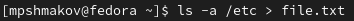

---
## Front matter
lang: ru-RU
title: Отчет по лабораторной работе №6
author: |
	Шмаков Максим\inst{1}
institute: |
	\inst{1}RUDN University, Moscow, Russian Federation
date: 2022, 7 мая , Москва

## Formatting
toc: false
slide_level: 2
theme: metropolis
header-includes: 
 - \metroset{progressbar=frametitle,sectionpage=progressbar,numbering=fraction}
 - '\makeatletter'
 - '\beamer@ignorenonframefalse'
 - '\makeatother'
aspectratio: 43
section-titles: true
---

# Цель работы

Ознакомление с инструментами поиска файлов и фильтрации текстовых данных.
Приобретение практических навыков: по управлению процессами (и заданиями), по проверке использования диска и обслуживанию файловых систем.

## 1. Осуществите вход в систему, используя соответствующее имя пользователя. (рис. [-@fig:001])

{ #fig:001 width=70% }

## 2. Запишите в файл file.txt названия файлов, содержащихся в каталоге /etc. Допишите в этот же файл названия файлов, содержащихся в вашем домашнем каталоге. 

Использую одну > в первой команде, потому что записываю первый раз и >> во второй команде, чтобы не переписать предыдущюю информацию. (рис. [-@fig:002]) (рис. [-@fig:003])

{ #fig:002 width=70% }

## 2. Запишите в файл file.txt названия файлов, содержащихся в каталоге /etc. Допишите в этот же файл названия файлов, содержащихся в вашем домашнем каталоге. 

{ #fig:003 width=70% }

## 3. Выведите имена всех файлов из file.txt, имеющих расширение .conf, после чего запишите их в новый текстовой файл conf.txt. (рис. [-@fig:004])

{ #fig:004 width=70% }

## 4. Определите, какие файлы в вашем домашнем каталоге имеют имена, начинавшиеся с символа c? Предложите несколько вариантов, как это сделать. (рис. [-@fig:005])

{ #fig:005 width=70% }

## 5. Выведите на экран (по странично) имена файлов из каталога /etc, начинающиеся с символа h. (рис. [-@fig:006])

{ #fig:006 width=70% }

## 6. Запустите в фоновом режиме процесс, который будет записывать в файл ~/logfile файлы, имена которых начинаются с log. (рис. [-@fig:007]) (рис. [-@fig:008])

{ #fig:007 width=70% }

## 7. Удалите файл ~/logfile. (рис. [-@fig:009])

{ #fig:009 width=70% }

## 8. Запустите из консоли в фоновом режиме редактор gedit. (рис. [-@fig:010])

{ #fig:010 width=70% }

## 9. Определите идентификатор процесса gedit, используя команду ps, конвейер и фильтр grep. Как ещё можно определить идентификатор процесса? (рис. [-@fig:011])

{ #fig:011 width=70% }

## 10. Прочтите справку (man) команды kill, после чего используйте её для завершения процесса gedit. (рис. [-@fig:0012]) (рис. [-@fig:013])

{ #fig:012 width=70% }

## 10. Прочтите справку (man) команды kill, после чего используйте её для завершения процесса gedit. (рис. [-@fig:0012]) (рис. [-@fig:013])

{ #fig:013 width=70% }

## 11. Выполните команды df и du, предварительно получив более подробную информацию об этих командах, с помощью команды man. (рис. [-@fig:014])

{ #fig:014 width=70% }

## 12. Воспользовавшись справкой команды find, выведите имена всех директорий, имеющихся в вашем домашнем каталоге. (рис. [-@fig:015])

{ #fig:015 width=70% }

# Выводы

В ходе работы я ознакомался с инструментами поиска файлов и фильтрации текстовых данных, научился управлять процессами и заданиями и понял как проверять использование диска и обслуживать файловые системы.

