---
## Front matter
title: "Отчет по лабораторной работе №5"
subtitle: "дисциплина: операционные системы"
author: "Шмаков Максим Павлович"

## Generic otions
lang: ru-RU
toc-title: "Содержание"

## Bibliography
bibliography: bib/cite.bib
csl: pandoc/csl/gost-r-7-0-5-2008-numeric.csl

## Pdf output format
toc: true # Table of contents
toc-depth: 2
lof: true # List of figures
lot: true # List of tables
fontsize: 12pt
linestretch: 1.5
papersize: a4
documentclass: scrreprt
## I18n polyglossia
polyglossia-lang:
  name: russian
  options:
	- spelling=modern
	- babelshorthands=true
polyglossia-otherlangs:
  name: english
## I18n babel
babel-lang: russian
babel-otherlangs: english
## Fonts
mainfont: PT Serif
romanfont: PT Serif
sansfont: PT Sans
monofont: PT Mono
mainfontoptions: Ligatures=TeX
romanfontoptions: Ligatures=TeX
sansfontoptions: Ligatures=TeX,Scale=MatchLowercase
monofontoptions: Scale=MatchLowercase,Scale=0.9
## Biblatex
biblatex: true
biblio-style: "gost-numeric"
biblatexoptions:
  - parentracker=true
  - backend=biber
  - hyperref=auto
  - language=auto
  - autolang=other*
  - citestyle=gost-numeric
## Pandoc-crossref LaTeX customization
figureTitle: "Рис."
tableTitle: "Таблица"
listingTitle: "Листинг"
lofTitle: "Список иллюстраций"
lotTitle: "Список таблиц"
lolTitle: "Листинги"
## Misc options
indent: true
header-includes:
  - \usepackage{indentfirst}
  - \usepackage{float} # keep figures where there are in the text
  - \floatplacement{figure}{H} # keep figures where there are in the text
---

# Цель работы

Ознакомление с инструментами поиска файлов и фильтрации текстовых данных.
Приобретение практических навыков: по управлению процессами (и заданиями), по проверке использования диска и обслуживанию файловых систем.

# Задание

1. Осуществите вход в систему, используя соответствующее имя пользователя.
2. Запишите в файл file.txt названия файлов, содержащихся в каталоге /etc. Допишите в этот же файл названия файлов, содержащихся в вашем домашнем каталоге.
3. Выведите имена всех файлов из file.txt, имеющих расширение .conf, после чего запишите их в новый текстовой файл conf.txt.
4. Определите, какие файлы в вашем домашнем каталоге имеют имена, начинавшиеся
с символа c? Предложите несколько вариантов, как это сделать.
5. Выведите на экран (по странично) имена файлов из каталога /etc, начинающиеся
с символа h.
6. Запустите в фоновом режиме процесс, который будет записывать в файл ~/logfile файлы, имена которых начинаются с log.
7. Удалите файл ~/logfile.
8. Запустите из консоли в фоновом режиме редактор gedit.
9. Определите идентификатор процесса gedit, используя команду ps, конвейер и фильтр
grep. Как ещё можно определить идентификатор процесса?
10. Прочтите справку (man) команды kill, после чего используйте её для завершения
процесса gedit.
11. Выполните команды df и du, предварительно получив более подробную информацию об этих командах, с помощью команды man.
12. Воспользовавшись справкой команды find, выведите имена всех директорий, имеющихся в вашем домашнем каталоге.

# Выполнение лабораторной работы

1. Осуществите вход в систему, используя соответствующее имя пользователя. (рис. [-@fig:001])

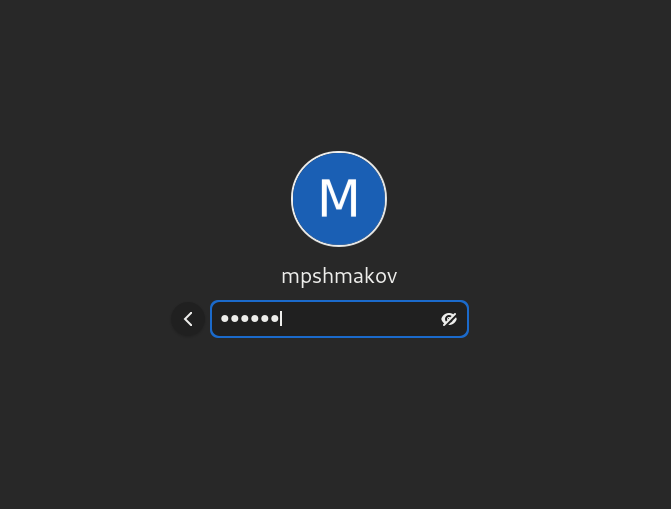{ #fig:001 width=70% }

2. Запишите в файл file.txt названия файлов, содержащихся в каталоге /etc. Допишите в этот же файл названия файлов, содержащихся в вашем домашнем каталоге. 

Использую одну > в первой команде, потому что записываю первый раз и >> во второй команде, чтобы не переписать предыдущюю информацию. (рис. [-@fig:002]) (рис. [-@fig:003])

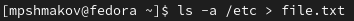{ #fig:002 width=70% }
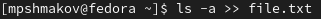{ #fig:003 width=70% }

3. Выведите имена всех файлов из file.txt, имеющих расширение .conf, после чего запишите их в новый текстовой файл conf.txt. (рис. [-@fig:004])

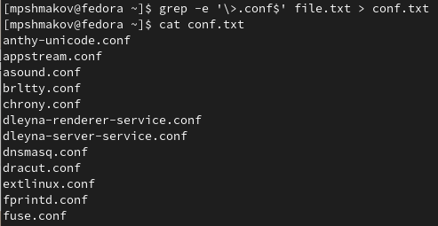{ #fig:004 width=70% }

4. Определите, какие файлы в вашем домашнем каталоге имеют имена, начинавшиеся
с символа c? Предложите несколько вариантов, как это сделать. (рис. [-@fig:005])

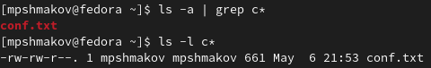{ #fig:005 width=70% }

5. Выведите на экран (по странично) имена файлов из каталога /etc, начинающиеся
с символа h. (рис. [-@fig:006])

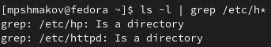{ #fig:006 width=70% }

6. Запустите в фоновом режиме процесс, который будет записывать в файл ~/logfile файлы, имена которых начинаются с log. (рис. [-@fig:007]) (рис. [-@fig:008])

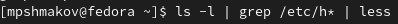{ #fig:007 width=70% }
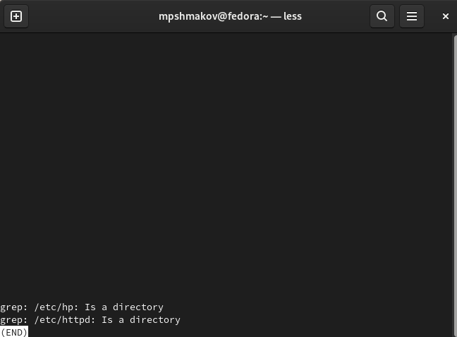{ #fig:008 width=70% }

7. Удалите файл ~/logfile. (рис. [-@fig:009])

{ #fig:009 width=70% }

8. Запустите из консоли в фоновом режиме редактор gedit. (рис. [-@fig:010])

{ #fig:010 width=70% }

9. Определите идентификатор процесса gedit, используя команду ps, конвейер и фильтр
grep. Как ещё можно определить идентификатор процесса? (рис. [-@fig:011])

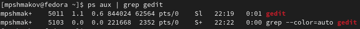{ #fig:011 width=70% }

10. Прочтите справку (man) команды kill, после чего используйте её для завершения процесса gedit. (рис. [-@fig:0012]) (рис. [-@fig:013])

{ #fig:012 width=70% }

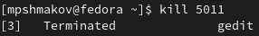{ #fig:013 width=70% }

11. Выполните команды df и du, предварительно получив более подробную информацию об этих командах, с помощью команды man. (рис. [-@fig:014])

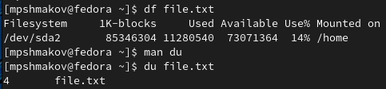{ #fig:014 width=70% }

12. Воспользовавшись справкой команды find, выведите имена всех директорий, имеющихся в вашем домашнем каталоге. (рис. [-@fig:015])

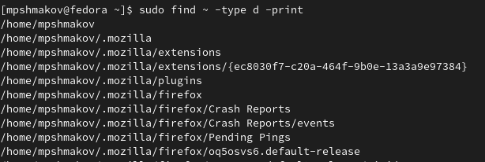{ #fig:015 width=70% }

# Выводы

В ходе работы я ознакомался с инструментами поиска файлов и фильтрации текстовых данных, научился управлять процессами и заданиями и понял как проверять использование диска и обслуживать файловые системы.

# Контрольные вопросы

1. Я знаю поток ввода stdin, поток выводa stdout и поток вывода сообщения об ошибке stderr.

2. Операция > записывает информацию в файл, а >> добавляет. То есть, если к файлу с информацией применять операцию >, то вся информация перезапишется, в то же время >> добавит ее к существующей.

3. Конвейер служит для объединения команд в одну цепь засчет того, что результат предыдущей команды передается следующей.

4. Процесс - это активная программа.

5. PID - process id - индентификатор процесса (номер).
GID - group id - идентификатор группы (номер)

6. Задачи - запущенные фоном программы. Их список можно получить с помощью команды jobs и уничтожить задачу командой kill %номер.

7. top - команда, которая выводит список работающих процессов и информацию о них. htop - то же самое, но можно прокручивть список процессов вертикально и горизонтально, чтобы видеть их полные размеры запуска, а также управление процессами без ручного ввода их идентификаторов.

8. find - команда для поиска файлов. Ее синтаксис find путь (-опции). Путь определяет каталог, начиная с которого по всем подкаталогам будет вестись поиск. 
Пример:
Вывести на экран имена файлов из вашего домашнего каталога и его подкаталогов, начинающихся на d:

find ~ -name "d*" -print

Здесь ~ — обозначение вашего домашнего каталога, -name — после этой опции указывается имя файла, который нужно найти, "d*" — строка символов, определяющая имя файла, -print — опция, задающая вывод результатов поиска на экран.

9. Можно. С помощью этой команды grep (контекст) (путь)

10. С помощью команды df можно посмотреть количество свободной и занятой памяти на жестком диске и других файловых систем.

11. С помощью команды "du ~".

12. Прописать команду jobs, найти процесс и его номер и убить его командой kill %номер.

