---
## Front matter
lang: ru-RU
title: Отчет по лабораторной работе №7
author: |
	Шмаков Максим\inst{1}
institute: |
	\inst{1}RUDN University, Moscow, Russian Federation
date: 2022, 13 мая , Москва

## Formatting
toc: false
slide_level: 2
theme: metropolis
header-includes: 
 - \metroset{progressbar=frametitle,sectionpage=progressbar,numbering=fraction}
 - '\makeatletter'
 - '\beamer@ignorenonframefalse'
 - '\makeatother'
aspectratio: 43
section-titles: true
---

# Цель работы

## Цель работы

Освоение основных возможностей командной оболочки Midnight Commander. Приобретение навыков практической работы по просмотру каталогов и файлов; манипуляций с ними.

## 1. Изучите информацию о mc, вызвав в командной строке man mc. (рис. [-@fig:001]) (рис. [-@fig:002])

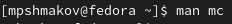{ #fig:001 width=70% }

## 1. Изучите информацию о mc, вызвав в командной строке man mc. (рис. [-@fig:001]) (рис. [-@fig:002])

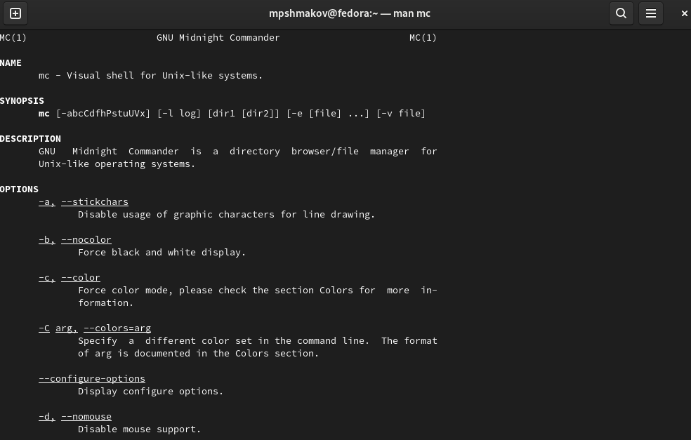{ #fig:002 width=70% }

## 2. Запустите из командной строки mc, изучите его структуру и меню. (рис. [-@fig:003])

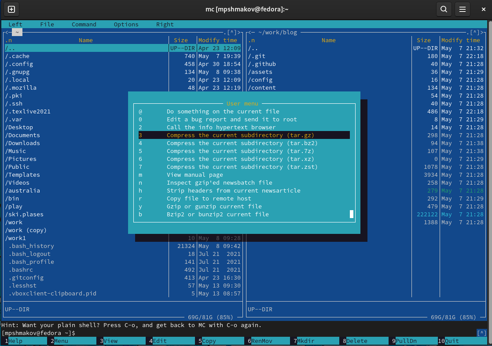{ #fig:003 width=70% }

## 3. Выполните несколько операций в mc, используя управляющие клавиши (операции с панелями; выделение/отмена выделения файлов, копирование/перемещение файлов, получение информации о размере и правах доступа на файлы и/или каталоги и т.п.)

Переставляю панели местами с помощью control + u (рис. [-@fig:004])  (рис. [-@fig:005])
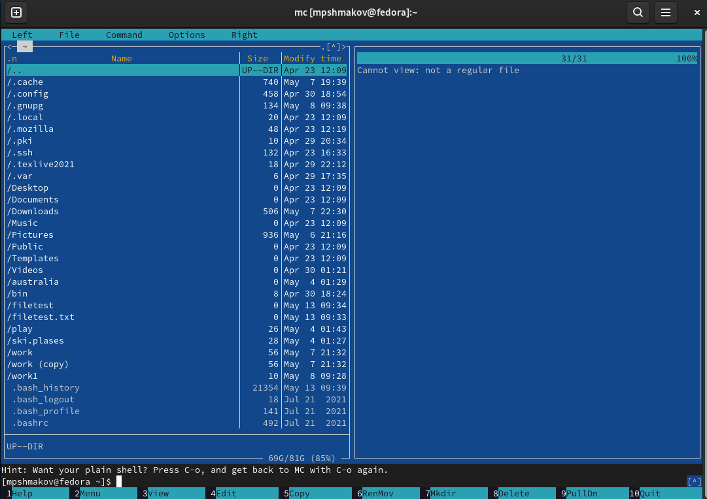{ #fig:004 width=70% }

## 3. Выполните несколько операций в mc, используя управляющие клавиши (операции с панелями; выделение/отмена выделения файлов, копирование/перемещение файлов, получение информации о размере и правах доступа на файлы и/или каталоги и т.п.)

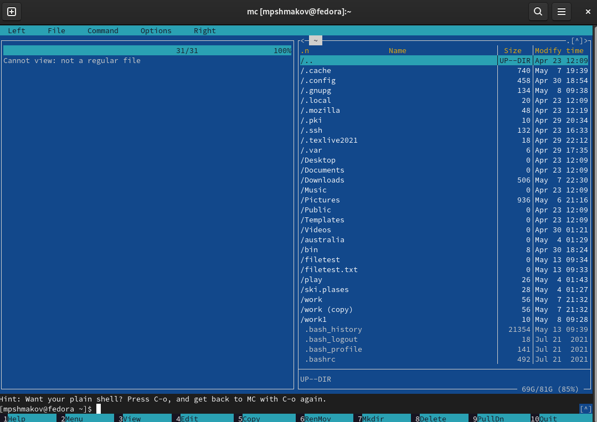{ #fig:005 width=70% }

## 3. Выполните несколько операций в mc, используя управляющие клавиши (операции с панелями; выделение/отмена выделения файлов, копирование/перемещение файлов, получение информации о размере и правах доступа на файлы и/или каталоги и т.п.)

Выделяю файлы с помощью shift + стрелочки вниз вверх и так же выбираю выделение  (рис. [-@fig:006])  (рис. [-@fig:007])
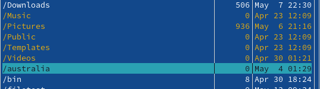{ #fig:006 width=70% }

## 3. Выполните несколько операций в mc, используя управляющие клавиши (операции с панелями; выделение/отмена выделения файлов, копирование/перемещение файлов, получение информации о размере и правах доступа на файлы и/или каталоги и т.п.)

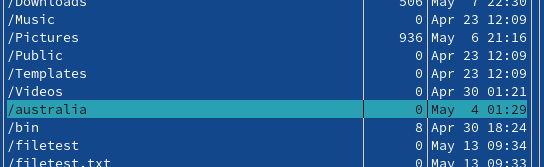{ #fig:007 width=70% }

## 3. Выполните несколько операций в mc, используя управляющие клавиши (операции с панелями; выделение/отмена выделения файлов, копирование/перемещение файлов, получение информации о размере и правах доступа на файлы и/или каталоги и т.п.)

Перемещение файлов  (рис. [-@fig:008])  (рис. [-@fig:009])
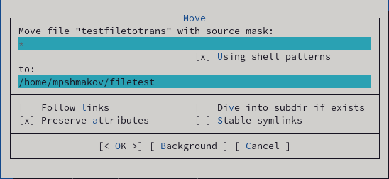{ #fig:008 width=70% }

## 3. Выполните несколько операций в mc, используя управляющие клавиши (операции с панелями; выделение/отмена выделения файлов, копирование/перемещение файлов, получение информации о размере и правах доступа на файлы и/или каталоги и т.п.)

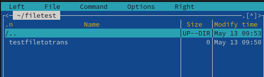{ #fig:009 width=70% }

## 3. Выполните несколько операций в mc, используя управляющие клавиши (операции с панелями; выделение/отмена выделения файлов, копирование/перемещение файлов, получение информации о размере и правах доступа на файлы и/или каталоги и т.п.)

Получаение информации о размере и правах доступа на файлы  (рис. [-@fig:010])  (рис. [-@fig:011])  (рис. [-@fig:012])
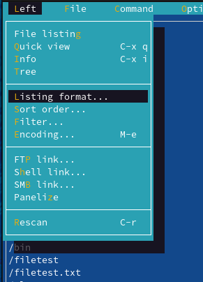{ #fig:010 width=70% }

## 3. Выполните несколько операций в mc, используя управляющие клавиши (операции с панелями; выделение/отмена выделения файлов, копирование/перемещение файлов, получение информации о размере и правах доступа на файлы и/или каталоги и т.п.)

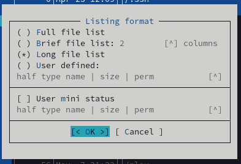{ #fig:011 width=70% }

## 3. Выполните несколько операций в mc, используя управляющие клавиши (операции с панелями; выделение/отмена выделения файлов, копирование/перемещение файлов, получение информации о размере и правах доступа на файлы и/или каталоги и т.п.)

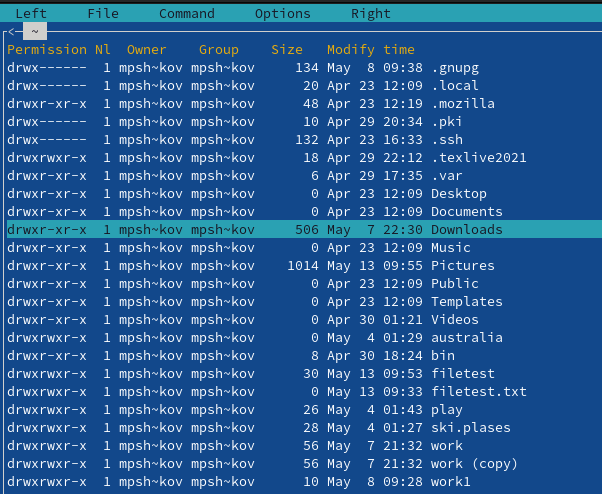{ #fig:012 width=70% }

## 4. Выполните основные команды меню левой (или правой) панели. Оцените степень подробности вывода информации о файлах. (рис. [-@fig:013]) (рис. [-@fig:014])  (рис. [-@fig:015])  (рис. [-@fig:016])

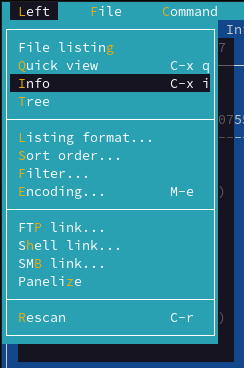{ #fig:013 width=70% }

## 4. Выполните основные команды меню левой (или правой) панели. Оцените степень подробности вывода информации о файлах. (рис. [-@fig:013]) (рис. [-@fig:014])  (рис. [-@fig:015])  (рис. [-@fig:016])

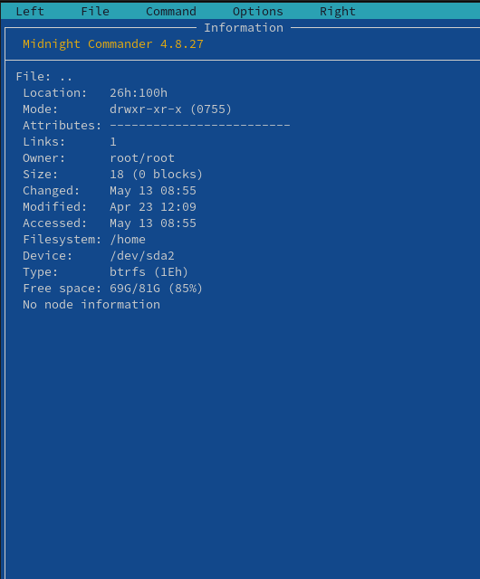{ #fig:014 width=70% }

## 4. Выполните основные команды меню левой (или правой) панели. Оцените степень подробности вывода информации о файлах. (рис. [-@fig:013]) (рис. [-@fig:014])  (рис. [-@fig:015])  (рис. [-@fig:016])

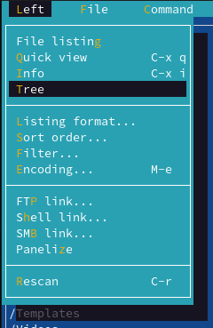{ #fig:015 width=70% }

## 4. Выполните основные команды меню левой (или правой) панели. Оцените степень подробности вывода информации о файлах. (рис. [-@fig:013]) (рис. [-@fig:014])  (рис. [-@fig:015])  (рис. [-@fig:016])

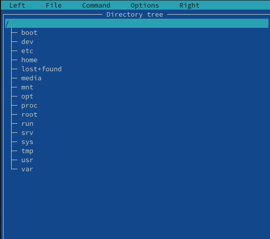{ #fig:016 width=70% }

## 5. Используя возможности подменю Файл , выполните: – просмотр содержимого текстового файла;(рис. [-@fig:017]) (рис. [-@fig:018])( рис. [-@fig:019])

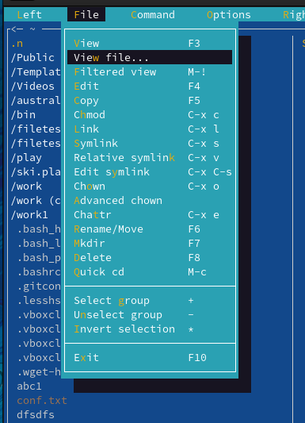{ #fig:017 width=70% }

## 5. Используя возможности подменю Файл , выполните: 
– просмотр содержимого текстового файла;(рис. [-@fig:017]) (рис. [-@fig:018])( рис. [-@fig:019])

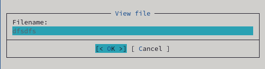{ #fig:018 width=70% }

## 5. Используя возможности подменю Файл , выполните: 

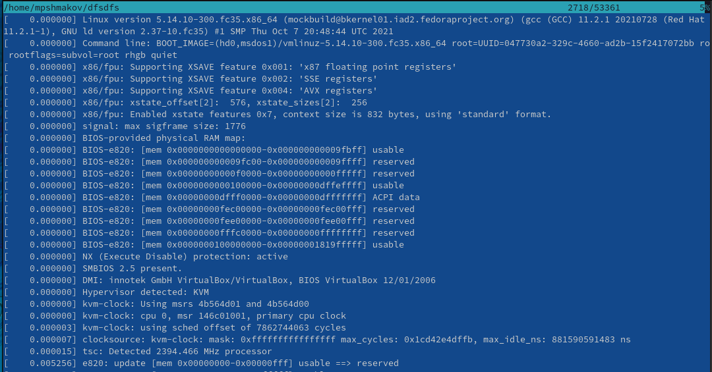{ #fig:019 width=70% }

## 5. Используя возможности подменю Файл , выполните: 
– редактирование содержимого текстового файла (без сохранения результатов редактирования);
– создание каталога;(рис. [-@fig:020]) (рис. [-@fig:021]) (рис. [-@fig:022])

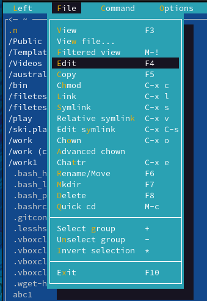{ #fig:020 width=70% }

## 5. Используя возможности подменю Файл , выполните: 

{ #fig:021 width=70% }

## 5. Используя возможности подменю Файл , выполните:

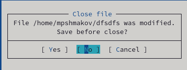{ #fig:022 width=70% }

## 5. Используя возможности подменю Файл , выполните: 
– копирование в файлов в созданный каталог.(рис. [-@fig:023]) (рис. [-@fig:024]) (рис. [-@fig:025]) (рис. [-@fig:026])

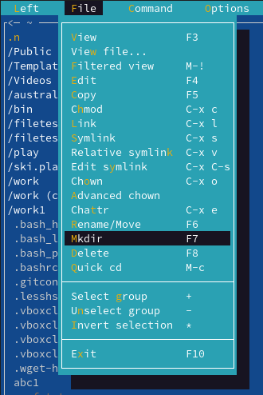{ #fig:023 width=70% }

## 5. Используя возможности подменю Файл , выполните:

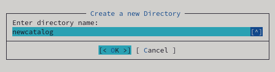{ #fig:024 width=70% }

## 5. Используя возможности подменю Файл , выполните: 

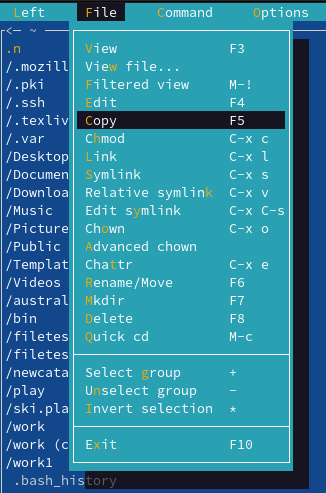{ #fig:025 width=70% }

## 5. Используя возможности подменю Файл , выполните:

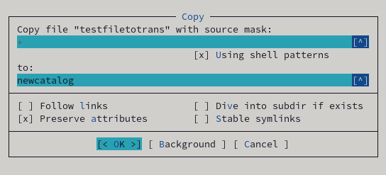{ #fig:026 width=70% }

## 6. С помощью соответствующих средств подменю Команда осуществите:
– поиск в файловой системе файла с заданными условиями (например, файла с расширением .c или .cpp, содержащего строку main);  (рис. [-@fig:027])  (рис. [-@fig:028])  (рис. [-@fig:029])

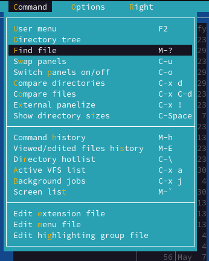{ #fig:027 width=70% }

## 6. С помощью соответствующих средств подменю Команда осуществите:

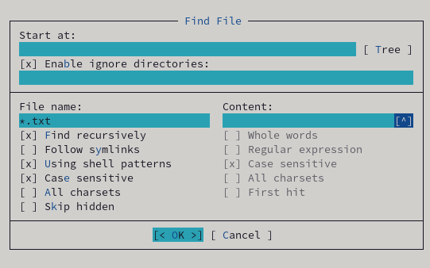{ #fig:028 width=70% }

## 6. С помощью соответствующих средств подменю Команда осуществите:

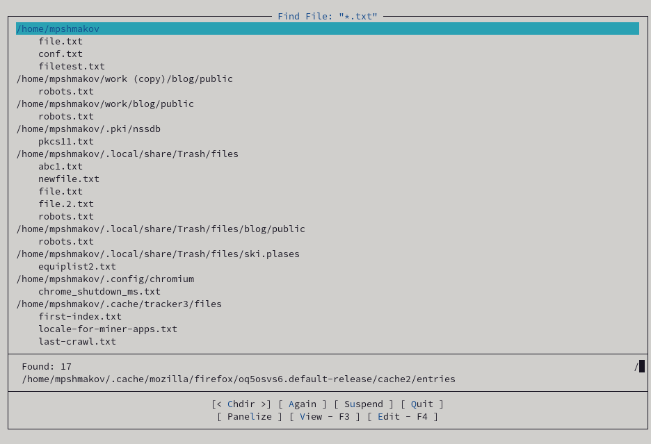{ #fig:029 width=70% }

## 6. С помощью соответствующих средств подменю Команда осуществите:

– выбор и повторение одной из предыдущих команд; (рис. [-@fig:030]) (рис. [-@fig:031])

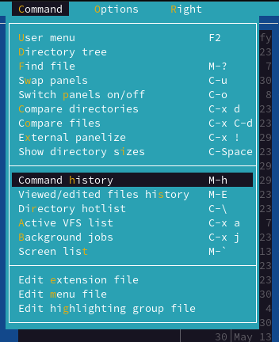{ #fig:030 width=70% }

## 6. С помощью соответствующих средств подменю Команда осуществите:

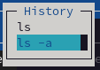{ #fig:031 width=70% }

## 6. С помощью соответствующих средств подменю Команда осуществите:

– переход в домашний каталог;  (рис. [-@fig:032]) (рис. [-@fig:033])

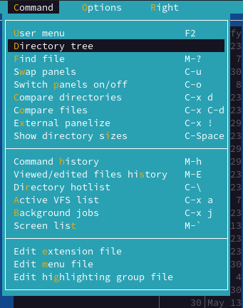{ #fig:032 width=70% }

## 6. С помощью соответствующих средств подменю Команда осуществите:

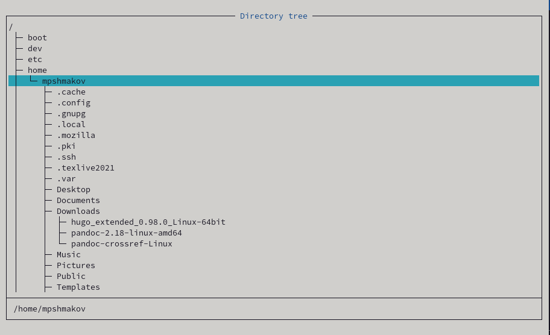{ #fig:033 width=70% }

## 6. С помощью соответствующих средств подменю Команда осуществите:

– анализ файла меню и файла расширений. (рис. [-@fig:034]) (рис. [-@fig:035]) (рис. [-@fig:036]) (рис. [-@fig:037]) (рис. [-@fig:038])

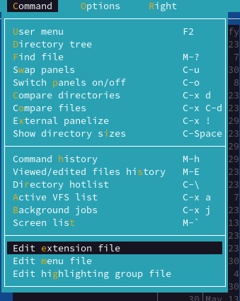{ #fig:034 width=70% }

## 6. С помощью соответствующих средств подменю Команда осуществите:

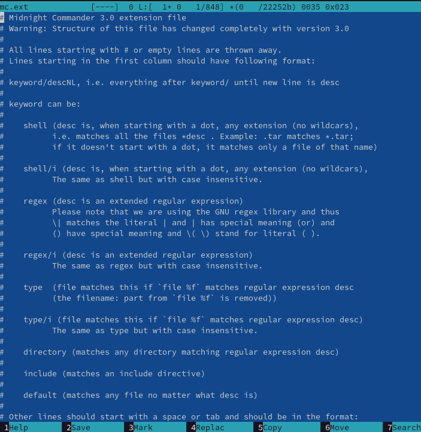{ #fig:035 width=70% }

## 6. С помощью соответствующих средств подменю Команда осуществите:

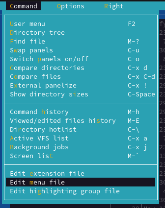{ #fig:036 width=70% }

## 6. С помощью соответствующих средств подменю Команда осуществите:

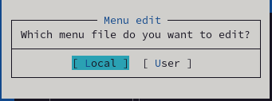{ #fig:037 width=70% }

## 6. С помощью соответствующих средств подменю Команда осуществите:

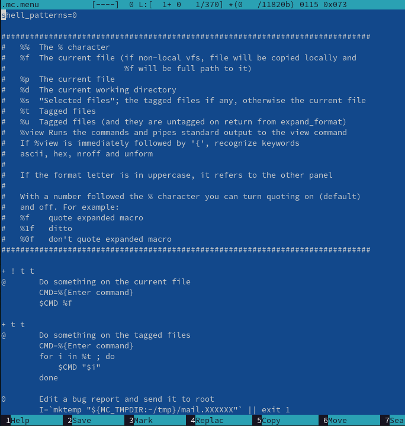{ #fig:038 width=70% }

## 7. Вызовите подменю Настройки . Освойте операции, определяющие структуру экрана mc (Full screen, Double Width, Show Hidden Files и т.д.). (рис. [-@fig:039])

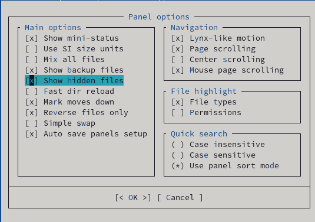{ #fig:039 width=70% }

# Задание по встроенному редактору mc

## 1. Создайте текстовой файл text.txt. (рис. [-@fig:040])

{ #fig:040 width=70% }

## 2. Откройте этот файл с помощью встроенного в mc редактора. (рис. [-@fig:041])

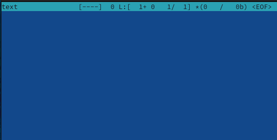{ #fig:041 width=70% }

## 3. Вставьте в открытый файл небольшой фрагмент текста, скопированный из любого другого файла или Интернета. (рис. [-@fig:042])

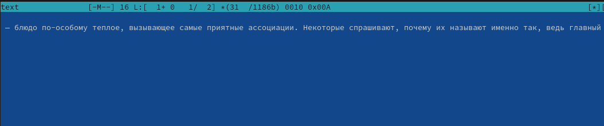{ #fig:042 width=70% }

## 4. Проделайте с текстом следующие манипуляции, используя горячие клавиши:

Удалите строку текста. (рис. [-@fig:043]) (рис. [-@fig:044])

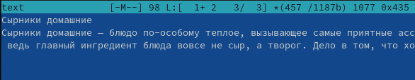{ #fig:043 width=70% }

## 4. Проделайте с текстом следующие манипуляции, используя горячие клавиши:

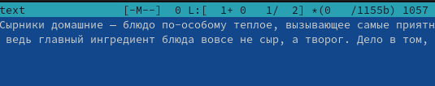{ #fig:044 width=70% }

## 4. Проделайте с текстом следующие манипуляции, используя горячие клавиши:
Выделите фрагмент текста и скопируйте его на новую строку. (рис. [-@fig:045])

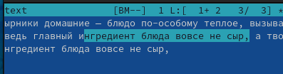{ #fig:045 width=70% }

## 4. Проделайте с текстом следующие манипуляции, используя горячие клавиши:

Выделите фрагмент текста и перенесите его на новую строку. (рис. [-@fig:046]) (рис. [-@fig:047])

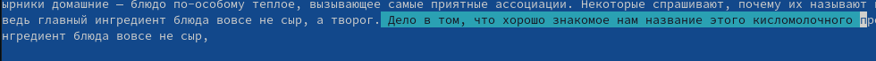{ #fig:046 width=70% }

## 4. Проделайте с текстом следующие манипуляции, используя горячие клавиши:

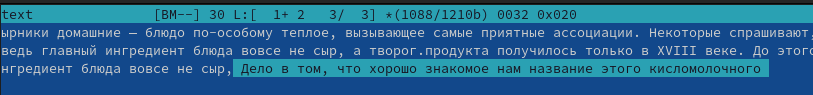{ #fig:047 width=70% }

## 4. Проделайте с текстом следующие манипуляции, используя горячие клавиши:

Сохраните файл. (рис. [-@fig:048])

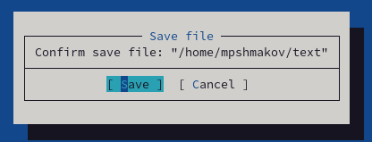{ #fig:048 width=70% }

## 4. Проделайте с текстом следующие манипуляции, используя горячие клавиши:

Отмените последнее действие. (рис. [-@fig:049])

{ #fig:049 width=70% }

## 4. Проделайте с текстом следующие манипуляции, используя горячие клавиши:

Перейдите в конец файла (нажав комбинацию клавиш) и напишите некоторый текст. 
С помощью END и стрелочек (рис. [-@fig:050])

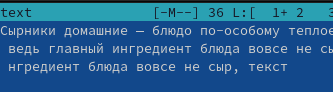{ #fig:050 width=70% }

## 4. Проделайте с текстом следующие манипуляции, используя горячие клавиши:

Перейдите в начало файла (нажав комбинацию клавиш) и напишите некоторый текст. 
С помощью HOME и стрелочек (рис. [-@fig:051])

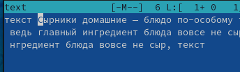{ #fig:051 width=70% }

## 4. Проделайте с текстом следующие манипуляции, используя горячие клавиши:

Сохраните и закройте файл. (рис. [-@fig:052])

{ #fig:052 width=70% }

## 5. Откройте файл с исходным текстом на некотором языке программирования (например C или Java) (рис. [-@fig:053])
(с помощью F3)
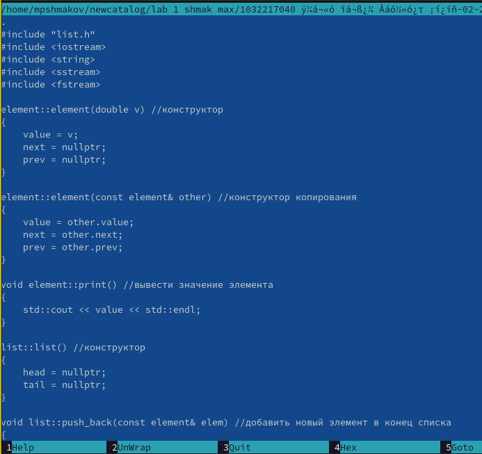{ #fig:053 width=70% }

## 6. Используя меню редактора, включите подсветку синтаксиса, если она не включена, или выключите, если она включена. (рис. [-@fig:054])
(c помощью F4)
{ #fig:054 width=70% }

# Выводы

## Выводы

В ходе работы я научился пользоваться Midnight commander. Научился просматривать каталоги и файлы и выполнять операции с ними.

