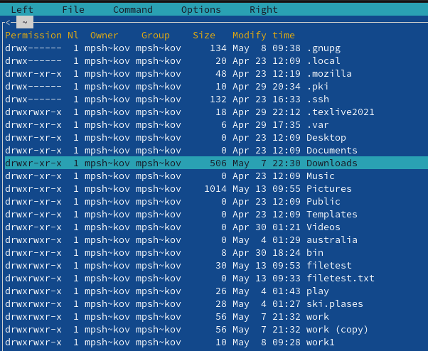
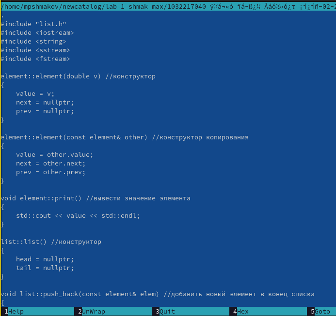

---
## Front matter
title: "Отчет по лабораторной работе №7"
subtitle: "дисциплина: операционные системы"
author: "Шмаков Максим Павлович"

## Generic otions
lang: ru-RU
toc-title: "Содержание"

## Bibliography
bibliography: bib/cite.bib
csl: pandoc/csl/gost-r-7-0-5-2008-numeric.csl

## Pdf output format
toc: true # Table of contents
toc-depth: 2
lof: true # List of figures
lot: true # List of tables
fontsize: 12pt
linestretch: 1.5
papersize: a4
documentclass: scrreprt
## I18n polyglossia
polyglossia-lang:
  name: russian
  options:
	- spelling=modern
	- babelshorthands=true
polyglossia-otherlangs:
  name: english
## I18n babel
babel-lang: russian
babel-otherlangs: english
## Fonts
mainfont: PT Serif
romanfont: PT Serif
sansfont: PT Sans
monofont: PT Mono
mainfontoptions: Ligatures=TeX
romanfontoptions: Ligatures=TeX
sansfontoptions: Ligatures=TeX,Scale=MatchLowercase
monofontoptions: Scale=MatchLowercase,Scale=0.9
## Biblatex
biblatex: true
biblio-style: "gost-numeric"
biblatexoptions:
  - parentracker=true
  - backend=biber
  - hyperref=auto
  - language=auto
  - autolang=other*
  - citestyle=gost-numeric
## Pandoc-crossref LaTeX customization
figureTitle: "Рис."
tableTitle: "Таблица"
listingTitle: "Листинг"
lofTitle: "Список иллюстраций"
lotTitle: "Список таблиц"
lolTitle: "Листинги"
## Misc options
indent: true
header-includes:
  - \usepackage{indentfirst}
  - \usepackage{float} # keep figures where there are in the text
  - \floatplacement{figure}{H} # keep figures where there are in the text
---

# Цель работы

Освоение основных возможностей командной оболочки Midnight Commander. Приобретение навыков практической работы по просмотру каталогов и файлов; манипуляций с ними.

# Задание

1. Изучите информацию о mc, вызвав в командной строке man mc.
2. Запустите из командной строки mc, изучите его структуру и меню.
3. Выполните несколько операций в mc, используя управляющие клавиши (операции
с панелями; выделение/отмена выделения файлов, копирование/перемещение файлов, получение информации о размере и правах доступа на файлы и/или каталоги и т.п.)
4. Выполните основные команды меню левой (или правой) панели. Оцените степень подробности вывода информации о файлах.
5. Используя возможности подменю Файл , выполните:
– просмотр содержимого текстового файла;
– редактирование содержимого текстового файла (без сохранения результатов редактирования);
– создание каталога;
– копирование в файлов в созданный каталог.
6. С помощью соответствующих средств подменю Команда осуществите:
– поиск в файловой системе файла с заданными условиями (например, файла с расширением .c или .cpp, содержащего строку main);
– выбор и повторение одной из предыдущих команд;
– переход в домашний каталог;
– анализ файла меню и файла расширений.
7. Вызовите подменю Настройки . Освойте операции, определяющие структуру экрана mc
(Full screen, Double Width, Show Hidden Files и т.д.)ю

Задание по встроенному редактору mc
1. Создайте текстовой файл text.txt.
2. Откройте этот файл с помощью встроенного в mc редактора.
3. Вставьте в открытый файл небольшой фрагмент текста, скопированный из любого
другого файла или Интернета.
4. Проделайте с текстом следующие манипуляции, используя горячие клавиши:
4.1. Удалите строку текста.
4.2. Выделите фрагмент текста и скопируйте его на новую строку.
Кулябов Д. С. и др. Операционные системы 69
4.3. Выделите фрагмент текста и перенесите его на новую строку.
4.4. Сохраните файл.
4.5. Отмените последнее действие.
4.6. Перейдите в конец файла (нажав комбинацию клавиш) и напишите некоторый
текст.
4.7. Перейдите в начало файла (нажав комбинацию клавиш) и напишите некоторый
текст.
4.8. Сохраните и закройте файл.
5. Откройте файл с исходным текстом на некотором языке программирования (например C или Java)
6. Используя меню редактора, включите подсветку синтаксиса, если она не включена, или выключите, если она включена.

# Выполнение лабораторной работы

1. Изучите информацию о mc, вызвав в командной строке man mc. (рис. [-@fig:001]) (рис. [-@fig:002])

{ #fig:001 width=70% }

{ #fig:002 width=70% }

2. Запустите из командной строки mc, изучите его структуру и меню. (рис. [-@fig:003])

{ #fig:003 width=70% }

3. Выполните несколько операций в mc, используя управляющие клавиши (операции с панелями; выделение/отмена выделения файлов, копирование/перемещение файлов, получение информации о размере и правах доступа на файлы и/или каталоги и т.п.)

Переставляю панели местами с помощью control + u (рис. [-@fig:004])  (рис. [-@fig:005])

{ #fig:004 width=70% }
{ #fig:005 width=70% }

Выделяю файлы с помощью shift + стрелочки вниз вверх и так же выбираю выделение  (рис. [-@fig:006])  (рис. [-@fig:007])

{ #fig:006 width=70% }
{ #fig:007 width=70% }

Перемещение файлов  (рис. [-@fig:008])  (рис. [-@fig:009])

{ #fig:008 width=70% }
{ #fig:009 width=70% }

Получаение информации о размере и правах доступа на файлы  (рис. [-@fig:010])  (рис. [-@fig:011])  (рис. [-@fig:012])

{ #fig:010 width=70% }

{ #fig:011 width=70% }

{ #fig:012 width=70% }

4. Выполните основные команды меню левой (или правой) панели. Оцените степень подробности вывода информации о файлах. (рис. [-@fig:013]) (рис. [-@fig:014])  (рис. [-@fig:015])  (рис. [-@fig:016])

{ #fig:013 width=70% }

{ #fig:014 width=70% }

{ #fig:015 width=70% }

{ #fig:016 width=70% }

5. Используя возможности подменю Файл , выполните:
– просмотр содержимого текстового файла;(рис. [-@fig:017]) (рис. [-@fig:018])( рис. [-@fig:019])

{ #fig:017 width=70% }

{ #fig:018 width=70% }

{ #fig:019 width=70% }

– редактирование содержимого текстового файла (без сохранения результатов редактирования);
– создание каталога;(рис. [-@fig:020]) (рис. [-@fig:021]) (рис. [-@fig:022])

{ #fig:020 width=70% }

{ #fig:021 width=70% }
 
{ #fig:022 width=70% }

– копирование в файлов в созданный каталог.(рис. [-@fig:023]) (рис. [-@fig:024]) (рис. [-@fig:025]) (рис. [-@fig:026])

{ #fig:023 width=70% }

{ #fig:024 width=70% }

{ #fig:025 width=70% }

{ #fig:026 width=70% }

6. С помощью соответствующих средств подменю Команда осуществите:
– поиск в файловой системе файла с заданными условиями (например, файла с расширением .c или .cpp, содержащего строку main);  (рис. [-@fig:027])  (рис. [-@fig:028])  (рис. [-@fig:029])

{ #fig:027 width=70% }

{ #fig:028 width=70% }

{ #fig:029 width=70% }

– выбор и повторение одной из предыдущих команд; (рис. [-@fig:030]) (рис. [-@fig:031])

{ #fig:030 width=70% }

{ #fig:031 width=70% }

– переход в домашний каталог;  (рис. [-@fig:032]) (рис. [-@fig:033])

{ #fig:032 width=70% }

{ #fig:033 width=70% }

– анализ файла меню и файла расширений. (рис. [-@fig:034]) (рис. [-@fig:035]) (рис. [-@fig:036]) (рис. [-@fig:037]) (рис. [-@fig:038])

{ #fig:034 width=70% }

{ #fig:035 width=70% }

{ #fig:036 width=70% }

{ #fig:037 width=70% }

{ #fig:038 width=70% }

7. Вызовите подменю Настройки . Освойте операции, определяющие структуру экрана mc (Full screen, Double Width, Show Hidden Files и т.д.). (рис. [-@fig:039])

{ #fig:039 width=70% }

Задание по встроенному редактору mc
1. Создайте текстовой файл text.txt. (рис. [-@fig:040])

{ #fig:040 width=70% }

2. Откройте этот файл с помощью встроенного в mc редактора. (рис. [-@fig:041])

{ #fig:041 width=70% }

3. Вставьте в открытый файл небольшой фрагмент текста, скопированный из любого другого файла или Интернета. (рис. [-@fig:042])

{ #fig:042 width=70% }

4. Проделайте с текстом следующие манипуляции, используя горячие клавиши:
4.1. Удалите строку текста. (рис. [-@fig:043]) (рис. [-@fig:044])

{ #fig:043 width=70% }

{ #fig:044 width=70% }

4.2. Выделите фрагмент текста и скопируйте его на новую строку. (рис. [-@fig:045])

{ #fig:045 width=70% }

4.3. Выделите фрагмент текста и перенесите его на новую строку. (рис. [-@fig:046]) (рис. [-@fig:047])

{ #fig:046 width=70% }

{ #fig:047 width=70% }

4.4. Сохраните файл. (рис. [-@fig:048])

{ #fig:048 width=70% }

4.5. Отмените последнее действие. (рис. [-@fig:049])

{ #fig:049 width=70% }

4.6. Перейдите в конец файла (нажав комбинацию клавиш) и напишите некоторый
текст. 
С помощью END и стрелочек (рис. [-@fig:050])

{ #fig:050 width=70% }

4.7. Перейдите в начало файла (нажав комбинацию клавиш) и напишите некоторый
текст. 
С помощью HOME и стрелочек (рис. [-@fig:051])

{ #fig:051 width=70% }

4.8. Сохраните и закройте файл. (рис. [-@fig:052])

{ #fig:052 width=70% }

5. Откройте файл с исходным текстом на некотором языке программирования (например C или Java) (рис. [-@fig:053])
(с помощью F3)
{ #fig:053 width=70% }

6. Используя меню редактора, включите подсветку синтаксиса, если она не включена, или выключите, если она включена. (рис. [-@fig:054])
(c помощью F4)
{ #fig:054 width=70% }

# Выводы

В ходе работы я научился пользоваться Midnight commander. Научился просматривать каталоги и файлы и выполнять операции с ними.

