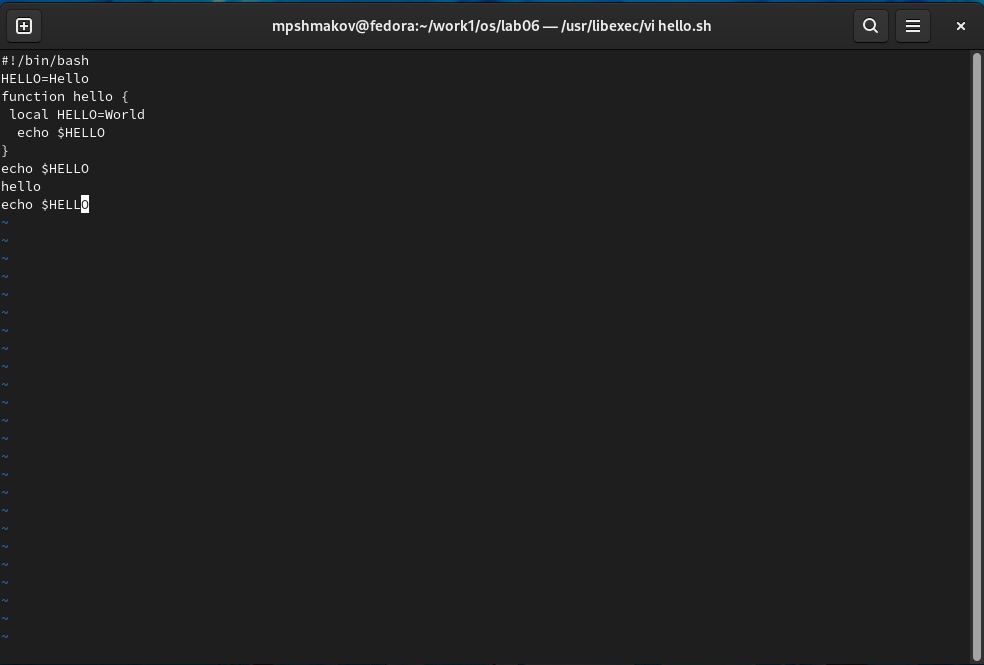

---
## Front matter
lang: ru-RU
title: Отчет по лабораторной работе №8
author: |
	Шмаков Максим\inst{1}
institute: |
	\inst{1}RUDN University, Moscow, Russian Federation
date: 2022, 13 мая , Москва

## Formatting
toc: false
slide_level: 2
theme: metropolis
header-includes: 
 - \metroset{progressbar=frametitle,sectionpage=progressbar,numbering=fraction}
 - '\makeatletter'
 - '\beamer@ignorenonframefalse'
 - '\makeatother'
aspectratio: 43
section-titles: true
---

# Цель работы

## Цель работы

Познакомиться с операционной системой Linux. Получить практические навыки работы с редактором vi, установленным по умолчанию практически во всех дистрибутивах.

# Задание 1

## 1. Создайте каталог с именем ~/work/os/lab06. (рис. [-@fig:001])

{ #fig:001 width=70% }

## 2. Перейдите во вновь созданный каталог. (рис. [-@fig:002])

{ #fig:002 width=70% }

## 3. Вызовите vi и создайте файл hello.sh (рис. [-@fig:003]) (рис. [-@fig:004])

{ #fig:003 width=70% }

## 3. Вызовите vi и создайте файл hello.sh (рис. [-@fig:003]) (рис. [-@fig:004])

{ #fig:004 width=70% }

## 4. Нажмите клавишу i и вводите следующий текст.
 #!/bin/bash
 HELL=Hello
 function hello {
 LOCAL HELLO=World
 echo $HELLO
 }
 echo $HELLO
 hello
  (рис. [-@fig:005])

## 4. Нажмите клавишу i и вводите следующий текст.

{ #fig:005 width=70% }

## 5. Нажмите клавишу Esc для перехода в командный режим после завершения ввода текста. (рис. [-@fig:006])

{ #fig:006 width=70% }

## 6. Нажмите : для перехода в режим последней строки и внизу вашего экрана появится приглашение в виде двоеточия. (рис. [-@fig:007])

{ #fig:007 width=70% }

## 7. Нажмите w (записать) и q (выйти), а затем нажмите клавишу Enter для сохранения вашего текста и завершения работы. (рис. [-@fig:008])

{ #fig:008 width=70% }

## 8. Сделайте файл исполняемым (рис. [-@fig:009])

{ #fig:009 width=70% }

# Задание 2

## 1. Вызовите vi на редактирование файла (рис. [-@fig:010])

{ #fig:010 width=70% }

## 2. Установите курсор в конец слова HELL второй строки. (рис. [-@fig:011])

{ #fig:011 width=70% }

## 3. Перейдите в режим вставки и замените на HELLO. Нажмите Esc для возврата в командный режим.

Нажимаю "a" для режима вставки после курсора  (рис. [-@fig:012])

{ #fig:012 width=70% }

## 4. Установите курсор на четвертую строку и сотрите слово LOCAL.

Навожу курсор на конец слова LOCAL, потом нажимаю d + 0 и тем самым стираю все от начала строки до слова. (рис. [-@fig:013])

{ #fig:013 width=70% }

## 5. Перейдите в режим вставки и наберите следующий текст: local, нажмите Esc для возврата в командный режим.

Нажимаю "a" для режима вставки после курсора (рис. [-@fig:014])

{ #fig:014 width=70% }

## 6. Установите курсор на последней строке файла. Вставьте после неё строку, содержащую следующий текст: echo $HELLO.

Нажимаю "o" для создания новой строки и ввожу текст  (рис. [-@fig:015])

{ #fig:015 width=70% }

## 7. Нажмите Esc для перехода в командный режим. (рис. [-@fig:016])

{ #fig:016 width=70% }

## 8. Удалите последнюю строку.

Ввожу ":9,9d", где 9 это номер строчки и таким образом удаляю мне нужную строчку (рис. [-@fig:017])

{ #fig:017 width=70% }

## 9. Введите команду отмены изменений u для отмены последней команды. (рис. [-@fig:018])

{ #fig:018 width=70% }

## 10. Введите символ : для перехода в режим последней строки. Запишите произведённые изменения и выйдите из vi. (рис. [-@fig:019])

{ #fig:019 width=70% }

# Выводы

## Выводы

В ходе работы я научился пользоваться редактором vi.

