---
## Front matter
title: "Отчет по лабораторной работе №8"
subtitle: "дисциплина: операционные системы"
author: "Шмаков Максим Павлович"

## Generic otions
lang: ru-RU
toc-title: "Содержание"

## Bibliography
bibliography: bib/cite.bib
csl: pandoc/csl/gost-r-7-0-5-2008-numeric.csl

## Pdf output format
toc: true # Table of contents
toc-depth: 2
lof: true # List of figures
lot: true # List of tables
fontsize: 12pt
linestretch: 1.5
papersize: a4
documentclass: scrreprt
## I18n polyglossia
polyglossia-lang:
  name: russian
  options:
	- spelling=modern
	- babelshorthands=true
polyglossia-otherlangs:
  name: english
## I18n babel
babel-lang: russian
babel-otherlangs: english
## Fonts
mainfont: PT Serif
romanfont: PT Serif
sansfont: PT Sans
monofont: PT Mono
mainfontoptions: Ligatures=TeX
romanfontoptions: Ligatures=TeX
sansfontoptions: Ligatures=TeX,Scale=MatchLowercase
monofontoptions: Scale=MatchLowercase,Scale=0.9
## Biblatex
biblatex: true
biblio-style: "gost-numeric"
biblatexoptions:
  - parentracker=true
  - backend=biber
  - hyperref=auto
  - language=auto
  - autolang=other*
  - citestyle=gost-numeric
## Pandoc-crossref LaTeX customization
figureTitle: "Рис."
tableTitle: "Таблица"
listingTitle: "Листинг"
lofTitle: "Список иллюстраций"
lotTitle: "Список таблиц"
lolTitle: "Листинги"
## Misc options
indent: true
header-includes:
  - \usepackage{indentfirst}
  - \usepackage{float} # keep figures where there are in the text
  - \floatplacement{figure}{H} # keep figures where there are in the text
---

# Цель работы

Познакомиться с операционной системой Linux. Получить практические навыки работы с редактором vi, установленным по умолчанию практически во всех дистрибутивах.

# Задание 1

1. Создайте каталог с именем ~/work/os/lab06.
2. Перейдите во вновь созданный каталог.
3. Вызовите vi и создайте файл hello.sh
4. Нажмите клавишу i и вводите следующий текст.
 #!/bin/bash
 HELL=Hello
 function hello {
 LOCAL HELLO=World
 echo $HELLO
 }
echo $HELLO
8 hello
5. Нажмите клавишу Esc для перехода в командный режим после завершения ввода текста.
6. Нажмите : для перехода в режим последней строки и внизу вашего экрана появится приглашение в виде двоеточия.
7. Нажмите w (записать) и q (выйти), а затем нажмите клавишу Enter для сохранения вашего текста и завершения работы.
8. Сделайте файл исполняемым

# Задание 2

1. Вызовите vi на редактирование файла
2. Установите курсор в конец слова HELL второй строки.
3. Перейдите в режим вставки и замените на HELLO. Нажмите Esc для возврата в командный режим.
4. Установите курсор на четвертую строку и сотрите слово LOCAL.
5. Перейдите в режим вставки и наберите следующий текст: local, нажмите Esc для возврата в командный режим.
6. Установите курсор на последней строке файла. Вставьте после неё строку, содержащую следующий текст: echo $HELLO.
7. Нажмите Esc для перехода в командный режим.
8. Удалите последнюю строку.
9. Введите команду отмены изменений u для отмены последней команды.
10. Введите символ : для перехода в режим последней строки. Запишите произведённые изменения и выйдите из vi.

# Выполнение лабораторной работы

### Задание 1

1. Создайте каталог с именем ~/work/os/lab06. (рис. [-@fig:001])

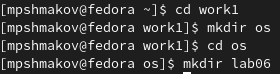{ #fig:001 width=70% }

2. Перейдите во вновь созданный каталог. (рис. [-@fig:002])

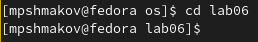{ #fig:002 width=70% }

3. Вызовите vi и создайте файл hello.sh (рис. [-@fig:003]) (рис. [-@fig:004])

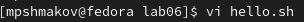{ #fig:003 width=70% }

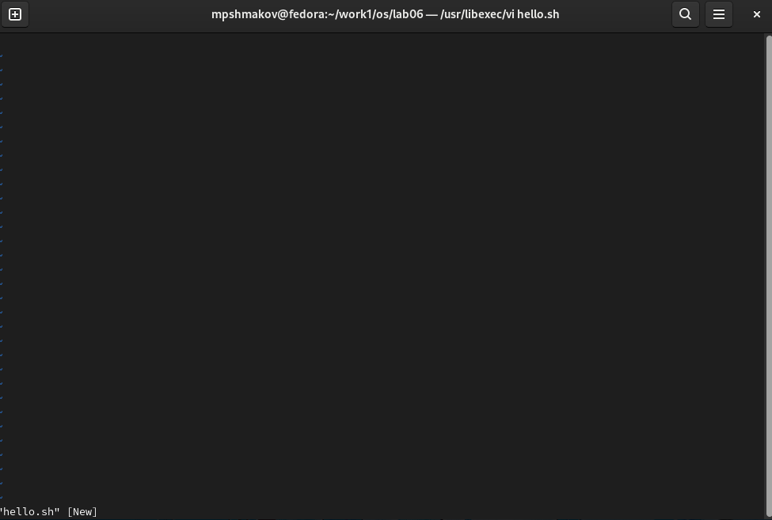{ #fig:004 width=70% }

4. Нажмите клавишу i и вводите следующий текст.
 #!/bin/bash
 HELL=Hello
 function hello {
 LOCAL HELLO=World
 echo $HELLO
 }
 echo $HELLO
 hello
  (рис. [-@fig:005])

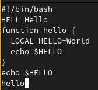{ #fig:005 width=70% }

5. Нажмите клавишу Esc для перехода в командный режим после завершения ввода текста. (рис. [-@fig:006])

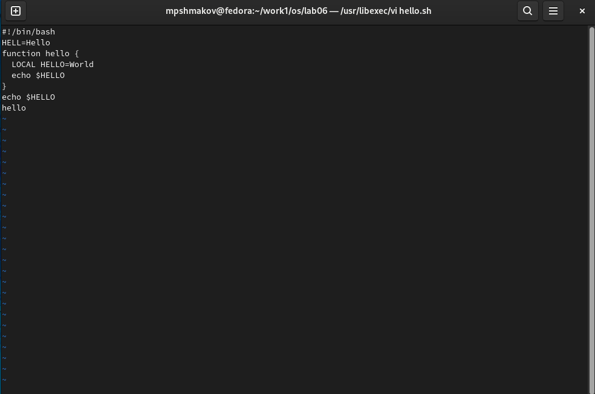{ #fig:006 width=70% }

6. Нажмите : для перехода в режим последней строки и внизу вашего экрана появится приглашение в виде двоеточия. (рис. [-@fig:007])

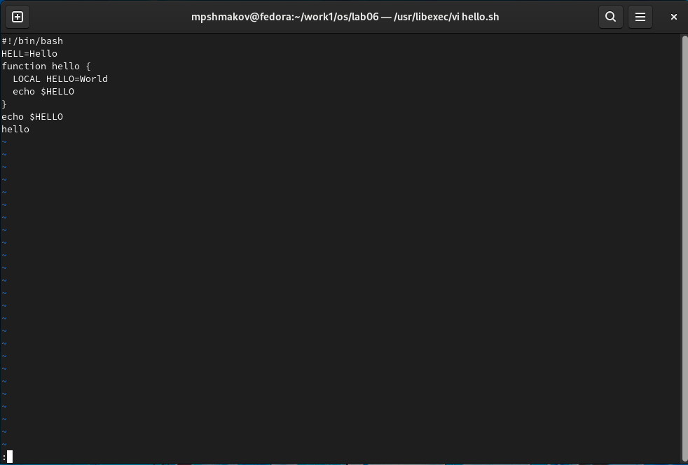{ #fig:007 width=70% }

7. Нажмите w (записать) и q (выйти), а затем нажмите клавишу Enter для сохранения вашего текста и завершения работы. (рис. [-@fig:008])

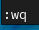{ #fig:008 width=70% }

8. Сделайте файл исполняемым (рис. [-@fig:009])

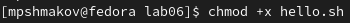{ #fig:009 width=70% }

### Задание 2

1. Вызовите vi на редактирование файла (рис. [-@fig:010])

{ #fig:010 width=70% }

2. Установите курсор в конец слова HELL второй строки. (рис. [-@fig:011])

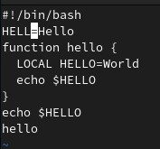{ #fig:011 width=70% }

3. Перейдите в режим вставки и замените на HELLO. Нажмите Esc для возврата в командный режим.

Нажимаю "a" для режима вставки после курсора  (рис. [-@fig:012])

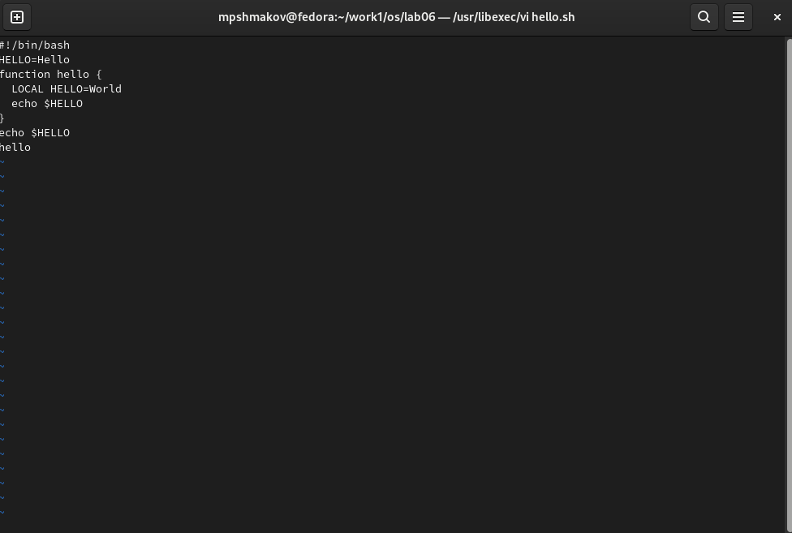{ #fig:012 width=70% }

4. Установите курсор на четвертую строку и сотрите слово LOCAL.

Навожу курсор на конец слова LOCAL, потом нажимаю d + 0 и тем самым стираю все от начала строки до слова. (рис. [-@fig:013])

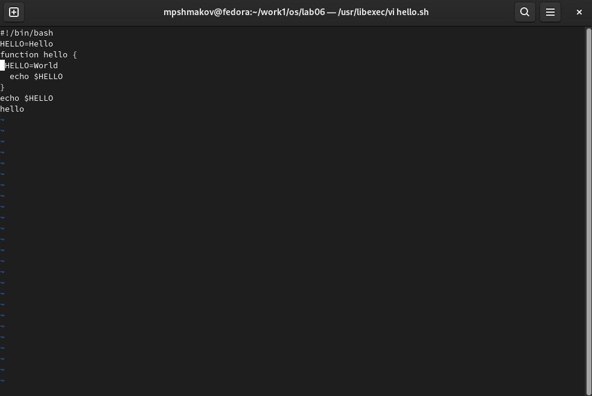{ #fig:013 width=70% }

5. Перейдите в режим вставки и наберите следующий текст: local, нажмите Esc для возврата в командный режим.

Нажимаю "a" для режима вставки после курсора (рис. [-@fig:014])

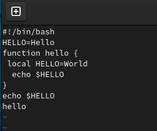{ #fig:014 width=70% }

6. Установите курсор на последней строке файла. Вставьте после неё строку, содержащую следующий текст: echo $HELLO.

Нажимаю "o" для создания новой строки и ввожу текст  (рис. [-@fig:015])

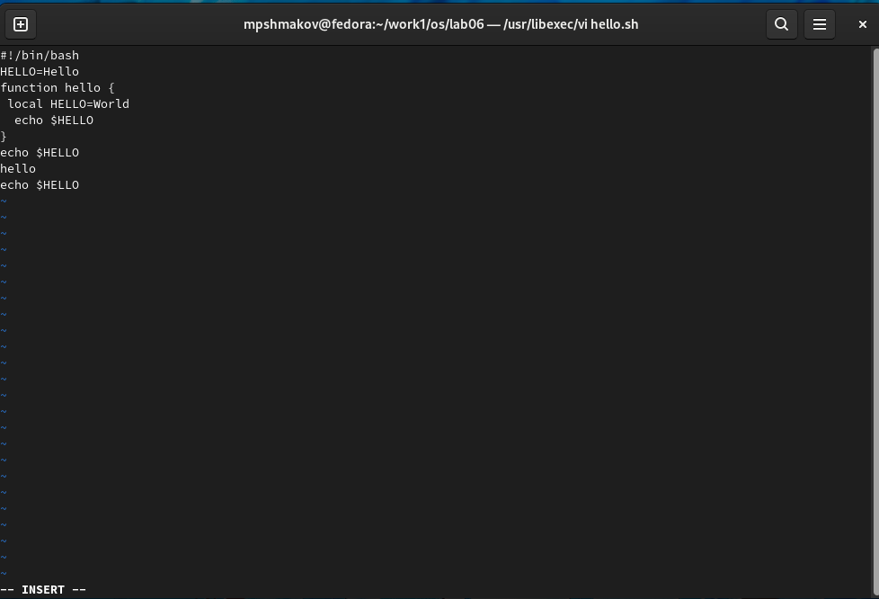{ #fig:015 width=70% }

7. Нажмите Esc для перехода в командный режим. (рис. [-@fig:016])

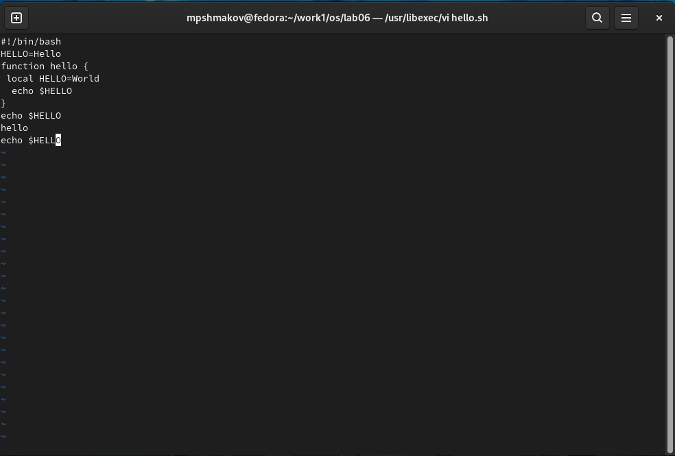{ #fig:016 width=70% }

8. Удалите последнюю строку.

Ввожу ":9,9d", где 9 это номер строчки и таким образом удаляю мне нужную строчку (рис. [-@fig:017])

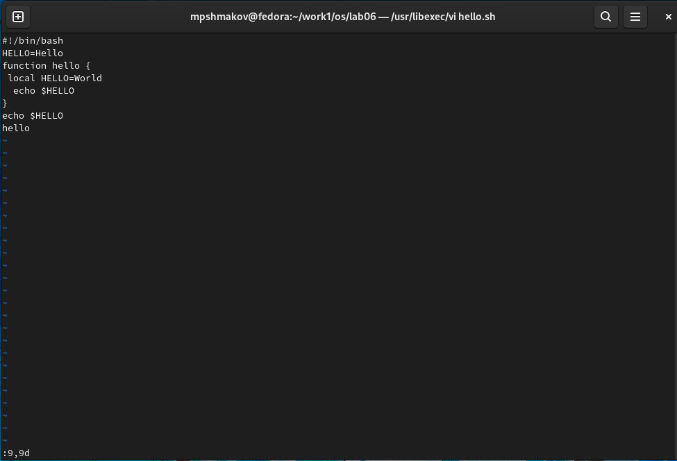{ #fig:017 width=70% }

9. Введите команду отмены изменений u для отмены последней команды. (рис. [-@fig:018])

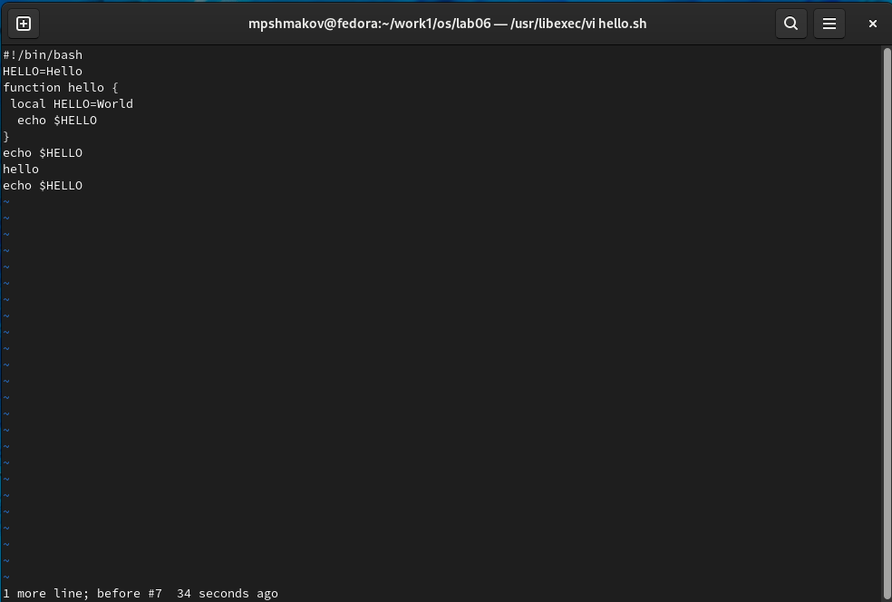{ #fig:018 width=70% }

10. Введите символ : для перехода в режим последней строки. Запишите произведённые изменения и выйдите из vi. (рис. [-@fig:019])

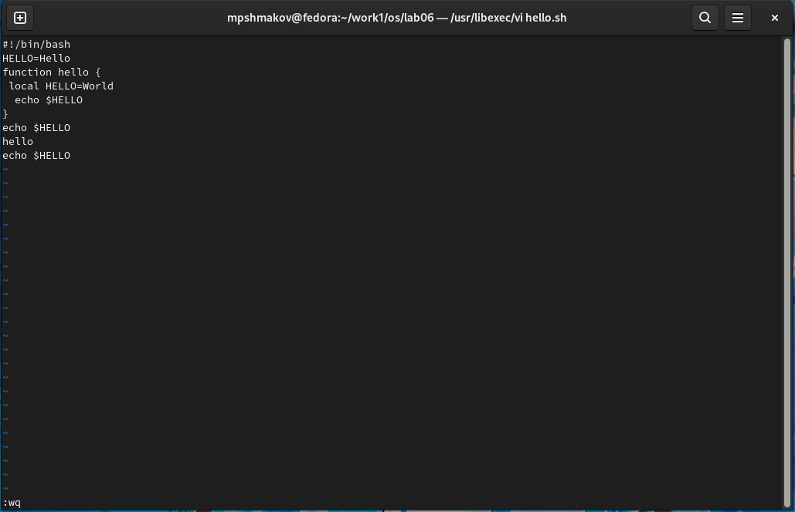{ #fig:019 width=70% }

# Выводы

В ходе работы я научился пользоваться редактором vi.

# Контрольные вопросы

1. Дайте краткую характеристику режимам работы редактора vi.

- командный режим — предназначен для ввода команд редактирования и навигации по редактируемому файлу;
- режим вставки — предназначен для ввода содержания редактируемого файла;
- режим последней строки — используется для записи изменений в файл и выхода из редактора.

2. Как выйти из редактора, не сохраняя произведённые изменения?

Прописать в командном режиме ":q".

3. Назовите и дайте краткую характеристику командам позиционирования.

- 0 — переход в начало строки;
- $ — переход в конец строки;
- G — переход в конец файла;
- n G — переход на строку с номером n.

4. Что для редактора vi является словом?

Набор текста, набранный в режиме вставки и разделенный пробелом.

5. Каким образом из любого места редактируемого файла перейти в начало (конец) файла?

В командном режиме нажать 0 если нужно в начало и G если в конец.

6. Назовите и дайте краткую характеристику основным группам команд редактирования.

Вставка текста
- а — вставить текст после курсора;
- А — вставить текст в конец строки;
- i — вставить текст перед курсором;
- n i — вставить текст n раз;
- I — вставить текст в начало строки.
Вставка строки
- о — вставить строку под курсором;
- О — вставить строку над курсором.
Удаление текста
- x — удалить один символ в буфер;
- d w — удалить одно слово в буфер;
- d $ — удалить в буфер текст от курсора до конца строки;
- d 0 — удалить в буфер текст от начала строки до позиции курсора;
- d d — удалить в буфер одну строку;
- n d d — удалить в буфер n строк.

7. Необходимо заполнить строку символами $. Каковы ваши действия?

В командном режиме нажму "a" и введу нужно количество "$".

8. Как отменить некорректное действие, связанное с процессом редактирования?

Нужно нажать "u".

9. Назовите и дайте характеристику основным группам команд режима последней строки.

Копирование и перемещение текста
- : n,m d — удалить строки с n по m;
- : i,j m k — переместить строки с i по j, начиная со строки k;
- : i,j t k — копировать строки с i по j в строку k;
- : i,j w имя-файла — записать строки с i по j в файл с именем имя-файла.
Запись в файл и выход из редактора
- : w — записать изменённый текст в файл, не выходя из vi;
- : w имя-файла — записать изменённый текст в новый файл с именем имя-файла;
- : w ! имя-файла — записать изменённый текст в файл с именем имя-файла;
- : w q — записать изменения в файл и выйти из vi;
- : q — выйти из редактора vi;
- : q ! — выйти из редактора без записи;
- : e ! — вернуться в командный режим, отменив все изменения, произведённые со времени последней записи.

10. Как определить, не перемещая курсора, позицию, в которой заканчивается строка?

В командном режиме нажать "$".

11. Выполните анализ опций редактора vi (сколько их, как узнать их назначение и т.д.).

Их более чем 20. Их назначение можно узнать прописав команду "man vi" в терминале.

12. Как определить режим работы редактора vi?

В самом низу редактора если ничего нет, то это командный режим. Если есть слово insert, то это режим вставки. Режим последней строки включается, когда вы пишите ":".

13. Постройте граф взаимосвязи режимов работы редактора vi.

В любой момент при работе в редакторе vi вы находитесь в одном из трёх режимов редактора: командный режим (command mode), режим ввода (insert mode) и режим последней строки (last line mode).

При запуске редактора vi вы оказываетесь в командном режиме. В этом режиме можно давать команды для редактирования файлов или перейти в другой режим. Например, вводя x в командном режиме мы удаляем символ, на который указывает курсор. Клавиши-стрелки перемещают курсор по редактируемому файлу. Как правило, команды, используемые в командном режиме, состоят из одного или двух символов.

Основной ввод и редактирование текста осуществляется в режиме ввода. При использовании редактора vi основное время, скорее всего, будет проводиться именно в этом режиме. Переход в режим ввода из командного режима осуществляется командой i (от слова insert). Находясь в режиме ввода, можно вводить текст в то место, куда указывает курсор. Выход из режима ввода в командный режим осуществляется клавишей Esc.

Режим последней строки═ — это специальный режим, в котором редактору даются сложные команды. При вводе этих команд они отображаются в последней строке экрана (отсюда пошло название режима). Например, если ввести в командном режиме команду :, то осуществится переход в режим последней строки, и можно будет вводить такие команды, как wq (записать файл и покинуть редактор vi) или q! (выйти из редактора vi без сохранения изменений). В режиме последней строки обычно вводятся команды, название которых состоит из нескольких символов. В этом режиме в последнюю строку вводится команда, после чего нажимается клавиша Enter, и команда исполняется.

