---
## Front matter
lang: ru-RU
title: Отчет по лабораторной работе №9
author: |
	Шмаков Максим\inst{1}
institute: |
	\inst{1}RUDN University, Moscow, Russian Federation
date: 2022, 19 мая , Москва

## Formatting
toc: false
slide_level: 2
theme: metropolis
header-includes: 
 - \metroset{progressbar=frametitle,sectionpage=progressbar,numbering=fraction}
 - '\makeatletter'
 - '\beamer@ignorenonframefalse'
 - '\makeatother'
aspectratio: 43
section-titles: true
---

# Цель работы

## Цель работы

Познакомиться с операционной системой Linux. Получить практические навыки работы с редактором Emacs.

# Выполнение лабораторной работы

# Основные команды emacs
## 1. Открыть emacs. (рис. [-@fig:001]) (рис. [-@fig:002])

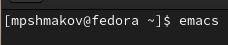{ #fig:001 width=70% }

## 1. Открыть emacs. (рис. [-@fig:001]) (рис. [-@fig:002])

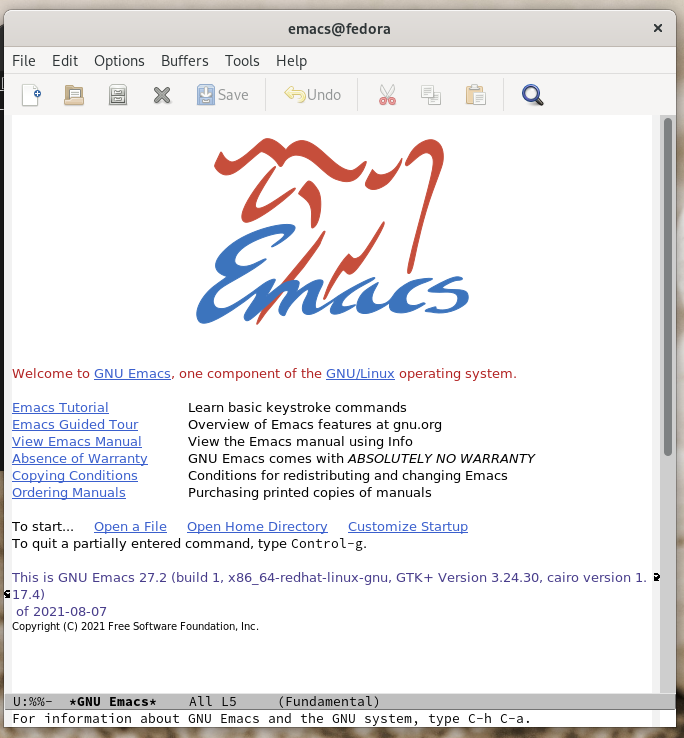{ #fig:002 width=70% }

## 2. Создать файл lab07.sh с помощью комбинации Ctrl-x Ctrl-f (C-x C-f). (рис. [-@fig:003]) (рис. [-@fig:004])

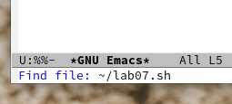{ #fig:003 width=70% }

## 2. Создать файл lab07.sh с помощью комбинации Ctrl-x Ctrl-f (C-x C-f). (рис. [-@fig:003]) (рис. [-@fig:004])

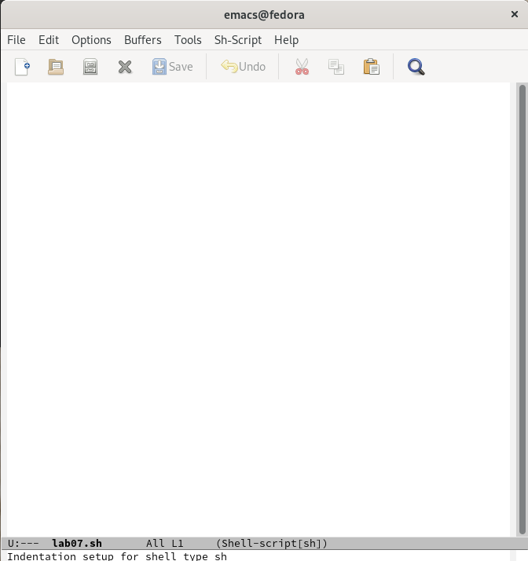{ #fig:004 width=70% }

## 3. Наберите текст:
 #!/bin/bash
 HELL=Hello
 function hello {
 LOCAL HELLO=World
 echo $HELLO
 }
 echo $HELLO
 hello
(рис. [-@fig:005])

## 3. Наберите текст:

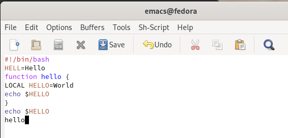{ #fig:005 width=70% }

## 4. Сохранить файл с помощью комбинации Ctrl-x Ctrl-s (C-x C-s). (рис. [-@fig:006])

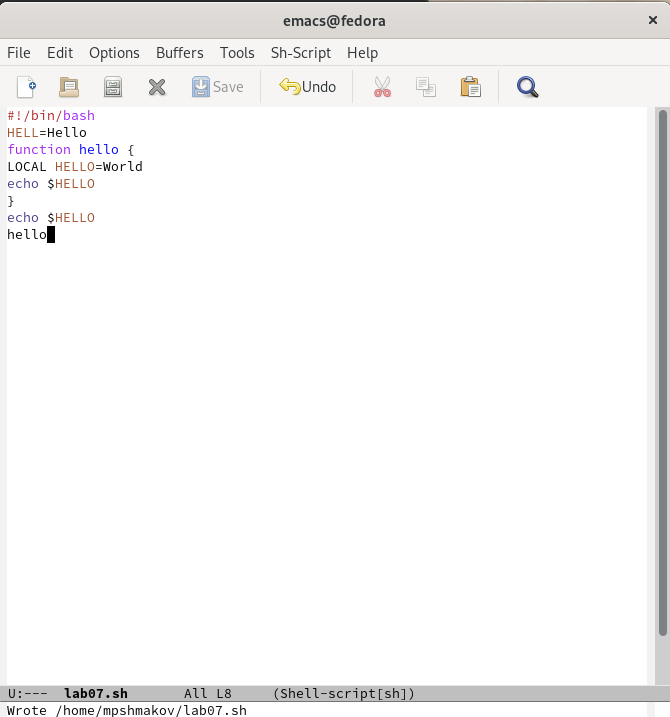{ #fig:006 width=70% }

## 5. Проделать с текстом стандартные процедуры редактирования, каждое действие должно осуществляться комбинацией клавиш.
5.1. Вырезать одной командой целую строку (С-k).

Ставлю курсор в начала строки и использую команду (C-k). (рис. [-@fig:007])

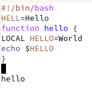{ #fig:007 width=70% }

## 5. Проделать с текстом стандартные процедуры редактирования, каждое действие должно осуществляться комбинацией клавиш.

5.2. Вставить эту строку в конец файла (C-y). (рис. [-@fig:008])

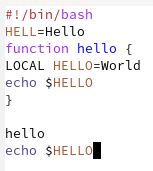{ #fig:008 width=70% }

## 5. Проделать с текстом стандартные процедуры редактирования, каждое действие должно осуществляться комбинацией клавиш.

5.3. Выделить область текста (C-space). (рис. [-@fig:009])

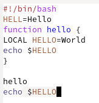{ #fig:009 width=70% }

## 5. Проделать с текстом стандартные процедуры редактирования, каждое действие должно осуществляться комбинацией клавиш.

5.4. Скопировать область в буфер обмена (M-w). (рис. [-@fig:010])

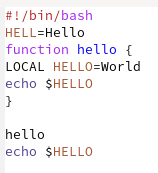{ #fig:010 width=70% }

## 5. Проделать с текстом стандартные процедуры редактирования, каждое действие должно осуществляться комбинацией клавиш.

5.5. Вставить область в конец файла. (рис. [-@fig:011])

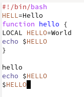{ #fig:011 width=70% }

## 5. Проделать с текстом стандартные процедуры редактирования, каждое действие должно осуществляться комбинацией клавиш.

5.6. Вновь выделить эту область и на этот раз вырезать её (C-w). (рис. [-@fig:012]) (рис. [-@fig:013])

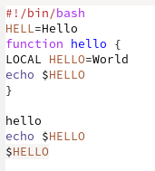{ #fig:012 width=70% }

## 5. Проделать с текстом стандартные процедуры редактирования, каждое действие должно осуществляться комбинацией клавиш.

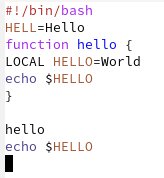{ #fig:013 width=70% }

## 5. Проделать с текстом стандартные процедуры редактирования, каждое действие должно осуществляться комбинацией клавиш.

5.7. Отмените последнее действие (C-/). (рис. [-@fig:014])

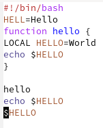{ #fig:014 width=70% }

## 6. Научитесь использовать команды по перемещению курсора.
6.1. Переместите курсор в начало строки (C-a). (рис. [-@fig:015])

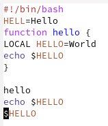{ #fig:015 width=70% }

## 6. Научитесь использовать команды по перемещению курсора.

6.2. Переместите курсор в конец строки (C-e). (рис. [-@fig:016])

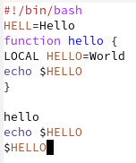{ #fig:016 width=70% }

## 6. Научитесь использовать команды по перемещению курсора.

6.3. Переместите курсор в начало буфера (M-<). (рис. [-@fig:017])

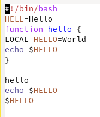{ #fig:017 width=70% }

## 6. Научитесь использовать команды по перемещению курсора.

6.4. Переместите курсор в конец буфера (M->). (рис. [-@fig:018])

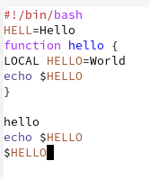{ #fig:018 width=70% }

## 7. Управление буферами.
7.1. Вывести список активных буферов на экран (C-x C-b). (рис. [-@fig:0019])

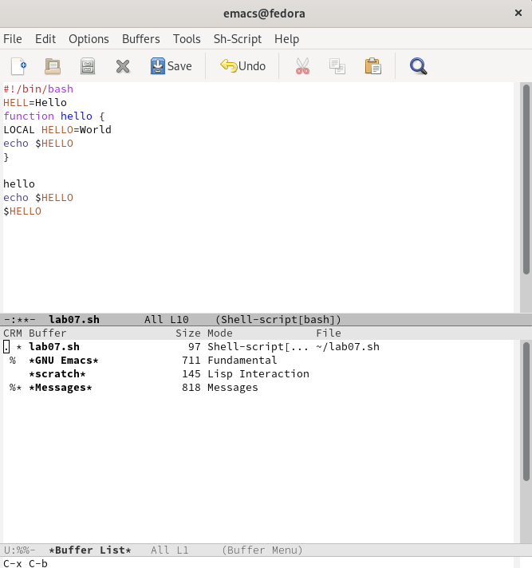{ #fig:019 width=70% }

## 7. Управление буферами.

7.2. Переместитесь во вновь открытое окно (C-x) o со списком открытых буферов и переключитесь на другой буфер. (рис. [-@fig:020]) 

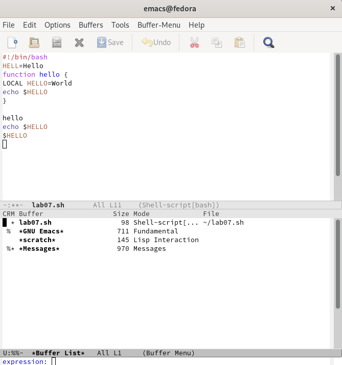{ #fig:020 width=70% }

## 7. Управление буферами.

Навожу курсор на каталог и с помощью enter переключаюсь на него. (рис. [-@fig:021])
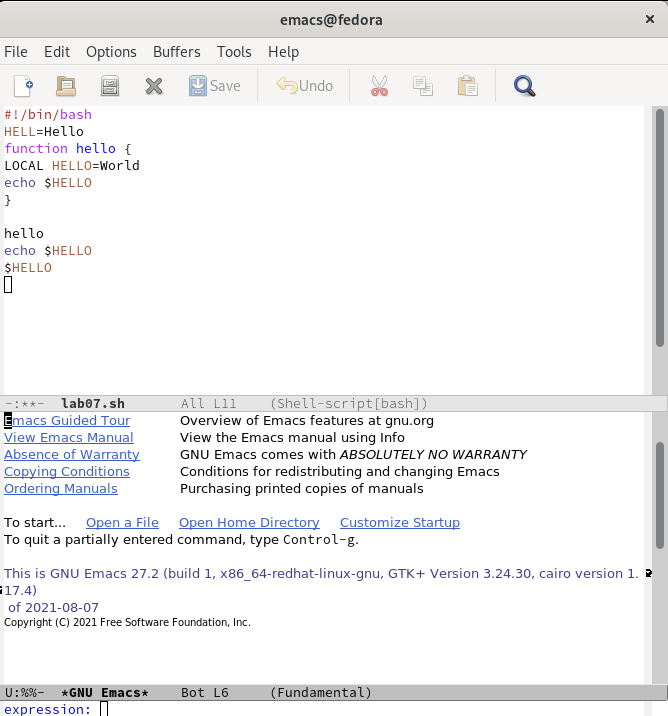{ #fig:021 width=70% }

## 7. Управление буферами.

7.3. Закройте это окно (C-x 0). (рис. [-@fig:022])

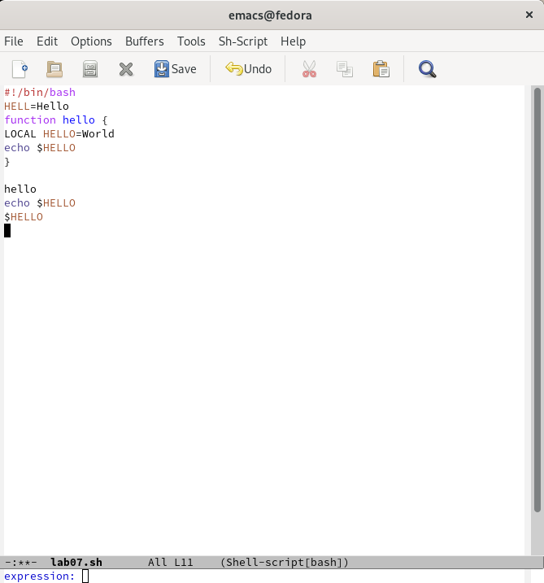{ #fig:022 width=70% }

## 7. Управление буферами.

7.4. Теперь вновь переключайтесь между буферами, но уже без вывода их списка на экран (C-x b). (рис. [-@fig:023])  (рис. [-@fig:024])

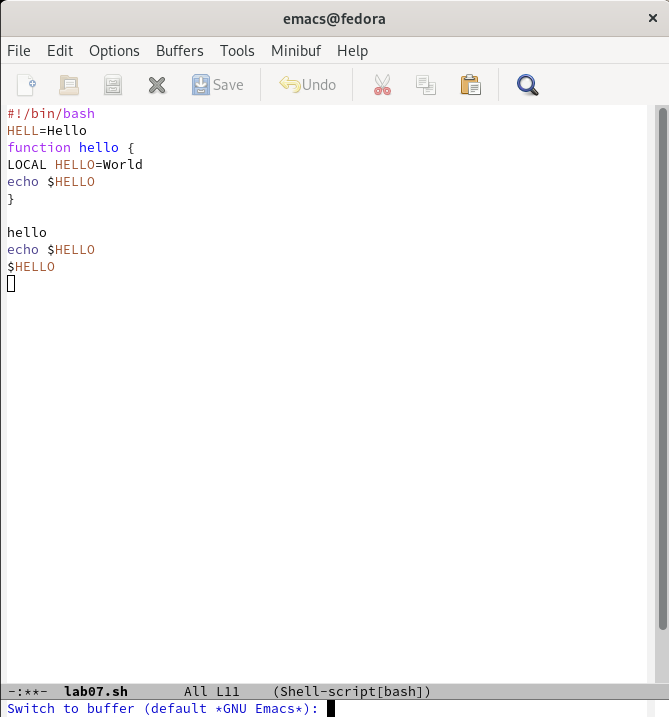{ #fig:023 width=70% }

## 7. Управление буферами.

{ #fig:024 width=70% }

## 8. Управление окнами.
8.1. Поделите фрейм на 4 части: разделите фрейм на два окна по вертикали (C-x 3), а затем каждое из этих окон на две части по горизонтали (C-x 2) (рис. [-@fig:025]) (рис. [-@fig:026])

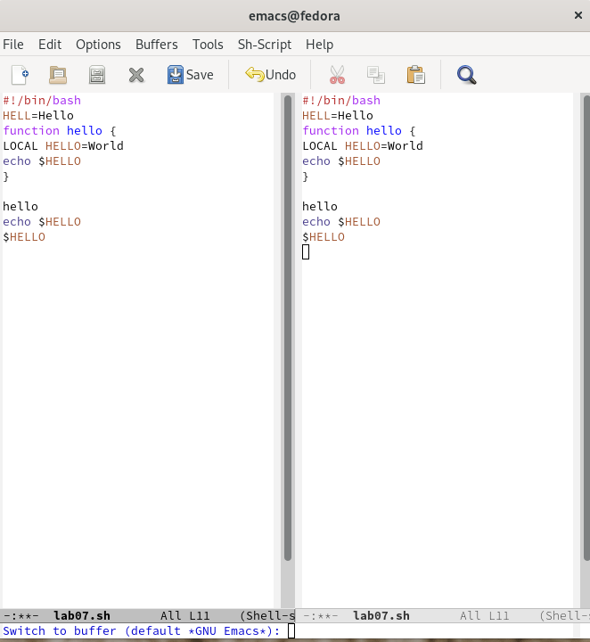{ #fig:025 width=70% }

## 8. Управление окнами.

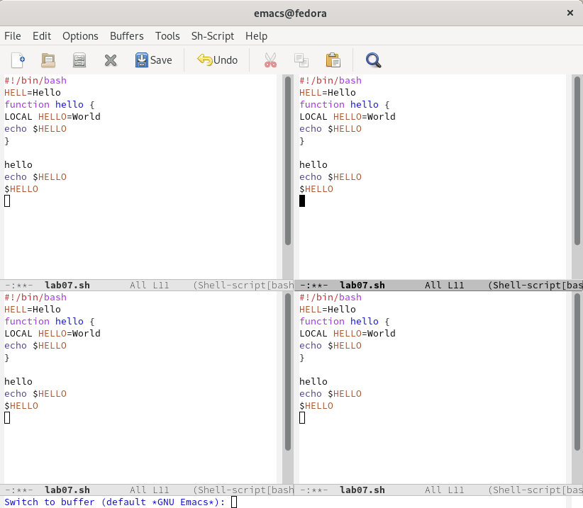{ #fig:026 width=70% }

## 8. Управление окнами.

8.2. В каждом из четырёх созданных окон откройте новый буфер (файл) и введите несколько строк текста. (рис. [-@fig:027])

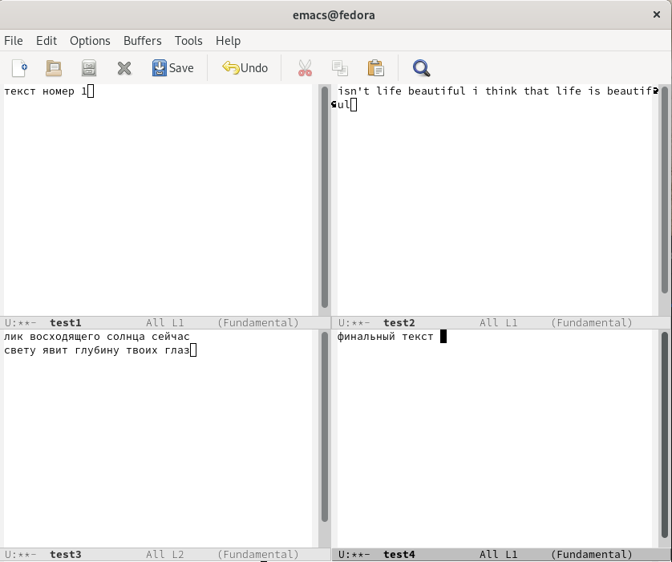{ #fig:027 width=70% }

## 9. Режим поиска
9.1. Переключитесь в режим поиска (C-s) и найдите несколько слов, присутствующих в тексте. (рис. [-@fig:028]) (рис. [-@fig:029])

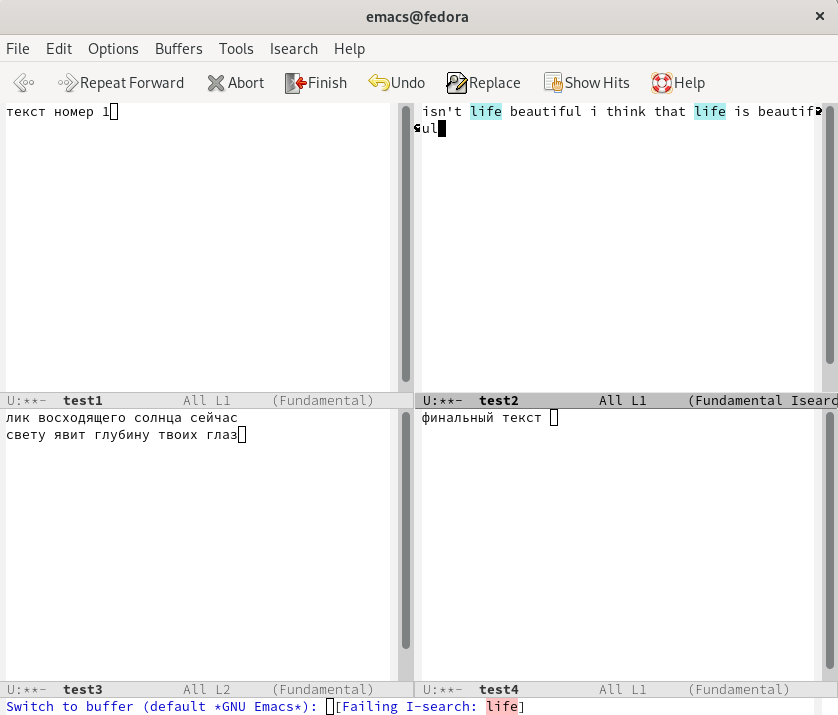{ #fig:028 width=70% }

## 9. Режим поиска

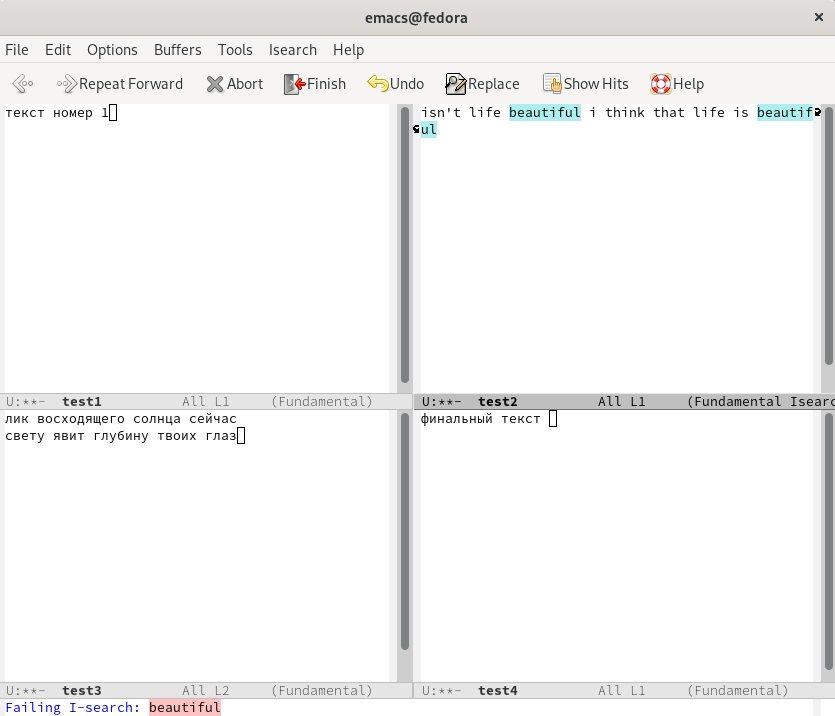{ #fig:029 width=70% }

## 9. Режим поиска

9.2. Переключайтесь между результатами поиска, нажимая C-s. (рис. [-@fig:030])

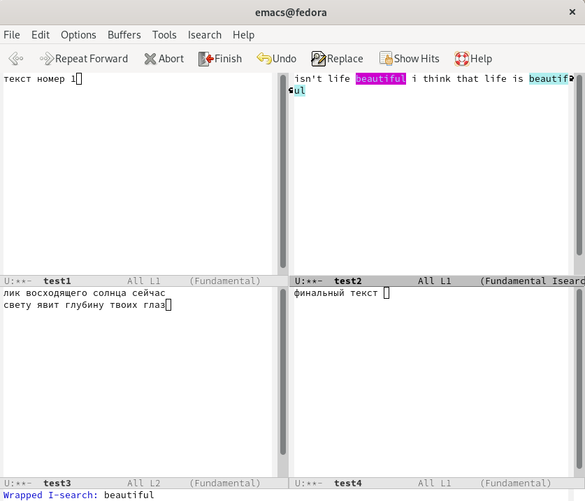{ #fig:030 width=70% }

## 9. Режим поиска

9.3. Выйдите из режима поиска, нажав C-g. (рис. [-@fig:031])

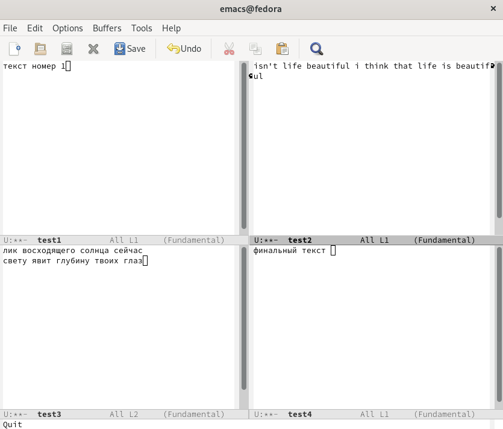{ #fig:031 width=70% }

## 9. Режим поиска

9.4. Перейдите в режим поиска и замены (M-%), введите текст, который следует найти и заменить, нажмите Enter , затем введите текст для замены. После того как будут подсвечены результаты поиска, нажмите ! для подтверждения замены. (рис. [-@fig:032]) (рис. [-@fig:033])

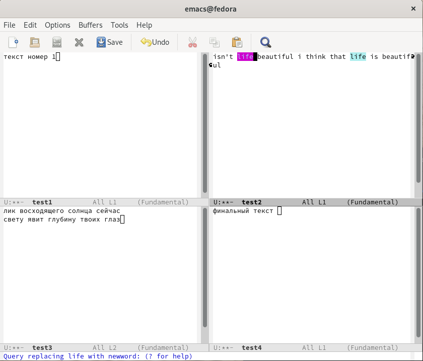{ #fig:032 width=70% }

## 9. Режим поиска

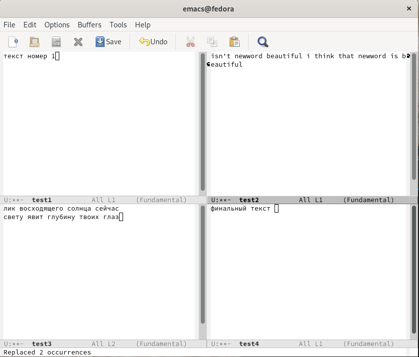{ #fig:033 width=70% }

## 9. Режим поиска

9.5. Испробуйте другой режим поиска, нажав M-s o. Объясните, чем он отличается от обычного режима? (

В обычном режиме нам просто подсвечивается текст в окне в буфере, а здесь у нас открывается результат поиска в отдельном окне в буфере * Occur * с ссылкой на буфер, где это слово было найдено. рис. [-@fig:034])

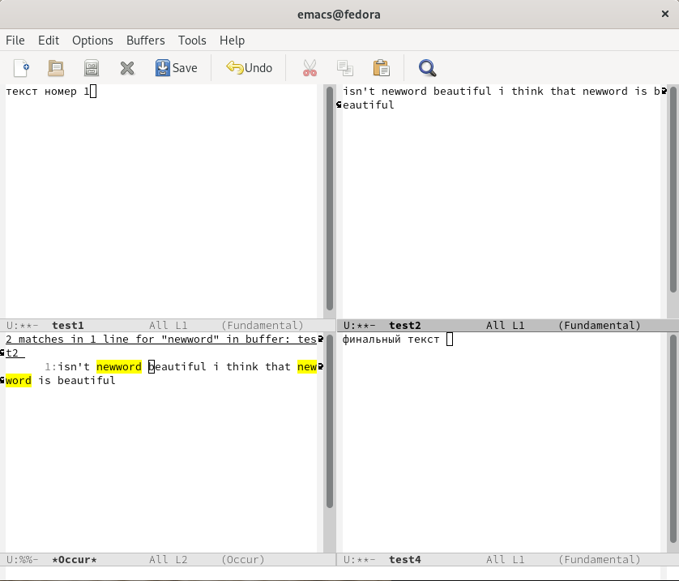{ #fig:034 width=70% }

# Выводы

## Выводы

В ходе работы я получил практические навыки работы с редактором Emacs.

