---
## Front matter
title: "Отчет по лабораторной работе №10"
subtitle: "дисциплина: операционные системы"
author: "Шмаков Максим Павлович"

## Generic otions
lang: ru-RU
toc-title: "Содержание"

## Bibliography
bibliography: bib/cite.bib
csl: pandoc/csl/gost-r-7-0-5-2008-numeric.csl

## Pdf output format
toc: true # Table of contents
toc-depth: 2
lof: true # List of figures
lot: true # List of tables
fontsize: 12pt
linestretch: 1.5
papersize: a4
documentclass: scrreprt
## I18n polyglossia
polyglossia-lang:
  name: russian
  options:
	- spelling=modern
	- babelshorthands=true
polyglossia-otherlangs:
  name: english
## I18n babel
babel-lang: russian
babel-otherlangs: english
## Fonts
mainfont: PT Serif
romanfont: PT Serif
sansfont: PT Sans
monofont: PT Mono
mainfontoptions: Ligatures=TeX
romanfontoptions: Ligatures=TeX
sansfontoptions: Ligatures=TeX,Scale=MatchLowercase
monofontoptions: Scale=MatchLowercase,Scale=0.9
## Biblatex
biblatex: true
biblio-style: "gost-numeric"
biblatexoptions:
  - parentracker=true
  - backend=biber
  - hyperref=auto
  - language=auto
  - autolang=other*
  - citestyle=gost-numeric
## Pandoc-crossref LaTeX customization
figureTitle: "Рис."
tableTitle: "Таблица"
listingTitle: "Листинг"
lofTitle: "Список иллюстраций"
lotTitle: "Список таблиц"
lolTitle: "Листинги"
## Misc options
indent: true
header-includes:
  - \usepackage{indentfirst}
  - \usepackage{float} # keep figures where there are in the text
  - \floatplacement{figure}{H} # keep figures where there are in the text
---

# Цель работы

Изучить основы программирования в оболочке ОС UNIX/Linux. Научиться писать небольшие командные файлы.

# Задание

1. Написать скрипт, который при запуске будет делать резервную копию самого себя (то есть файла, в котором содержится его исходный код) в другую директорию backup в вашем домашнем каталоге. При этом файл должен архивироваться одним из архиваторов на выбор zip, bzip2 или tar. Способ использования команд архивации необходимо узнать, изучив справку.
2. Написать пример командного файла, обрабатывающего любое произвольное число аргументов командной строки, в том числе превышающее десять. Например, скрипт может последовательно распечатывать значения всех переданных аргументов.
3. Написать командный файл — аналог команды ls (без использования самой этой команды и команды dir). Требуется, чтобы он выдавал информацию о нужном каталоге и выводил информацию о возможностях доступа к файлам этого каталога.
4. Написать командный файл, который получает в качестве аргумента командной строки формат файла (.txt, .doc, .jpg, .pdf и т.д.) и вычисляет количество таких файлов в указанной директории. Путь к директории также передаётся в виде аргумента командной строки.

# Выполнение лабораторной работы

1. Написать скрипт, который при запуске будет делать резервную копию самого себя (то есть файла, в котором содержится его исходный код) в другую директорию backup в вашем домашнем каталоге. При этом файл должен архивироваться одним из архиваторов на выбор zip, bzip2 или tar. Способ использования команд архивации необходимо узнать, изучив справку.

Изучил документацию zip, bzip2, tar  (рис. [-@fig:001]) (рис. [-@fig:002]) (рис. [-@fig:003]) (рис. [-@fig:004])

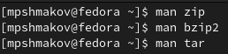{ #fig:001 width=70% }

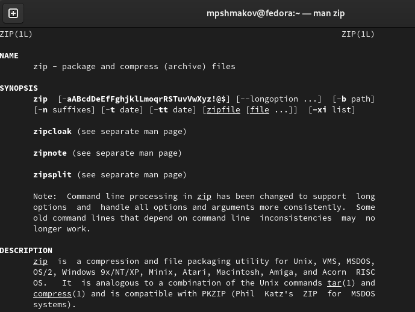{ #fig:002 width=70% }

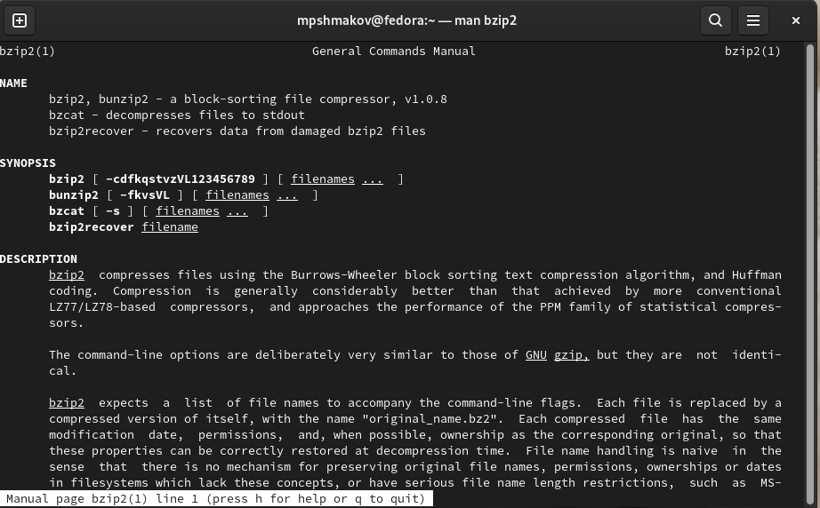{ #fig:003 width=70% }

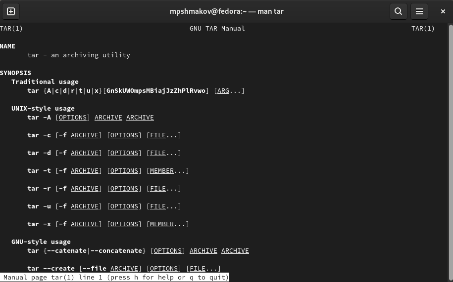{ #fig:004 width=70% }

Создаю файл backup.sh и пишу в нем скрипт. Затем даю права на исполнение этому файлу и тестирую скрипт. Проверяю результат с помощью cd и ls. (рис. [-@fig:005]) (рис. [-@fig:006]) (рис. [-@fig:007])

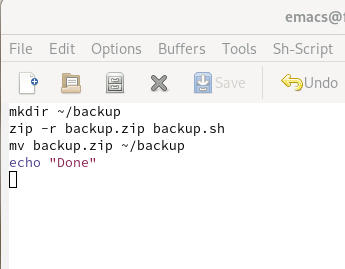{ #fig:005 width=70% }

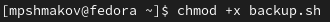{ #fig:006 width=70% }

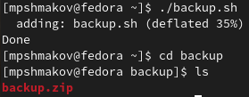{ #fig:007 width=70% }

2. Написать пример командного файла, обрабатывающего любое произвольное число аргументов командной строки, в том числе превышающее десять. Например, скрипт может последовательно распечатывать значения всех переданных аргументов.

Cоздаю файл zadanie2.sh и пишу в нем скрипт. Даю права на испольнение и проверяю задав больше и меньше 10 аргументов.  (рис. [-@fig:008]) (рис. [-@fig:009]) (рис. [-@fig:010])

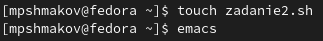{ #fig:008 width=70% }

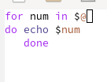{ #fig:009 width=70% }

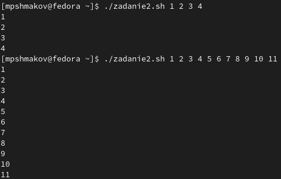{ #fig:010 width=70% }

3. Написать командный файл — аналог команды ls (без использования самой этой команды и команды dir). Требуется, чтобы он выдавал информацию о нужном каталоге и выводил информацию о возможностях доступа к файлам этого каталога.

Cоздаю файл finder.sh и пишу в нем скрипт. Даю права на исполнение и проверяю работу скрипта. (рис. [-@fig:011]) (рис. [-@fig:012]) (рис. [-@fig:013])

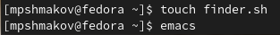{ #fig:011 width=70% }

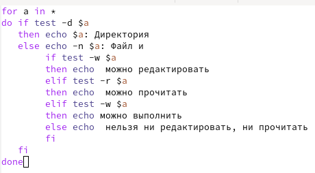{ #fig:012 width=70% }

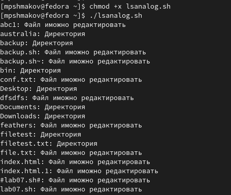{ #fig:013 width=70% }

4. Написать командный файл, который получает в качестве аргумента командной строки формат файла (.txt, .doc, .jpg, .pdf и т.д.) и вычисляет количество таких файлов в указанной директории. Путь к директории также передаётся в виде аргумента командной строки.

Cоздаю файл lsanalog.sh и пишу в нем скрипт. Даю права на исполнение, проверяю работу скрипта задав разные форматы файлов на вход. (рис. [-@fig:014]) (рис. [-@fig:015]) (рис. [-@fig:016])

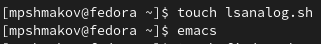{ #fig:014 width=70% }

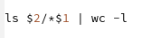{ #fig:015 width=70% }

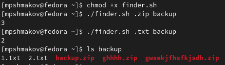{ #fig:016 width=70% }

# Выводы

В ходе работы я изучил основы программирования в оболочке ОС UNIX/Linux. Научиться писать небольшие командные файлы.

# Контрольные вопросы

1. Объясните понятие командной оболочки. Приведите примеры командных оболочек.
Чем они отличаются?

Командный процессор (командная оболочка, интерпретатор команд shell) — это программа, позволяющая пользователю взаимодействовать с операционной системой компьютера. В операционных системах типа UNIX/Linux наиболее часто используются следующие реализации командных оболочек:
- оболочка Борна (Bourne shell или sh) — стандартная командная оболочка UNIX/Linux, содержащая базовый, но при этом полный набор функций;
- С-оболочка (или csh) — надстройка на оболочкой Борна, использующая С-подобный синтаксис команд с возможностью сохранения истории выполнения команд;
- оболочка Корна (или ksh) — напоминает оболочку С, но операторы управления программой совместимы с операторами оболочки Борна;
- BASH — сокращение от Bourne Again Shell (опять оболочка Борна), в основе своей совмещает свойства оболочек С и Корна (разработка компании Free Software Foundation).

2. Что такое POSIX?

POSIX (Portable Operating System Interface for Computer Environments) — набор стандартов описания интерфейсов взаимодействия операционной системы и прикладных программ.
Стандарты POSIX разработаны комитетом IEEE (Institute of Electrical and Electronics Engineers) для обеспечения совместимости различных UNIX/Linux-подобных операционных систем и переносимости прикладных программ на уровне исходного кода. POSIX-совместимые оболочки разработаны на базе оболочки Корна.

3. Как определяются переменные и массивы в языке программирования bash?

Имена переменных могут быть выбраны пользователем. Пользователь имеет возможность присвоить переменной значение некоторой строки символов.
Например, команда
mark=/usr/andy/bin
присваивает значение строки символов /usr/andy/bin переменной mark типа строка символов.

Для создания массива используется команда set с флагом -A. За флагом следует имя переменной, а затем список значений, разделённых пробелами. Например,
set -A states Delaware Michigan "New Jersey"
Далее можно сделать добавление в массив, например,states[49]=Alaska. Индексация массивов начинается с нулевого элемента.

4. Каково назначение операторов let и read?

Команда let является показателем того, что последующие аргументы представляют собой выражение, подлежащее вычислению. 

Команда read позволяет читать значения переменных со стандартного ввода:
echo "Please enter Month and Day of Birth ?"
read mon day trash
В переменные mon и day будут считаны соответствующие значения, введённые с клавиатуры, а переменная trash нужна для того, чтобы отобрать всю избыточно введённую информацию и игнорировать её.

5. Какие арифметические операции можно применять в языке программирования bash?

В языке программирования bash можно применять сложение, умножение, вычитание, деление, нахождение остатка, побитовое дополнение, побитовое сдвижение, сравнение (>, <, ==).

6. Что означает операция (( ))?

В них можно записывать условия оболочки bash.

7. Какие стандартные имена переменных Вам известны?

PATH, PS1, PS2, HOME, IFS, MAIL, TERM и LOGNAME.

8. Что такое метасимволы?

Такие символы, как ' < > * ? | \ " &, являются метасимволами и имеют для командного процессора специальный смысл. 

9. Как экранировать метасимволы?

а. Экранирование может быть осуществлено с помощью предшествующего метасимволу символа \, который, в свою очередь, является метасимволом.
Для экранирования группы метасимволов нужно заключить её в одинарные кавычки. Строка, заключённая в двойные кавычки, экранирует все метасимволы, кроме $, ' , \, ". Например,
- echo \* выведет на экран символ *,
- echo ab’*\|*’cd выведет на экран строку ab*\|*cd.

10. Как создавать и запускать командные файлы?

Создаем текстовый файл, пишем код, даем право на исполнение с помощью команды chmod +x (имя файла) и запускаем с помощью ./(имя файла)

11. Как определяются функции в языке программирования bash?

Группу команд можно объединить в функцию. Для этого существует ключевое слово function, после которого следует имя функции и список команд, заключённых в фигурные скобки.

12. Каким образом можно выяснить, является файл каталогом или обычным файлом?

С помощью команды test:

– test -f file — истина, если файл file существует;
– test -d file — истина, если файл file является каталогом.

13. Каково назначение команд set, typeset и unset?

Для создания массива используется команда set с флагом -A.

typeset используется для обхявления и присовения переменных.

Изъять переменную из программы можно с помощью команды unset

14. Как передаются параметры в командные файлы?

С помощью метасимвола $. Например, 
Пусть к командному файлу where имеется доступ по выполнению и этот командный файл содержит следующий конвейер:
who | grep $1.
Если Вы введёте с терминала команду where andy, то в случае, если пользователь, зарегистрированный в ОС UNIX под именем andy, в данный момент работает в ОС UNIX, то на терминал будет выведена строка, содержащая номер терминала, используемого указанным пользователем. Если же в данный момент этот пользователь не работает в ОС UNIX, то на терминал ничего не будет выведено.

15. Назовите специальные переменные языка bash и их назначение.

При использовании в командном файле комбинации символов $# вместо неё будет осуществлена подстановка числа параметров, указанных в командной строке при вызове данного командного файла на выполнение.
– $* — отображается вся командная строка или параметры оболочки;
– $? — код завершения последней выполненной команды;
– $$ — уникальный идентификатор процесса, в рамках которого выполняется командный процессор;
– $! — номер процесса, в рамках которого выполняется последняя вызванная на выполнение в командном режиме команда;
– $- — значение флагов командного процессора;
– ${#*} — возвращает целое число — количество слов, которые были результатом $*;
– ${#name} — возвращает целое значение длины строки в переменной name;
– ${name[n]} — обращение к n-му элементу массива;
– ${name[*]} — перечисляет все элементы массива, разделённые пробелом;
– ${name[@]} — то же самое, но позволяет учитывать символы пробелы в самих переменных;
– ${name:-value} — если значение переменной name не определено, то оно будет заменено на указанное value;
– ${name:value} — проверяется факт существования переменной;
– ${name=value} — если name не определено, то ему присваивается значение value;
– ${name?value} — останавливает выполнение, если имя переменной не определено, и выводит value как сообщение об ошибке;
– ${name+value} — это выражение работает противоположно ${name-value}. Если переменная определена, то подставляется value;
– ${name#pattern} — представляет значение переменной name с удалённым самым коротким левым образцом (pattern);
– ${#name[*]} и ${#name[@]} — эти выражения возвращают количество элементов в массиве name.

