---
## Front matter
lang: ru-RU
title: Отчет по лабораторной работе №11
author: |
	Шмаков Максим\inst{1}
institute: |
	\inst{1}RUDN University, Moscow, Russian Federation
date: 2022, 28 мая , Москва

## Formatting
toc: false
slide_level: 2
theme: metropolis
header-includes: 
 - \metroset{progressbar=frametitle,sectionpage=progressbar,numbering=fraction}
 - '\makeatletter'
 - '\beamer@ignorenonframefalse'
 - '\makeatother'
aspectratio: 43
section-titles: true
---

# Цель работы

Изучить основы программирования в оболочке ОС UNIX. Научится писать более сложные командные файлы с использованием логических управляющих конструкций и циклов.

# Выполнение лабораторной работы

## 1. Используя команды getopts grep, написать командный файл, который анализирует командную строку с ключами:
– -iinputfile — прочитать данные из указанного файла;
– -ooutputfile — вывести данные в указанный файл;
– -pшаблон — указать шаблон для поиска;
– -C — различать большие и малые буквы;
– -n — выдавать номера строк.
а затем ищет в указанном файле нужные строки, определяемые ключом -p.

## Сначала создаю файлы num1.sh, textfile1 и textfile2  (рис. [-@fig:001]) (рис. [-@fig:002])

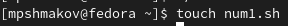{ #fig:001 width=70% }

## Сначала создаю файлы num1.sh, textfile1 и textfile2  (рис. [-@fig:001]) (рис. [-@fig:002])

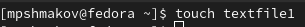{ #fig:002 width=70% }

## В num1.sh пишу скрипт  (рис. [-@fig:003])

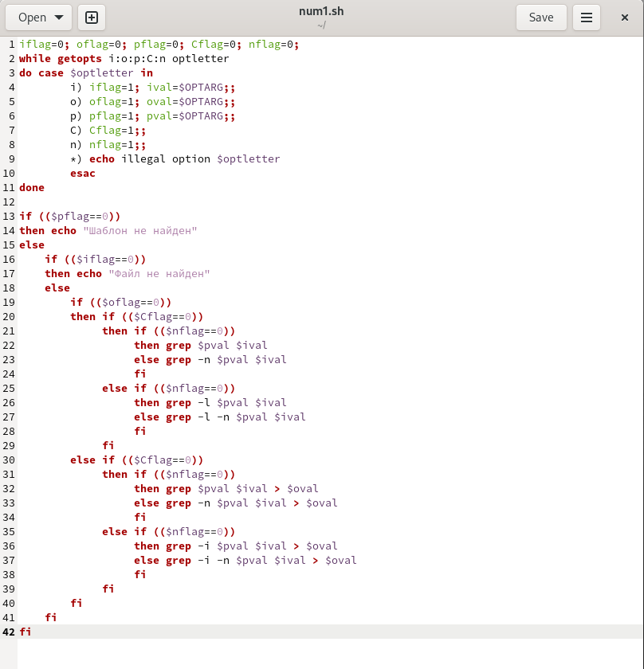{ #fig:003 width=70% }

## В textfile1 запишу случайный текст с повторяющимися словами, а textfile2 оставлю пустым.  (рис. [-@fig:004])

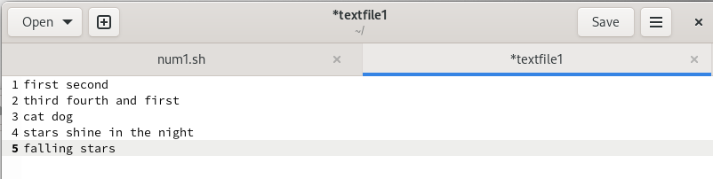{ #fig:004 width=70% }

## Даю права на исполнение и проверяю работу скрипта. Все работает исправно.  (рис. [-@fig:005])

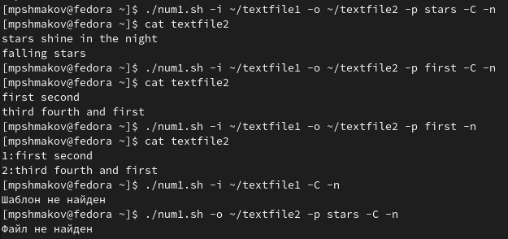{ #fig:005 width=70% }

# 2. Написать на языке Си программу, которая вводит число и определяет, является ли оно больше нуля, меньше нуля или равно нулю. Затем программа завершается с помощью функции exit(n), передавая информацию в о коде завершения в оболочку. Командный файл должен вызывать эту программу и, проанализировав с помощью команды $?, выдать сообщение о том, какое число было введено.

## Создаю файлы num2.c и num2.sh.  (рис. [-@fig:006])

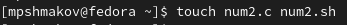{ #fig:006 width=70% }

## Пишу в num2.с код, который будет возвращать число (0, 1, 2). Это число используется скриптом, чтобы определить, какую строчку из 3 ему выводить.  (рис. [-@fig:007]) (рис. [-@fig:008])

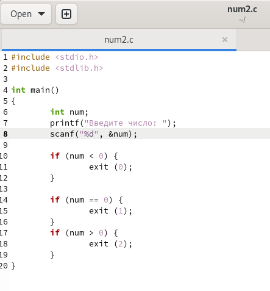{ #fig:007 width=70% }

## Пишу в num2.с код, который будет возвращать число (0, 1, 2). Это число используется скриптом, чтобы определить, какую строчку из 3 ему выводить.  (рис. [-@fig:007]) (рис. [-@fig:008])

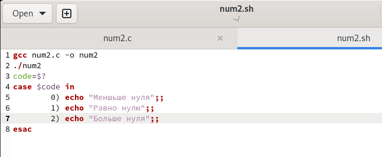{ #fig:008 width=70% }

## Даю права на исполнение и проверяю работу скрипта. Все работает исправно. (рис. [-@fig:009]) (рис. [-@fig:010])

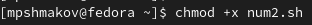{ #fig:009 width=70% }

## Даю права на исполнение и проверяю работу скрипта. Все работает исправно. (рис. [-@fig:009]) (рис. [-@fig:010])

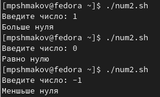{ #fig:010 width=70% }

# 3. Написать командный файл, создающий указанное число файлов, пронумерованных последовательно от 1 до N (например 1.tmp, 2.tmp, 3.tmp,4.tmp и т.д.). Число файлов, которые необходимо создать, передаётся в аргументы командной строки. Этот же командный файл должен уметь удалять все созданные им файлы (если они существуют).

## Создаю файл num3.sh и пишу в него скрипт.  (рис. [-@fig:011]) (рис. [-@fig:012])

{ #fig:011 width=70% }

## Создаю файл num3.sh и пишу в него скрипт.  (рис. [-@fig:011]) (рис. [-@fig:012])

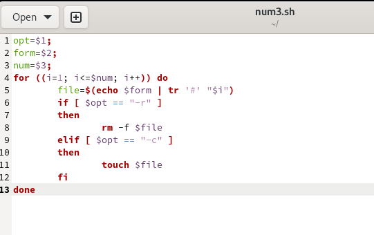{ #fig:012 width=70% }

## Даю права на исполнение и проверяю работу скрипта. Все работает исправно.  (рис. [-@fig:013])

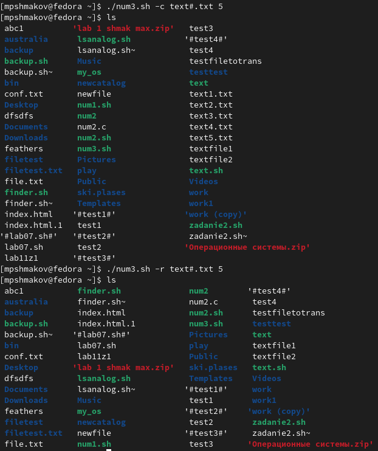{ #fig:013 width=70% }

# 4. Написать командный файл, который с помощью команды tar запаковывает в архив все файлы в указанной директории. Модифицировать его так, чтобы запаковывались только те файлы, которые были изменены менее недели тому назад (использовать команду find).

## Создаю файл num4.sh и пишу в неоо скрипт. (рис. [-@fig:014])

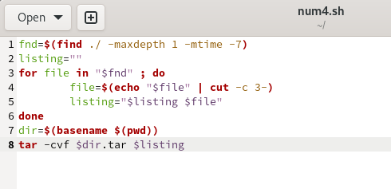{ #fig:014 width=70% }

## Даю права на исполнение и проверяю работу скрипта. Все работает исправно.  (рис. [-@fig:015]) (рис. [-@fig:016]) (рис. [-@fig:017])

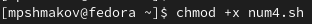{ #fig:015 width=70% }

## Даю права на исполнение и проверяю работу скрипта. Все работает исправно.  (рис. [-@fig:015]) (рис. [-@fig:016]) (рис. [-@fig:017])

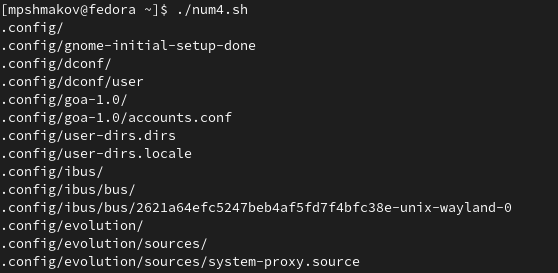{ #fig:016 width=70% }

## Даю права на исполнение и проверяю работу скрипта. Все работает исправно.  (рис. [-@fig:015]) (рис. [-@fig:016]) (рис. [-@fig:017])

{ #fig:017 width=70% }

# Выводы
## Выводы

В ходе работы я научился писать более сложные командные файлы с использованием логических управляющих конструкций и циклов. 

