---
## Front matter
lang: ru-RU
title: Отчет по лабораторной работе №12
author: |
	Шмаков Максим\inst{1}
institute: |
	\inst{1}RUDN University, Moscow, Russian Federation
date: 2022, 28 мая , Москва

## Formatting
toc: false
slide_level: 2
theme: metropolis
header-includes: 
 - \metroset{progressbar=frametitle,sectionpage=progressbar,numbering=fraction}
 - '\makeatletter'
 - '\beamer@ignorenonframefalse'
 - '\makeatother'
aspectratio: 43
section-titles: true
---

# Цель работы

Изучить основы программирования в оболочке ОС UNIX. Научиться писать более сложные командные файлы с использованием логических управляющих конструкций и циклов.

# Выполнение лабораторной работы

## 1. 
Написать командный файл, реализующий упрощённый механизм семафоров. Командный файл должен в течение некоторого времени t1 дожидаться освобождения ресурса, выдавая об этом сообщение, а дождавшись его освобождения, использовать его в течение некоторого времени t2<>t1, также выдавая информацию о том, что ресурс используется соответствующим командным файлом (процессом). Запустить командный файл в одном виртуальном терминале в фоновом режиме, перенаправив его вывод в другой (> /dev/tty#, где # — номер терминала куда перенаправляется вывод), в котором также запущен этот файл, но не фоновом, а в привилегированном режиме. Доработать программу так, чтобы имелась возможность взаимодействия трёх и более процессов.

## Создаю файл number1.sh и пишу в нем скрипт. (рис. [-@fig:001]) (рис. [-@fig:002])

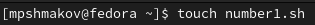{ #fig:001 width=70% }

## Создаю файл number1.sh и пишу в нем скрипт. (рис. [-@fig:001]) (рис. [-@fig:002])

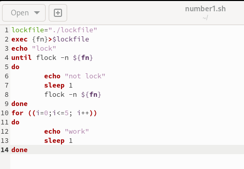{ #fig:002 width=70% }

## Даю право на исполнение и проверяю работу скрипта. Все работает правильно.  (рис. [-@fig:003]) (рис. [-@fig:004])

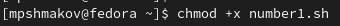{ #fig:003 width=70% }

## Даю право на исполнение и проверяю работу скрипта. Все работает правильно.  (рис. [-@fig:003]) (рис. [-@fig:004])

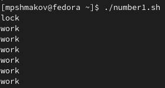{ #fig:004 width=70% }

## 2. 
Реализовать команду man с помощью командного файла. Изучите содержимое каталога /usr/share/man/man1. В нем находятся архивы текстовых файлов, содержащих справку по большинству установленных в системе программ и команд. Каждый архив можно открыть командой less сразу же просмотрев содержимое справки. Командный файл должен получать в виде аргумента командной строки название команды и в виде результата выдавать справку об этой команде или сообщение об отсутствии справки, если соответствующего файла нет в каталоге man1.

## Просмотрел содержимое каталога /usr/share/man/man1. (рис. [-@fig:005])

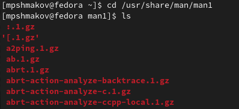{ #fig:005 width=70% }

## Создаю файл number2.sh и пишу в нем скрипт.  (рис. [-@fig:006]) (рис. [-@fig:007])

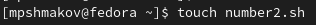{ #fig:006 width=70% }

## Создаю файл number2.sh и пишу в нем скрипт.  (рис. [-@fig:006]) (рис. [-@fig:007])

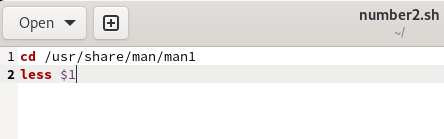{ #fig:007 width=70% }

## Даю право на исполнение, запускаю файл и проверяю результат. Все верно.  (рис. [-@fig:008]) (рис. [-@fig:009]) (рис. [-@fig:010])

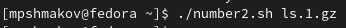{ #fig:008 width=70% }

## Даю право на исполнение, запускаю файл и проверяю результат. Все верно.  (рис. [-@fig:008]) (рис. [-@fig:009]) (рис. [-@fig:010])

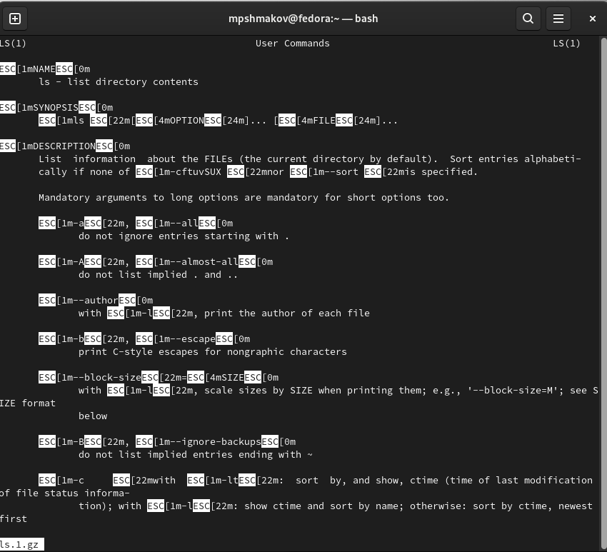{ #fig:009 width=70% }

## Даю право на исполнение, запускаю файл и проверяю результат. Все верно.  (рис. [-@fig:008]) (рис. [-@fig:009]) (рис. [-@fig:010])

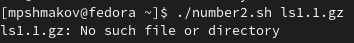{ #fig:010 width=70% }

## 3. 
Используя встроенную переменную $RANDOM, напишите командный файл, генерирующий случайную последовательность букв латинского алфавита. Учтите, что $RANDOM выдаёт псевдослучайные числа в диапазоне от 0 до 32767.

## Создаю файл number3.sh, пишу в нем скрипт.  (рис. [-@fig:011]) (рис. [-@fig:012])

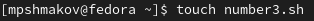{ #fig:011 width=70% }

## Создаю файл number3.sh, пишу в нем скрипт.  (рис. [-@fig:011]) (рис. [-@fig:012])

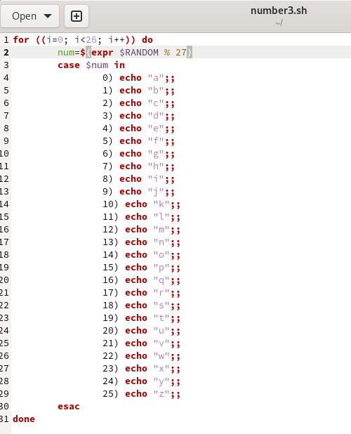{ #fig:012 width=70% }

## Даю право на исполнение и проверяю результат. На всякий случай, запускаю 2 раза, чтобы убедиться что выводятся разные буквы. Все верно. (рис. [-@fig:0013]) (рис. [-@fig:0014])

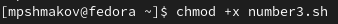{ #fig:013 width=70% }

## Даю право на исполнение и проверяю результат. На всякий случай, запускаю 2 раза, чтобы убедиться что выводятся разные буквы. Все верно. (рис. [-@fig:0013]) (рис. [-@fig:0014])

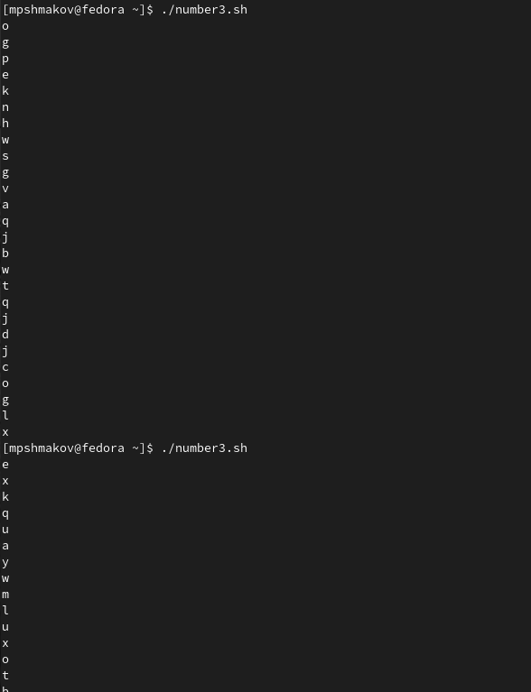{ #fig:014 width=70% }

# Выводы
## Выводы

В ходе работы я научился писать более сложные командные файлы с использованием логических управляющих конструкций и циклов.

