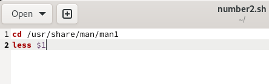

---
## Front matter
title: "Отчет по лабораторной работе №12"
subtitle: "дисциплина: операционные системы"
author: "Шмаков Максим Павлович"

## Generic otions
lang: ru-RU
toc-title: "Содержание"

## Bibliography
bibliography: bib/cite.bib
csl: pandoc/csl/gost-r-7-0-5-2008-numeric.csl

## Pdf output format
toc: true # Table of contents
toc-depth: 2
lof: true # List of figures
lot: true # List of tables
fontsize: 12pt
linestretch: 1.5
papersize: a4
documentclass: scrreprt
## I18n polyglossia
polyglossia-lang:
  name: russian
  options:
	- spelling=modern
	- babelshorthands=true
polyglossia-otherlangs:
  name: english
## I18n babel
babel-lang: russian
babel-otherlangs: english
## Fonts
mainfont: PT Serif
romanfont: PT Serif
sansfont: PT Sans
monofont: PT Mono
mainfontoptions: Ligatures=TeX
romanfontoptions: Ligatures=TeX
sansfontoptions: Ligatures=TeX,Scale=MatchLowercase
monofontoptions: Scale=MatchLowercase,Scale=0.9
## Biblatex
biblatex: true
biblio-style: "gost-numeric"
biblatexoptions:
  - parentracker=true
  - backend=biber
  - hyperref=auto
  - language=auto
  - autolang=other*
  - citestyle=gost-numeric
## Pandoc-crossref LaTeX customization
figureTitle: "Рис."
tableTitle: "Таблица"
listingTitle: "Листинг"
lofTitle: "Список иллюстраций"
lotTitle: "Список таблиц"
lolTitle: "Листинги"
## Misc options
indent: true
header-includes:
  - \usepackage{indentfirst}
  - \usepackage{float} # keep figures where there are in the text
  - \floatplacement{figure}{H} # keep figures where there are in the text
---

# Цель работы

Изучить основы программирования в оболочке ОС UNIX. Научиться писать более сложные командные файлы с использованием логических управляющих конструкций и циклов.

# Задание

1. Написать командный файл, реализующий упрощённый механизм семафоров. Командный файл должен в течение некоторого времени t1 дожидаться освобождения ресурса, выдавая об этом сообщение, а дождавшись его освобождения, использовать его в течение некоторого времени t2<>t1, также выдавая информацию о том, что ресурс используется соответствующим командным файлом (процессом). Запустить командный файл в одном виртуальном терминале в фоновом режиме, перенаправив его вывод в другой (> /dev/tty#, где # — номер терминала куда перенаправляется вывод), в котором также запущен этот файл, но не фоновом, а в привилегированном режиме. Доработать программу так, чтобы имелась возможность взаимодействия трёх и более процессов.

2. Реализовать команду man с помощью командного файла. Изучите содержимое каталога /usr/share/man/man1. В нем находятся архивы текстовых файлов, содержащих справку по большинству установленных в системе программ и команд. Каждый архив можно открыть командой less сразу же просмотрев содержимое справки. Командный файл должен получать в виде аргумента командной строки название команды и в виде результата выдавать справку об этой команде или сообщение об отсутствии справки, если соответствующего файла нет в каталоге man1.

3. Используя встроенную переменную $RANDOM, напишите командный файл, генерирующий случайную последовательность букв латинского алфавита. Учтите, что $RANDOM выдаёт псевдослучайные числа в диапазоне от 0 до 32767.

# Выполнение лабораторной работы

1. Написать командный файл, реализующий упрощённый механизм семафоров. Командный файл должен в течение некоторого времени t1 дожидаться освобождения ресурса, выдавая об этом сообщение, а дождавшись его освобождения, использовать его в течение некоторого времени t2<>t1, также выдавая информацию о том, что ресурс используется соответствующим командным файлом (процессом). Запустить командный файл в одном виртуальном терминале в фоновом режиме, перенаправив его вывод в другой (> /dev/tty#, где # — номер терминала куда перенаправляется вывод), в котором также запущен этот файл, но не фоновом, а в привилегированном режиме. Доработать программу так, чтобы имелась возможность взаимодействия трёх и более процессов.

Создаю файл number1.sh и пишу в нем скрипт. (рис. [-@fig:001]) (рис. [-@fig:002])

{ #fig:001 width=70% }

{ #fig:002 width=70% }

Даю право на исполнение и проверяю работу скрипта. Все работает правильно.  (рис. [-@fig:003]) (рис. [-@fig:004])

{ #fig:003 width=70% }

{ #fig:004 width=70% }

2. Реализовать команду man с помощью командного файла. Изучите содержимое каталога /usr/share/man/man1. В нем находятся архивы текстовых файлов, содержащих справку по большинству установленных в системе программ и команд. Каждый архив можно открыть командой less сразу же просмотрев содержимое справки. Командный файл должен получать в виде аргумента командной строки название команды и в виде результата выдавать справку об этой команде или сообщение об отсутствии справки, если соответствующего файла нет в каталоге man1.

Просмотрел содержимое каталога /usr/share/man/man1. (рис. [-@fig:005])

{ #fig:005 width=70% }

Создаю файл number2.sh и пишу в нем скрипт.  (рис. [-@fig:006]) (рис. [-@fig:007])

{ #fig:006 width=70% }

{ #fig:007 width=70% }

Даю право на исполнение, запускаю файл и проверяю результат. Все верно.  (рис. [-@fig:008]) (рис. [-@fig:009]) (рис. [-@fig:010])

{ #fig:008 width=70% }

{ #fig:009 width=70% }

{ #fig:010 width=70% }

3. Используя встроенную переменную $RANDOM, напишите командный файл, генерирующий случайную последовательность букв латинского алфавита. Учтите, что $RANDOM выдаёт псевдослучайные числа в диапазоне от 0 до 32767.

Создаю файл number3.sh, пишу в нем скрипт.  (рис. [-@fig:011]) (рис. [-@fig:012])

{ #fig:011 width=70% }

{ #fig:012 width=70% }

Даю право на исполнение и проверяю результат. На всякий случай, запускаю 2 раза, чтобы убедиться что выводятся разные буквы. Все верно. (рис. [-@fig:0013]) (рис. [-@fig:0014])

{ #fig:013 width=70% }

{ #fig:014 width=70% }

# Выводы

В ходе работы я научился писать более сложные командные файлы с использованием логических управляющих конструкций и циклов.

# Контрольные вопросы

1. Найдите синтаксическую ошибку в следующей строке:

while [$1 != "exit"]

В этой строке квадратные скобки надо заменить на круглые.

2. Как объединить (конкатенация) несколько строк в одну?

Самый простой способ объединить две или более строковые переменные — записать их одну за другой:
VAR1="Hello,"
VAR2=" World"
VAR3="$VAR1$VAR2"
echo "$VAR3"
итог:
Hello, World
 
Вы также можете объединить одну или несколько переменных с литеральными строками:

VAR1="Hello,"
VAR2="${VAR1}World"
echo "$VAR2"
итог:
Hello, World

3. Найдите информацию об утилите seq. Какими иными способами можно реализовать её функционал при программировании на bash?

Команда seq выводит последовательность целых или действительных чисел, подходящую для передачи в другие программы.

Мы можем использовать seq с циклом for, используя подстановку команд, как показано здесь:

$ for i in $(seq 1 0.5 4)
do
еcho "The number is $i"
done
Вывод:
The number is 1
The number is 1.5
The number is 2
The number is 2.5
The number is 3
The number is 3.5
The number is 4

4. Какой результат даст вычисление выражения $((10/3))?

Выдаст результат 3.

5. Укажите кратко основные отличия командной оболочки zsh от bash.

Чтобы дать вам лучше понять набор отличительных черт Z Shell, вот список того, что вы получите, используя Z Shell вместо Bash:

Встроенная команда zmv поможет вам массово переименовать файлы/директории, например, чтобы добавить ‘.txt’ к имени каждого файла, запустите zmv –C '(*)(#q.)' '$1.txt'.
Утилита zcalc — это замечательный калькулятор командной строки, это удобный способ считать быстро, не покидая терминал. Загрузите её через autoload -Uz zcalc и запустите командой zcalc.
Команда zparseopts — это однострочник, который поможет вам разобрать сложные варианты, которые предоставляются вашему скрипту(?)
Команда autopushd позволяет вам делать popd после того, как вы с помощью cd, чтобы вернуться в предыдущую директорию.
Поддержка чисел с плавающей точкой (коей Bash, к удивлению, не содержит).
Поддержка для структур данных “хэш”.
Есть также ряд особенностей, которые присутствуют в Bash, но их нет почти во всех остальных командных оболочках. Вот также некоторые из них:

Опция командной строки –norc, которая позволяет пользователю иметь дело с инициализацией командной строки, не читая файл .bashrc
Использование опции –rcfile <filename> с bash позволяет вам исполнять команды из определённого файла.
Отличные возможности вызова (набор опций для командной строки)
Может быть вызвана командой sh
Bash можно запустить в определённом режиме POSIX.  Применитеset –o posix, чтобы включить режим, или ––posix при запуске.
Вы можете управлять видом командной строки в Bash. Настройка переменной PROMPT_COMMAND с одним или более специальными символами настроит её за вас.
Bash также можно включить в режиме ограниченной оболочки (с rbash или --restricted), это означает, что некоторые команды/действия больше не будут доступны:
Настройка и удаление значений служебных переменных SHELL, PATH, ENV,  BASH_ENV
Перенаправление вывода с использованием операторов ‘>’, ‘>|’, ‘<>’, ‘>&’, ‘&>’, ‘>>’
Разбор значений SHELLOPTS из окружения оболочки при запуске
Использование встроенного оператора exec, чтобы заменить оболочку другой командой
И многое другое

6. Проверьте, верен ли синтаксис данной конструкции

for ((a=1; a <= LIMIT; a++))

Нет, перед LIMIT должен стоять $.

7. Сравните язык bash с какими-либо языками программирования. Какие преимущества у bash по сравнению с ними? Какие недостатки?

У Bash нет стандартного API, однако он поставляется с простыми встроенными функциями (например, со встроенной тестовой обработкой). Однако вам часто придется создавать процессы для обработки данных. Таким образом, Bash работает очень медленно по сравнению с другими языками, предназначенными для создания автоматизированных сценариев.

Используя встроенные функции Python, можно писать современные сложные Shell-сценарии. Но, в отличие от Bash, интерпретатор Python изначально не поддерживает выполнение процесса.

