---
## Front matter
lang: ru-RU
title: Отчет по лабораторной работе №13
author: |
	Шмаков Максим\inst{1}
institute: |
	\inst{1}RUDN University, Moscow, Russian Federation
date: 2022, 3 июня , Москва

## Formatting
toc: false
slide_level: 2
theme: metropolis
header-includes: 
 - \metroset{progressbar=frametitle,sectionpage=progressbar,numbering=fraction}
 - '\makeatletter'
 - '\beamer@ignorenonframefalse'
 - '\makeatother'
aspectratio: 43
section-titles: true
---

# Цель работы

Приобрести простейшие навыки разработки, анализа, тестирования и отладки приложений в ОС типа UNIX/Linux на примере создания на языке программирования С калькулятора с простейшими функциями.

# Выполнение лабораторной работы

## 1. В домашнем каталоге создайте подкаталог ~/work/os/lab_prog. (рис. [-@fig:001])

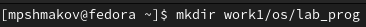{ #fig:001 width=70% }

## 2. Создайте в нём файлы: calculate.h, calculate.c, main.c. (рис. [-@fig:002])

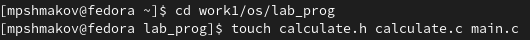{ #fig:002 width=70% }

## Реализация функций калькулятора в файле calculate.с: (рис. [-@fig:003])

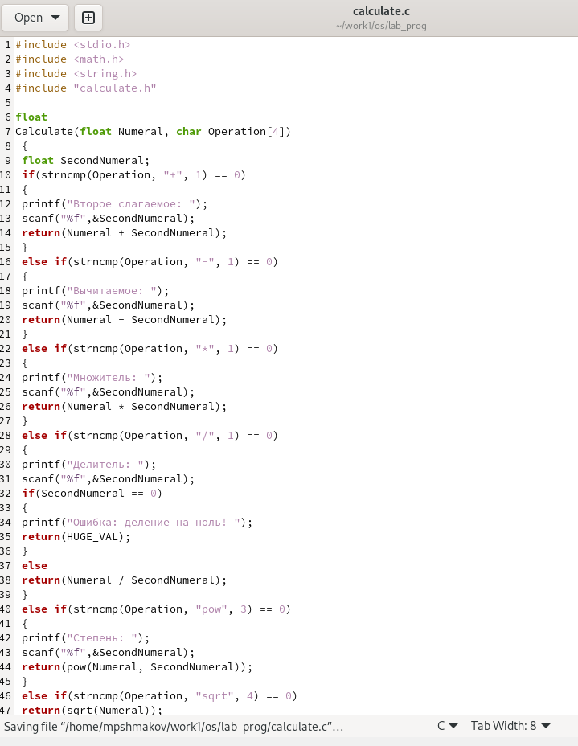{ #fig:003 width=70% }

## Интерфейсный файл calculate.h, описывающий формат вызова функции калькулятора: (рис. [-@fig:004])

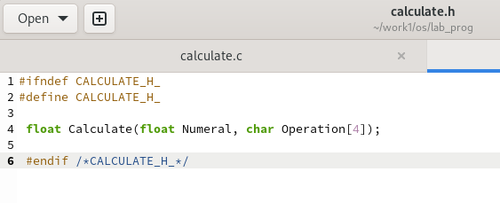{ #fig:004 width=70% }

## Основной файл main.c, реализующий интерфейс пользователя к калькулятору: (рис. [-@fig:005])

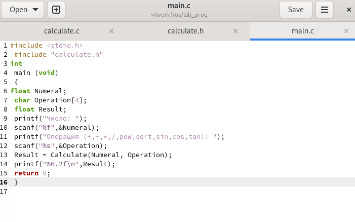{ #fig:005 width=70% }

## 3. Выполните компиляцию программы посредством gcc: (рис. [-@fig:006])

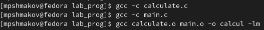{ #fig:006 width=70% }

## 4. При необходимости исправьте синтаксические ошибки.

Ошибок нет.

## 5. Создайте Makefile со следующим содержанием: (рис. [-@fig:007])

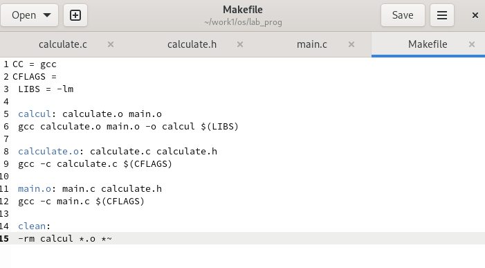{ #fig:007 width=70% }

## 6. С помощью gdb выполните отладку программы calcul (перед использованием gdb исправьте Makefile):

Добавил в Makefile параметр -g, который нужен для отладки. (рис. [-@fig:008])

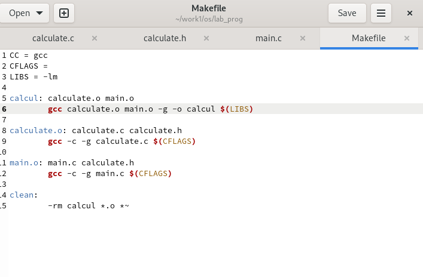{ #fig:008 width=70% }

## – Запустите отладчик GDB, загрузив в него программу для отладки: (рис. [-@fig:009])

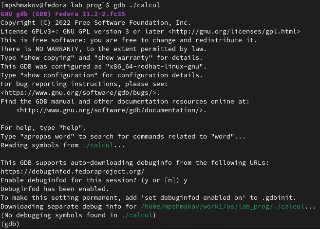{ #fig:009 width=70% }

## – Для запуска программы внутри отладчика введите команду run: (рис. [-@fig:010])

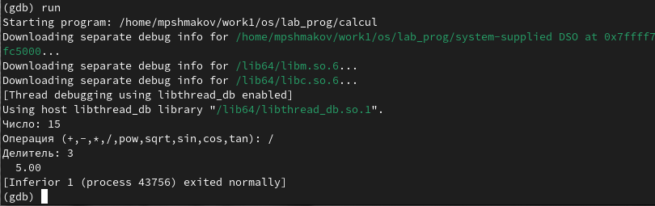{ #fig:010 width=70% }

## – Для постраничного (по 9 строк) просмотра исходного код используйте команду list: (рис. [-@fig:011])

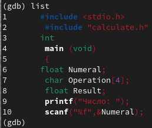{ #fig:011 width=70% }

## – Для просмотра строк с 12 по 15 основного файла используйте list с параметрами 12, 15: (рис. [-@fig:012])

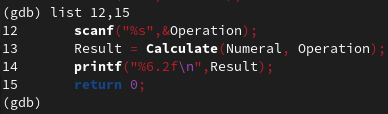{ #fig:012 width=70% }

## – Для просмотра определённых строк не основного файла используйте list с параметрами calculate.c:20,29: (рис. [-@fig:013])

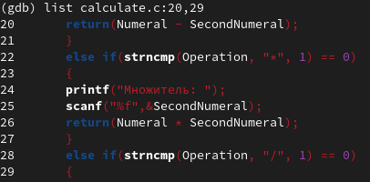{ #fig:013 width=70% }

## – Установите точку останова в файле calculate.c на строке номер 21: (рис. [-@fig:014])

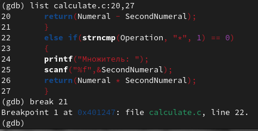{ #fig:014 width=70% }

## – Выведите информацию об имеющихся в проекте точка останова: (рис. [-@fig:015])

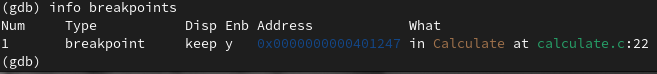{ #fig:015 width=70% }

## – Запустите программу внутри отладчика и убедитесь, что программа остановится в момент прохождения точки останова: (рис. [-@fig:016])

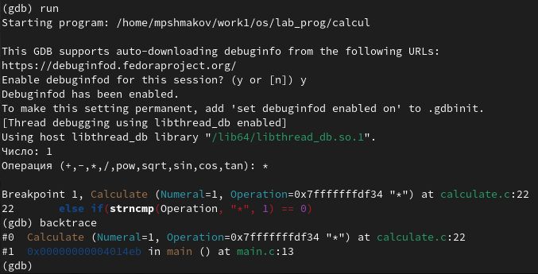{ #fig:016 width=70% }

## – Посмотрите, чему равно на этом этапе значение переменной Numeral c помощью print Numeral и сравните с display Numeral:

Результат вывода 2ух комманд отличается, но они обе показывают значение переменной.  (рис. [-@fig:017]) (рис. [-@fig:018])

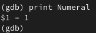{ #fig:017 width=70% }

## – Посмотрите, чему равно на этом этапе значение переменной Numeral c помощью print Numeral и сравните с display Numeral:

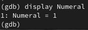{ #fig:018 width=70% }

## – Уберите точки останова: (рис. [-@fig:019])

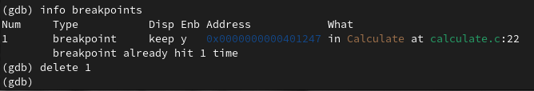{ #fig:019 width=70% }

## 7. С помощью утилиты splint попробуйте проанализировать коды файлов calculate.c и main.c. (рис. [-@fig:020]) (рис. [-@fig:021])

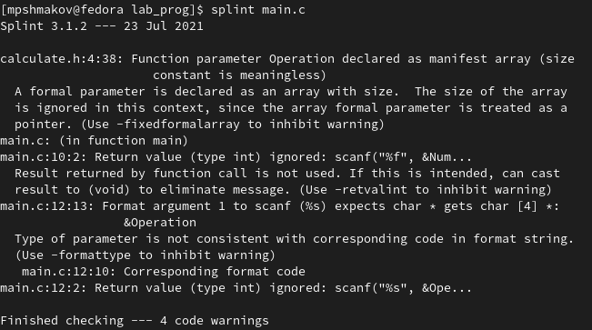{ #fig:020 width=70% }

## 7. С помощью утилиты splint попробуйте проанализировать коды файлов calculate.c и main.c. (рис. [-@fig:020]) (рис. [-@fig:021])

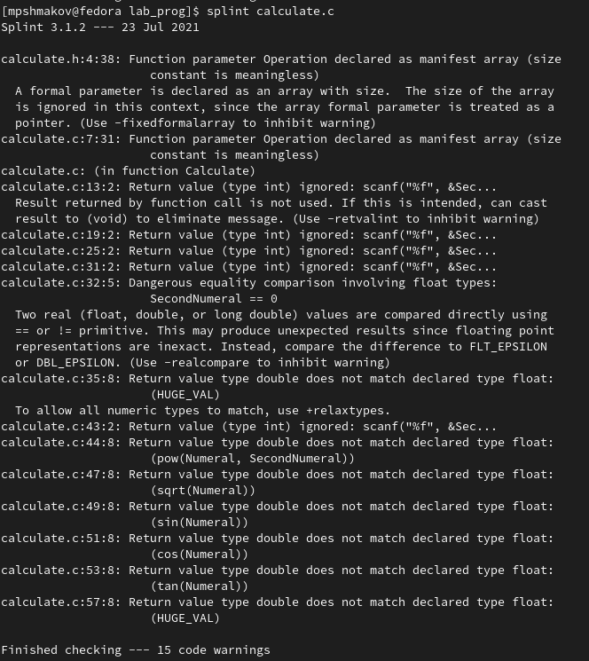{ #fig:021 width=70% }

# Выводы
## Выводы

В ходе работы я приобрел простейшие навыки разработки, анализа, тестирования и отладки приложений в ОС типа UNIX/Linux на примере создания на языке программирования С калькулятора с простейшими функциями.

