---
## Front matter
title: "Отчет по лабораторной работе №13"
subtitle: "дисциплина: операционные системы"
author: "Шмаков Максим Павлович"

## Generic otions
lang: ru-RU
toc-title: "Содержание"

## Bibliography
bibliography: bib/cite.bib
csl: pandoc/csl/gost-r-7-0-5-2008-numeric.csl

## Pdf output format
toc: true # Table of contents
toc-depth: 2
lof: true # List of figures
lot: true # List of tables
fontsize: 12pt
linestretch: 1.5
papersize: a4
documentclass: scrreprt
## I18n polyglossia
polyglossia-lang:
  name: russian
  options:
	- spelling=modern
	- babelshorthands=true
polyglossia-otherlangs:
  name: english
## I18n babel
babel-lang: russian
babel-otherlangs: english
## Fonts
mainfont: PT Serif
romanfont: PT Serif
sansfont: PT Sans
monofont: PT Mono
mainfontoptions: Ligatures=TeX
romanfontoptions: Ligatures=TeX
sansfontoptions: Ligatures=TeX,Scale=MatchLowercase
monofontoptions: Scale=MatchLowercase,Scale=0.9
## Biblatex
biblatex: true
biblio-style: "gost-numeric"
biblatexoptions:
  - parentracker=true
  - backend=biber
  - hyperref=auto
  - language=auto
  - autolang=other*
  - citestyle=gost-numeric
## Pandoc-crossref LaTeX customization
figureTitle: "Рис."
tableTitle: "Таблица"
listingTitle: "Листинг"
lofTitle: "Список иллюстраций"
lotTitle: "Список таблиц"
lolTitle: "Листинги"
## Misc options
indent: true
header-includes:
  - \usepackage{indentfirst}
  - \usepackage{float} # keep figures where there are in the text
  - \floatplacement{figure}{H} # keep figures where there are in the text
---

# Цель работы

Приобрести простейшие навыки разработки, анализа, тестирования и отладки приложений в ОС типа UNIX/Linux на примере создания на языке программирования С калькулятора с простейшими функциями.

# Задание

1. В домашнем каталоге создайте подкаталог ~/work/os/lab_prog.
2. Создайте в нём файлы: calculate.h, calculate.c, main.c.
Это будет примитивнейший калькулятор, способный складывать, вычитать, умножать и делить, возводить число в степень, брать квадратный корень, вычислять sin, cos, tan. При запуске он будет запрашивать первое число, операцию, второе число. После этого программа выведет результат и остановится.
3. Выполните компиляцию программы посредством gcc:
4. При необходимости исправьте синтаксические ошибки.
5. Создайте Makefile со следующим содержанием:
6. С помощью gdb выполните отладку программы calcul (перед использованием gdb
исправьте Makefile):
– Запустите отладчик GDB, загрузив в него программу для отладки:
– Для запуска программы внутри отладчика введите команду run:
– Для постраничного (по 9 строк) просмотра исходного код используйте команду list:
– Для просмотра строк с 12 по 15 основного файла используйте list с параметрами 12, 15:
– Для просмотра определённых строк не основного файла используйте list с параметрами calculate.c:20,29:
– Установите точку останова в файле calculate.c на строке номер 21:
– Выведите информацию об имеющихся в проекте точка останова:
– Запустите программу внутри отладчика и убедитесь, что программа остановится в момент прохождения точки останова:
– Посмотрите, чему равно на этом этапе значение переменной Numeral c помощью print Numeral и сравните с display Numeral:
– Уберите точки останова:
7. С помощью утилиты splint попробуйте проанализировать коды файлов calculate.c и main.c.

# Выполнение лабораторной работы

1. В домашнем каталоге создайте подкаталог ~/work/os/lab_prog. (рис. [-@fig:001])

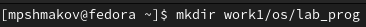{ #fig:001 width=70% }

2. Создайте в нём файлы: calculate.h, calculate.c, main.c. (рис. [-@fig:002])

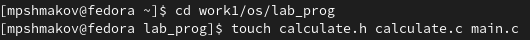{ #fig:002 width=70% }

Реализация функций калькулятора в файле calculate.с: (рис. [-@fig:003])

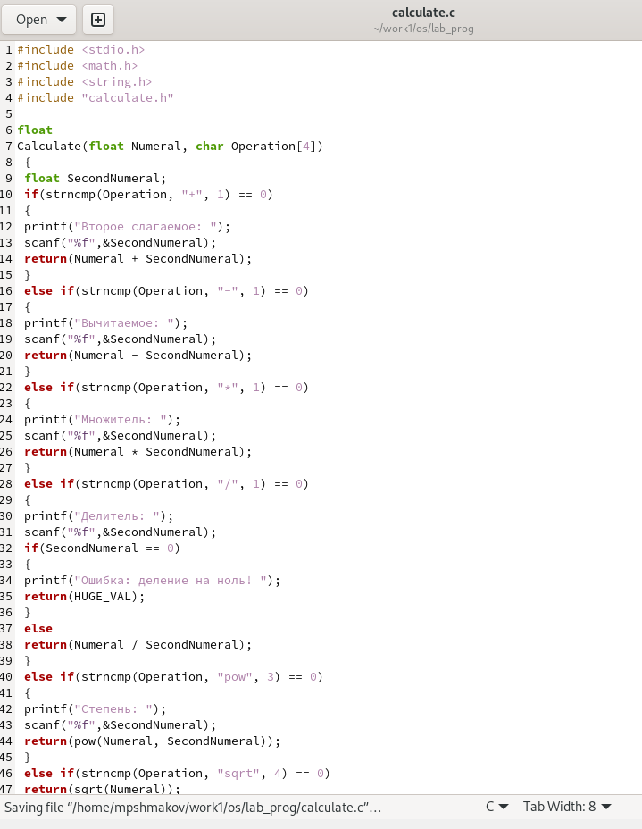{ #fig:003 width=70% }

Интерфейсный файл calculate.h, описывающий формат вызова функции калькулятора: (рис. [-@fig:004])

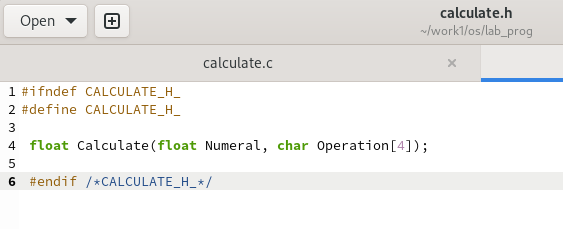{ #fig:004 width=70% }

Основной файл main.c, реализующий интерфейс пользователя к калькулятору: (рис. [-@fig:005])

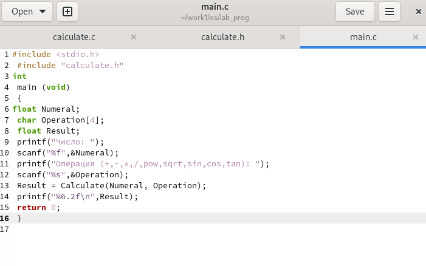{ #fig:005 width=70% }

3. Выполните компиляцию программы посредством gcc: (рис. [-@fig:006])

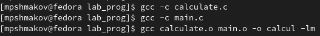{ #fig:006 width=70% }

4. При необходимости исправьте синтаксические ошибки.

Ошибок нет.

5. Создайте Makefile со следующим содержанием: (рис. [-@fig:007])

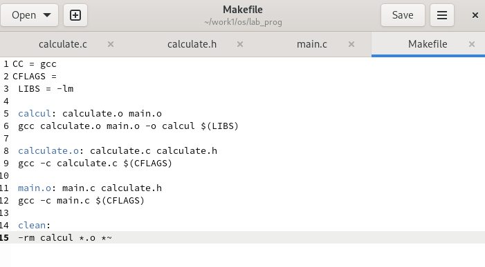{ #fig:007 width=70% }

6. С помощью gdb выполните отладку программы calcul (перед использованием gdb
исправьте Makefile):

Добавил в Makefile параметр -g, который нужен для отладки. (рис. [-@fig:008])

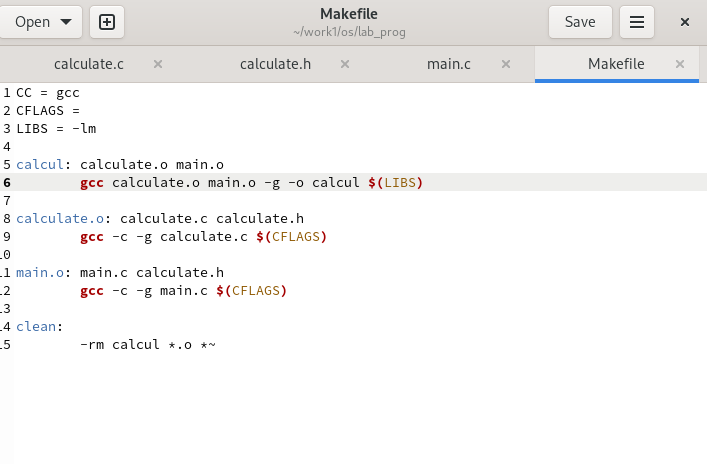{ #fig:008 width=70% }

– Запустите отладчик GDB, загрузив в него программу для отладки: (рис. [-@fig:009])

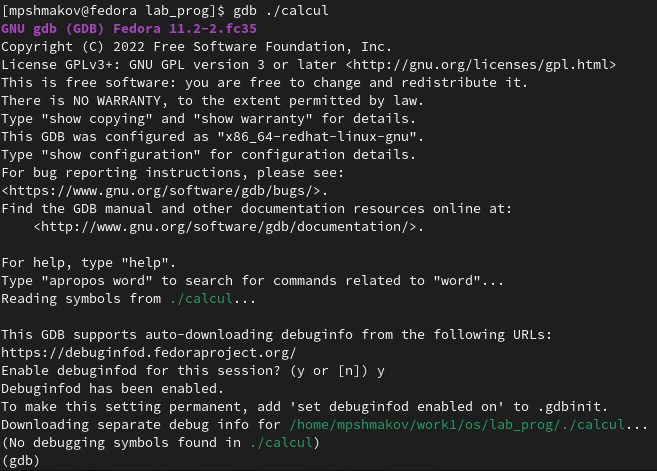{ #fig:009 width=70% }

– Для запуска программы внутри отладчика введите команду run: (рис. [-@fig:010])

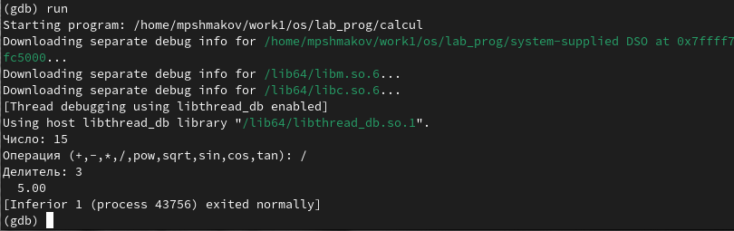{ #fig:010 width=70% }

– Для постраничного (по 9 строк) просмотра исходного код используйте команду list: (рис. [-@fig:011])

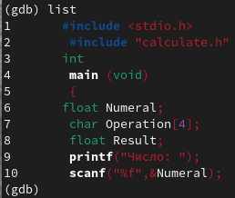{ #fig:011 width=70% }

– Для просмотра строк с 12 по 15 основного файла используйте list с параметрами 12, 15: (рис. [-@fig:012])

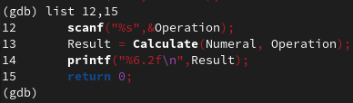{ #fig:012 width=70% }

– Для просмотра определённых строк не основного файла используйте list с параметрами calculate.c:20,29: (рис. [-@fig:013])

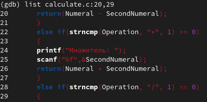{ #fig:013 width=70% }

– Установите точку останова в файле calculate.c на строке номер 21: (рис. [-@fig:014])

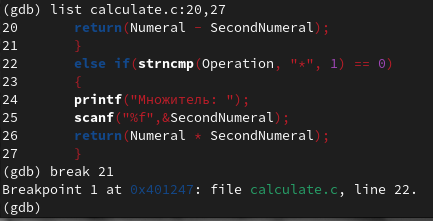{ #fig:014 width=70% }

– Выведите информацию об имеющихся в проекте точка останова: (рис. [-@fig:015])

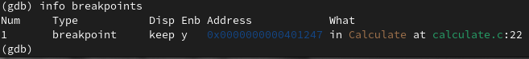{ #fig:015 width=70% }

– Запустите программу внутри отладчика и убедитесь, что программа остановится в момент прохождения точки останова: (рис. [-@fig:016])

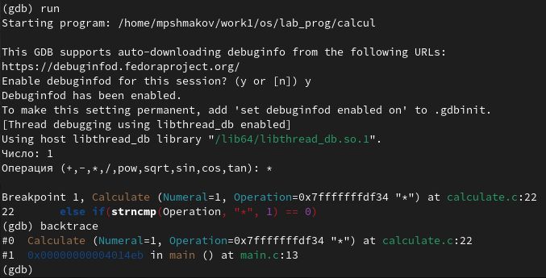{ #fig:016 width=70% }

– Посмотрите, чему равно на этом этапе значение переменной Numeral c помощью print Numeral и сравните с display Numeral:

Результат вывода 2ух комманд отличается, но они обе показывают значение переменной.  (рис. [-@fig:017]) (рис. [-@fig:018])

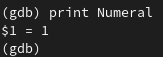{ #fig:017 width=70% }

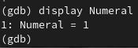{ #fig:018 width=70% }

– Уберите точки останова: (рис. [-@fig:019])

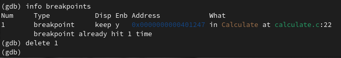{ #fig:019 width=70% }

7. С помощью утилиты splint попробуйте проанализировать коды файлов calculate.c и main.c. (рис. [-@fig:020]) (рис. [-@fig:021])

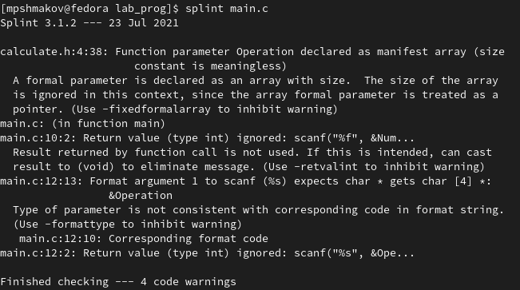{ #fig:020 width=70% }

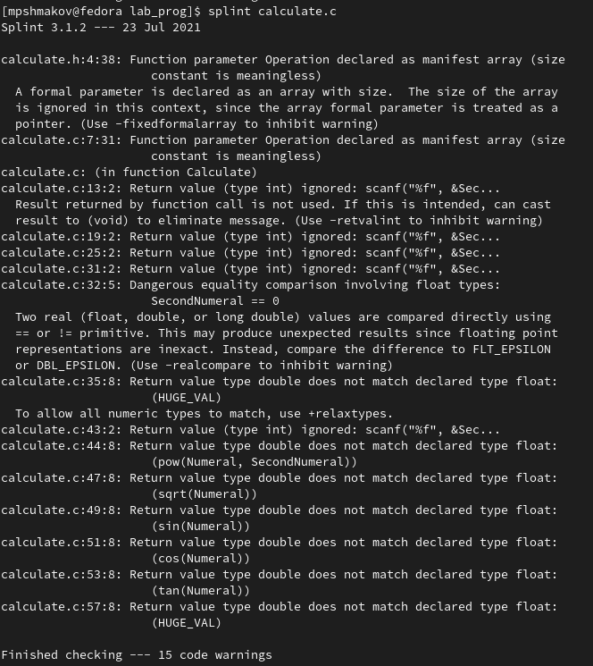{ #fig:021 width=70% }

# Выводы

В ходе работы я приобрел простейшие навыки разработки, анализа, тестирования и отладки приложений в ОС типа UNIX/Linux на примере создания на языке программирования С калькулятора с простейшими функциями.

# Контрольные вопросы

1. Как получить информацию о возможностях программ gcc, make, gdb и др.?

Чтобы получить информацию о возможностях этих программ нужно прописать в консоль man gcc, man make итд...

2. Назовите и дайте краткую характеристику основным этапам разработки приложений в UNIX.

Процесс разработки программного обеспечения обычно разделяется на следующие этапы:
– планирование, включающее сбор и анализ требований к функционалу и другим характеристикам разрабатываемого приложения;
– проектирование, включающее в себя разработку базовых алгоритмов и спецификаций, определение языка программирования;
– непосредственная разработка приложения:
– кодирование — по сути создание исходного текста программы (возможно в нескольких вариантах);
– анализ разработанного кода;
– сборка, компиляция и разработка исполняемого модуля;
– тестирование и отладка, сохранение произведённых изменений;
– документирование.
Для создания исходного текста программы разработчик может воспользоваться любым удобным для него редактором текста: vi, vim, mceditor, emacs, geany и др.
После завершения написания исходного кода программы (возможно состоящей из нескольких файлов), необходимо её скомпилировать и получить исполняемый модуль.

3. Что такое суффикс в контексте языка программирования? Приведите примеры использования.

Суффикс это составная часть имени файла. Система сборки каких-либо программ (например язык java) требует, чтобы имена файлов исходного кода заканчивались на . java. Файлы с расширением (суффиксом) .c воспринимаются gcc как программы на языке С, файлы с расширением .cc или .C — как файлы на языке C++, а файлы c расширением .o считаются объектными.

4. Каково основное назначение компилятора языка С в UNIX?

Компилятор — программа, переводящая написанный на языке программирования текст в набор машинных кодов.

5. Для чего предназначена утилита make?

Для компилиции файлов calculate.c, calculate.h и main.c.

6. Приведите пример структуры Makefile. Дайте характеристику основным элементам этого файла.

Общий синтаксис Makefile имеет вид:
1 target1 [target2...]:[:] [dependment1...]
2 [(tab)commands] [#commentary]
3 [(tab)commands] [#commentary]
Здесь знак # определяет начало комментария (содержимое от знака # и до конца строки не будет обрабатываться. Одинарное двоеточие указывает на то, что последовательность команд должна содержаться в одной строке. Для переноса можно в длинной строке команд можно использовать обратный слэш (\). Двойное двоеточие указывает на то, что последовательность команд может содержаться в нескольких последовательных строках.

7. Назовите основное свойство, присущее всем программам отладки. Что необходимо сделать, чтобы его можно было использовать?

Основным свойством присущим всем программам отладки является возможность ставить точки останова в программе. 
Для того, чтобы поставить точку останова в отладчике gdb нужно прописать break и сточку кода, где нужно остановить исполнение программы.

8. Назовите и дайте основную характеристику основным командам отладчика gdb.

backtrace - вывод на экран пути к текущей точке останова (по сути вывод названий всех функций)
break - установить точку останова (в качестве параметра может быть указан номер строки или название функции)
clear - удалить все точки останова в функции
continue - продолжить выполнение программы
delete - удалить точку останова
display - добавить выражение в список выражений, значения которых отображаются при достижении точки останова программы
finish - выполнить программу до момента выхода из функции
info breakpoints - вывести на экран список используемых точек останова
info watchpoints - вывести на экран список используемых контрольных выражений
list - вывести на экран исходный код (в качестве параметра может быть указано название файла и через двоеточие номера начальной и конечной строк)
next - выполнить программу пошагово, но без выполнения вызываемых в программе функций
print - вывести значение указываемого в качестве параметра выражения
run - запуск программы на выполнение
set - установить новое значение переменной
step - пошаговое выполнение программы
watch - установить контрольное выражение, при изменении значения которого программа будет остановлена

9. Опишите по шагам схему отладки программы, которую Вы использовали при выполнении лабораторной работы.

– Запустите отладчик GDB, загрузив в него программу для отладки:

gdb ./calcul

– Для запуска программы внутри отладчика введите команду run:

run

– Для постраничного (по 9 строк) просмотра исходного код используйте команду list:

list

– Для просмотра строк с 12 по 15 основного файла используйте list с параметрами:

list 12,15

– Для просмотра определённых строк не основного файла используйте list с параметрами:

list calculate.c:20,29

– Установите точку останова в файле calculate.c на строке номер 21:

list calculate.c:20,27
break 21

– Выведите информацию об имеющихся в проекте точка останова:

info breakpoints

– Запустите программу внутри отладчика и убедитесь, что программа остановится в момент прохождения точки останова:
run
5
-
backtrace

– Отладчик выдаст следующую информацию:

 #0 Calculate (Numeral=5, Operation=0x7fffffffd280 "-")
 at calculate.c:21
 #1 0x0000000000400b2b in main () at main.c:17
а команда backtrace покажет весь стек вызываемых функций от начала программы до текущего места.

– Посмотрите, чему равно на этом этапе значение переменной Numeral, введя:

print Numeral
На экран должно быть выведено число 5.

– Сравните с результатом вывода на экран после использования команды:

display Numeral

– Уберите точки останова:

info breakpoints
delete 1

10. Прокомментируйте реакцию компилятора на синтаксические ошибки в программе при его первом запуске.

Выводит в терминал место, где была допущена ошибка.

11. Назовите основные средства, повышающие понимание исходного кода программы.

1) Знание языка программирования исходного кода.
2) Программа splint может помочь понять ошибки в коде.

12. Каковы основные задачи, решаемые программой splint?

Утилита splint анализирует программный код, проверяет корректность задания аргументов использованных в программе функций и типов возвращаемых значений, обнаруживает синтаксические и семантические ошибки.
В отличие от компилятора C анализатор splint генерирует комментарии с описанием разбора кода программы и осуществляет общий контроль, обнаруживая такие ошибки, как одинаковые объекты, определённые в разных файлах, или объекты, чьи значения не используются в работе программы, переменные с некорректно заданными значениями и типами и многое другое.

