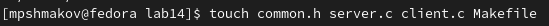
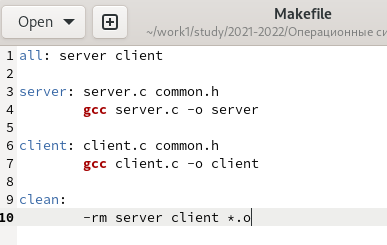
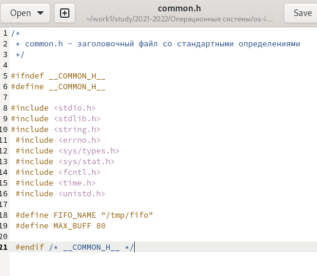
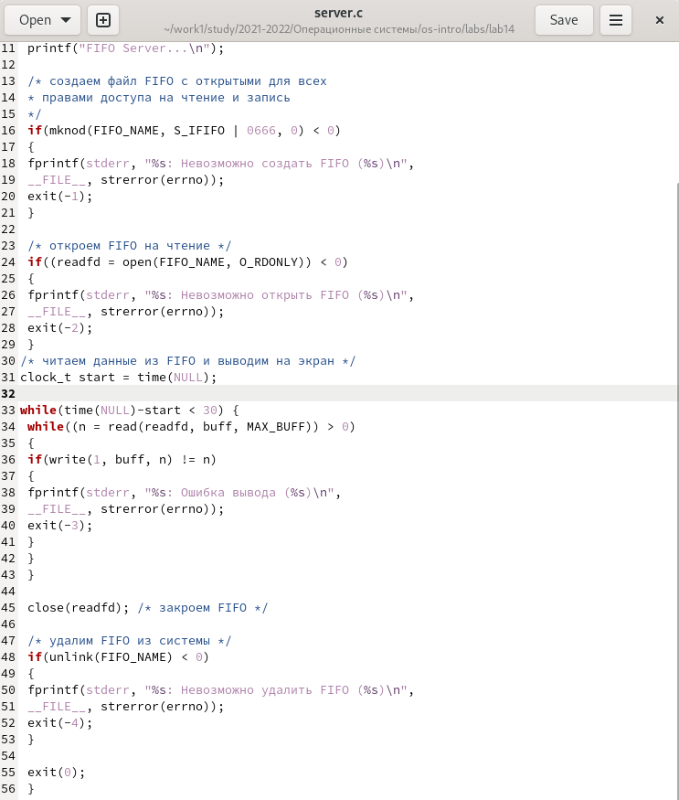
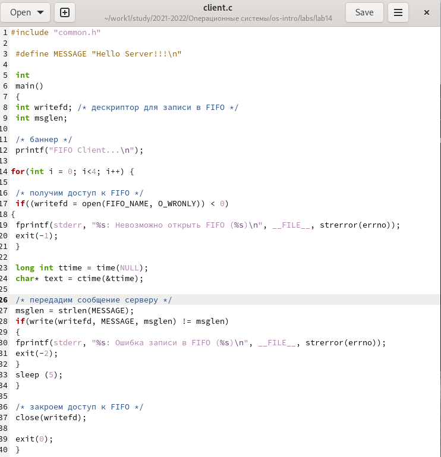
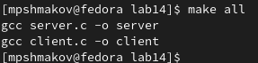
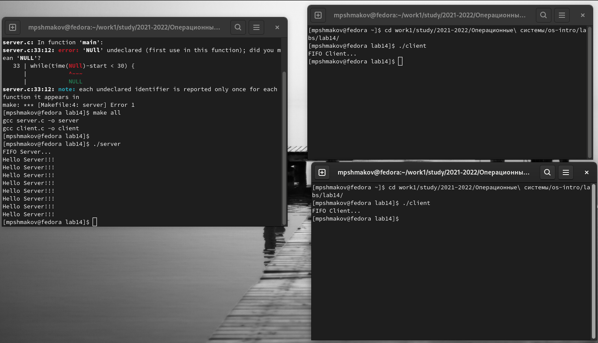

---
## Front matter
lang: ru-RU
title: Отчет по лабораторной работе №14
author: |
	Шмаков Максим\inst{1}
institute: |
	\inst{1}RUDN University, Moscow, Russian Federation
date: 2022, 4 июня , Москва

## Formatting
toc: false
slide_level: 2
theme: metropolis
header-includes: 
 - \metroset{progressbar=frametitle,sectionpage=progressbar,numbering=fraction}
 - '\makeatletter'
 - '\beamer@ignorenonframefalse'
 - '\makeatother'
aspectratio: 43
section-titles: true
---

# Цель работы

Приобретение практических навыков работы с именованными каналами

## Задание

Изучите приведённые в тексте программы server.c и client.c. Взяв данные примеры за образец, напишите аналогичные программы, внеся следующие изменения:
1. Работает не 1 клиент, а несколько (например, два).
2. Клиенты передают текущее время с некоторой периодичностью (например, раз в пять секунд). Используйте функцию sleep() для приостановки работы клиента.
3. Сервер работает не бесконечно, а прекращает работу через некоторое время (например, 30 сек). Используйте функцию clock() для определения времени работы сервера.
Что будет в случае, если сервер завершит работу, не закрыв канал?

# Выполнение лабораторной работы

## Создаю необходимые файлы  (рис. [-@fig:001])

{ #fig:001 width=70% }

# Далее изменяю коды этих программ.
## Makefile оставил таким, каким он был.  (рис. [-@fig:002])

{ #fig:002 width=70% }

## В файл common.h добавил unistd.h и time.h. Они нужны для корректной работы других файлов.  (рис. [-@fig:003])

{ #fig:003 width=70% }

## В файл server.c добавил цикл while, который следит, чтобы работа сервера завершилась через 30 секунд.  (рис. [-@fig:004])

{ #fig:004 width=70% }

## В client.c добавил цикл for, который отвечает за число сообщений (4 сообщения). Также написал команду sleep 5, которая приостанавливает работу клиента на 5 секунд.  (рис. [-@fig:005])

{ #fig:005 width=70% }

## Компилирую все файлы с помощью Makefile.  (рис. [-@fig:006])

{ #fig:006 width=70% }

# Далее я проверил работу кода.
## Открыл 3 консоли. В первой прописал ./server, а на других 2ух ./client. Каждый клиент вывел по 4 сообщения и через 30 секунд сервер прекратил работу. (рис. [-@fig:007])

{ #fig:007 width=70% }

# Выводы
## Выводы

В ходе работы я научился работать с именованными каналами

