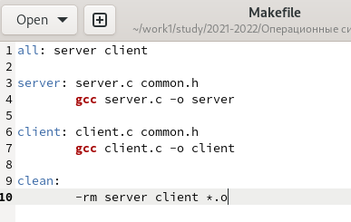
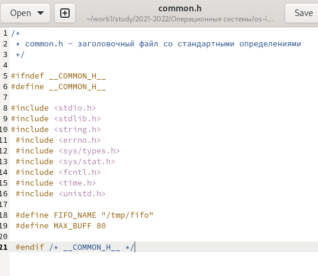
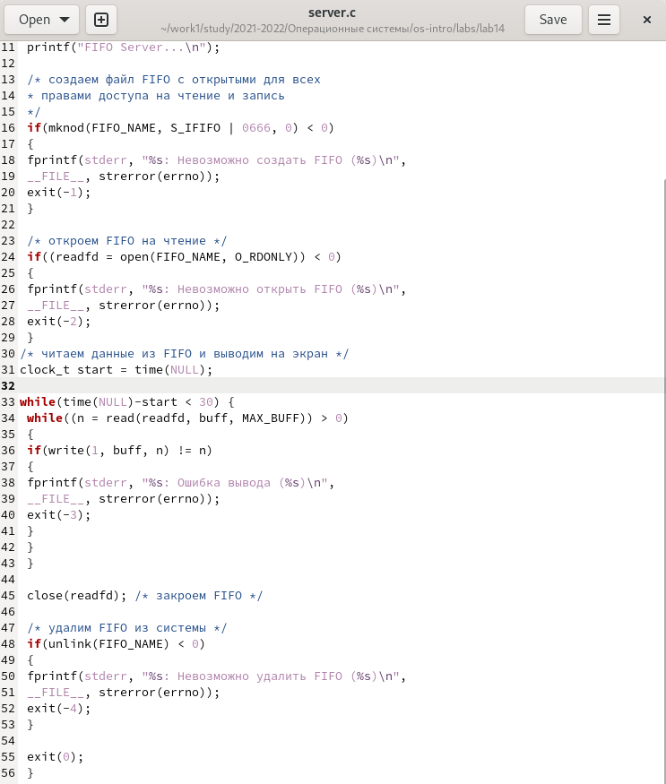
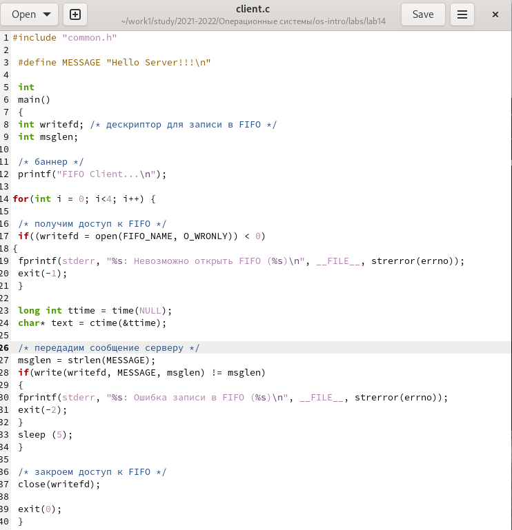
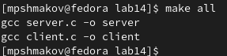
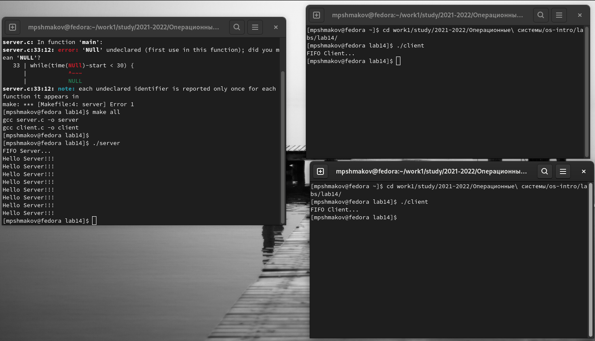

---
## Front matter
title: "Отчет по лабораторной работе №14"
subtitle: "дисциплина: операционные системы"
author: "Шмаков Максим Павлович"

## Generic otions
lang: ru-RU
toc-title: "Содержание"

## Bibliography
bibliography: bib/cite.bib
csl: pandoc/csl/gost-r-7-0-5-2008-numeric.csl

## Pdf output format
toc: true # Table of contents
toc-depth: 2
lof: true # List of figures
lot: true # List of tables
fontsize: 12pt
linestretch: 1.5
papersize: a4
documentclass: scrreprt
## I18n polyglossia
polyglossia-lang:
  name: russian
  options:
	- spelling=modern
	- babelshorthands=true
polyglossia-otherlangs:
  name: english
## I18n babel
babel-lang: russian
babel-otherlangs: english
## Fonts
mainfont: PT Serif
romanfont: PT Serif
sansfont: PT Sans
monofont: PT Mono
mainfontoptions: Ligatures=TeX
romanfontoptions: Ligatures=TeX
sansfontoptions: Ligatures=TeX,Scale=MatchLowercase
monofontoptions: Scale=MatchLowercase,Scale=0.9
## Biblatex
biblatex: true
biblio-style: "gost-numeric"
biblatexoptions:
  - parentracker=true
  - backend=biber
  - hyperref=auto
  - language=auto
  - autolang=other*
  - citestyle=gost-numeric
## Pandoc-crossref LaTeX customization
figureTitle: "Рис."
tableTitle: "Таблица"
listingTitle: "Листинг"
lofTitle: "Список иллюстраций"
lotTitle: "Список таблиц"
lolTitle: "Листинги"
## Misc options
indent: true
header-includes:
  - \usepackage{indentfirst}
  - \usepackage{float} # keep figures where there are in the text
  - \floatplacement{figure}{H} # keep figures where there are in the text
---

# Цель работы

Приобретение практических навыков работы с именованными каналами

# Задание

Изучите приведённые в тексте программы server.c и client.c. Взяв данные примеры за образец, напишите аналогичные программы, внеся следующие изменения:
1. Работает не 1 клиент, а несколько (например, два).
2. Клиенты передают текущее время с некоторой периодичностью (например, раз в пять секунд). Используйте функцию sleep() для приостановки работы клиента.
3. Сервер работает не бесконечно, а прекращает работу через некоторое время (например, 30 сек). Используйте функцию clock() для определения времени работы сервера.
Что будет в случае, если сервер завершит работу, не закрыв канал?

# Выполнение лабораторной работы

Создаю необходимые файлы  (рис. [-@fig:001])

{ #fig:001 width=70% }

Далее изменяю коды этих программ.
Makefile оставил таким, каким он был.  (рис. [-@fig:002])

{ #fig:002 width=70% }

В файл common.h добавил unistd.h и time.h. Они нужны для корректной работы других файлов.  (рис. [-@fig:003])

{ #fig:003 width=70% }

В файл server.c добавил цикл while, который следит, чтобы работа сервера завершилась через 30 секунд.  (рис. [-@fig:004])

{ #fig:004 width=70% }

В client.c добавил цикл for, который отвечает за число сообщений (4 сообщения). Также написал команду sleep 5, которая приостанавливает работу клиента на 5 секунд.  (рис. [-@fig:005])

{ #fig:005 width=70% }

Компилирую все файлы с помощью Makefile.  (рис. [-@fig:006])

{ #fig:006 width=70% }

Далее я проверил работу кода.
Открыл 3 консоли. В первой прописал ./server, а на других 2ух ./client. Каждый клиент вывел по 4 сообщения и через 30 секунд сервер прекратил работу. (рис. [-@fig:007])

{ #fig:007 width=70% }

# Выводы

В ходе работы я научился работать с именованными каналами

# Контрольные вопросы

1. В чем ключевое отличие именованных каналов от неименованных?

Именованные каналы отличаются от неименованных наличием идентификатора канала, который представлен как специальный файл (соответственно имя именованного канала — это имя файла).

2. Возможно ли создание неименованного канала из командной строки?

Нет, невозможно.

3. Возможно ли создание именованного канала из командной строки?

Да, возможно. Файлы именованных каналов создаются функцией mkfifo.

4. Опишите функцию языка С, создающую неименованный канал.

Неименованный канал создается вызовом pipe, который заносит в массив int [2] два дескриптора открытых файлов. fd[0] – открыт на чтение, fd[1] – на запись (вспомните STDIN == 0, STDOUT == 1). Канал уничтожается, когда будут закрыты все файловые дескрипторы ссылающиеся на него.

5. Опишите функцию языка С, создающую именованный канал.

Объект FIFO в файловой системе создаётся вызовом функции int mkfifo(const char *pathname, mode_t mode)

6. Что будет в случае прочтения из fifo меньшего числа байтов, чем находится в канале? Большего числа байтов?

- При чтении меньшего числа байтов, чем находится в канале или FIFO, возвращается требуемое число байтов, остаток сохраняется для последующих чтений.

- При чтении большего числа байтов, чем находится в канале или FIFO, возвращается доступное число байтов. Процесс, читающий из канала, должен соответствующим образом обработать ситуацию, когда прочитано меньше, чем заказано.

7. Аналогично, что будет в случае записи в fifo меньшего числа байтов, чем позволяет буфер? Большего числа байтов?

- Запись числа байтов, меньшего емкости канала или FIFO, гарантированно атомарно. Это означает, что в случае, когда несколько процессов одновременно записывают в канал, порции данных от этих процессов не перемешиваются.

- При записи большего числа байтов, чем это позволяет канал или FIFO, вызов write(2) блокируется до освобождения требуемого места. При этом атомарность операции не гарантируется. Если процесс пытается записать данные в канал, не открытый ни одним процессом на чтение, процессу генерируется сигнал SIGPIPE, а вызов write(2) возвращает 0 с установкой ошибки (errno=ERRPIPE) (если процесс не установил обработки сигнала SIGPIPE, производится обработка по умолчанию — процесс завершается).

8. Могут ли два и более процессов читать или записывать в канал?

Родитель после записи не может узнать считал ли дочерний процесс данные, а если считал то сколько. Соответственно, если родитель попробует читать из pipe, то, вполне вероятно, он считает часть собственных данных, которые станут недоступными для потомка.

Через канал можно передавать данные только между двумя процессами. Один из процессов создает канал, другой открывает его. После этого оба процесса могут передавать данные через канал в одну или обе стороны, используя для этого хорошо знакомые вам функции, предназначенные для работы с файлами, такие как ReadFile и WriteFile. Заметим, что приложения могут выполнять над каналами Pipe синхронные или асинхронные операции, аналогично тому, как это можно делать с файлами. В случае использования асинхронных операций необходимо отдельно побеспокоиться об организации синхронизации.

9. Опишите функцию write (тип возвращаемого значения, аргументы и логику работы). Что означает 1 (единица) в вызове этой функции в программе server.c (строка 42)?

Функция write записывает байты count  из  буфера  buffer  в файл, связанный с handle. Операции write начинаются с текущей позиции  указателя  на файл (указатель ассоциирован с заданным файлом). Если файл открыт для добавления, операции выполняются в конец файла. После осуществления операций записи указатель на  файл (если он есть) увеличивается на количество действительно записанных байтов.
            
Возвращаемое значение.
                            
Функция  write  возвращает  число  действительно записанных байтов. Возвращаемое значение должно быть положительным, но меньше числа count (например, когда размер для  записи  count  байтов выходит  за пределы пространства на диске). Возвращаемое значение -1 указывает на ошибку; errno устанавливается в одно из следующих значений:
            
ЗНАЧЕНИЕ          ЕГО СМЫСЛ
            
EACCES           файл открыт для чтения или закрыт для записи
            
EBADF            неверный handle-р файла
                    
ENOSPC           на устройстве нет свободного места

1 в программе server.c означает идентификатор стандартного потока вывода.

10. Опишите функцию strerror.

Строковая функция strerror - функция языков C/C++, транслирующая код ошибки, который обычно хранится в глобальной переменной errno, в сообщение об ошибке, понятном человеку.

