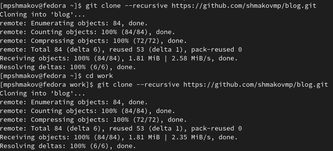

---
## Front matter
title: "Отчет по первому этапу проекта"
subtitle: "Дисциплина: операционные системы"
author: "Шмаков Максим Павлович"

## Generic otions
lang: ru-RU
toc-title: "Содержание"

## Bibliography
bibliography: bib/cite.bib
csl: pandoc/csl/gost-r-7-0-5-2008-numeric.csl

## Pdf output format
toc: true # Table of contents
toc-depth: 2
lof: true # List of figures
lot: true # List of tables
fontsize: 12pt
linestretch: 1.5
papersize: a4
documentclass: scrreprt
## I18n polyglossia
polyglossia-lang:
  name: russian
  options:
	- spelling=modern
	- babelshorthands=true
polyglossia-otherlangs:
  name: english
## I18n babel
babel-lang: russian
babel-otherlangs: english
## Fonts
mainfont: PT Serif
romanfont: PT Serif
sansfont: PT Sans
monofont: PT Mono
mainfontoptions: Ligatures=TeX
romanfontoptions: Ligatures=TeX
sansfontoptions: Ligatures=TeX,Scale=MatchLowercase
monofontoptions: Scale=MatchLowercase,Scale=0.9
## Biblatex
biblatex: true
biblio-style: "gost-numeric"
biblatexoptions:
  - parentracker=true
  - backend=biber
  - hyperref=auto
  - language=auto
  - autolang=other*
  - citestyle=gost-numeric
## Pandoc-crossref LaTeX customization
figureTitle: "Рис."
tableTitle: "Таблица"
listingTitle: "Листинг"
lofTitle: "Список иллюстраций"
lotTitle: "Список таблиц"
lolTitle: "Листинги"
## Misc options
indent: true
header-includes:
  - \usepackage{indentfirst}
  - \usepackage{float} # keep figures where there are in the text
  - \floatplacement{figure}{H} # keep figures where there are in the text
---

# Цель работы

Размещение на Github pages заготовки для персонального сайта.

# Задание

Установить необходимое программное обеспечение.
Скачать шаблон темы сайта.
Разместить его на хостинге git.
Установить параметр для URLs сайта.
Разместить заготовку сайта на Github pages.

# Выполнение работы

Захожу на сайт yamadharma.github.io/ru/post/2022/04/12/creating-hugo-site и скачиваю hugo. (рис. [-@fig:001]) (рис. [-@fig:002]) (рис. [-@fig:003]) 

{ #fig:001 width=70% }
{ #fig:002 width=70% }
{ #fig:003 width=70% }

Разархивирую файл и переношу hugo в каталог home/bin. (рис. [-@fig:004]) (рис. [-@fig:005]) 

{ #fig:004 width=70% }
{ #fig:005 width=70% }

На ТУИСе нахожу шаблон для сайта hugo academic theme захожу в репозиторий и создаю собственный репозиторий на основе этого шаблона. (рис. [-@fig:006]) (рис. [-@fig:007]) (рис. [-@fig:008])

{ #fig:006 width=70% }
{ #fig:007 width=70% }
{ #fig:008 width=70% }

Далее копирую ссылку на свой новый репозиторий и клонирую ее в каталогe work. (рис. [-@fig:009]) (рис. [-@fig:010])

{ #fig:009 width=70% }
{ #fig:010 width=70% }

Захожу в каталог blog и выполняю в нем hugo. Затем удаляю каталог public, так как он нам пока что не нужен и мы его потом сами создадим. (рис. [-@fig:011])

{ #fig:011 width=70% }

Выполняю hugo server и перехожу по сайту снизу. Сейчас зайти на него могу только я, потому что он пока что только на моей машине. (рис. [-@fig:012]) (рис. [-@fig:013])

{ #fig:012 width=70% }
{ #fig:013 width=70% }

На сайте написано, что нужно удалить content/home/demo.md. (рис. [-@fig:014])

{ #fig:014 width=70% }

Создаю новый репозиторий и называю его своим логином.github.io. Захожу в каталог ворк и клонирую туда ссылку на мой новый репозиторий, захожу в него и создаю ветку main. (рис. [-@fig:015]) (рис. [-@fig:016])

{ #fig:016 width=70% }
{ #fig:017 width=70% }

Создаю файл README.md для того чтобы активировать репозиторий и пишу об этом коммит. Перехожу в blog, запускаю mc, захожу в .gitignore и комментирую public. рис. [-@fig:017]) (рис. [-@fig:018]) (рис. [-@fig:019])

{ #fig:017 width=70% }
{ #fig:018 width=70% }
{ #fig:019 width=70% }

Убеждаюсь, что закомментировал public с помощью команды cat .gitignore и подключаю свой репозиторий shmakovmp.github.io к каталогу public. (рис. [-@fig:020])

{ #fig:020 width=70% }

Выполняю hugo в каталоге blog. Захожу в каталог public и убеждаюсь, что он подключен к репозиторию, синхронизирую файлы и пишу коммит "Добавили свайт". (рис. [-@fig:021]) (рис. [-@fig:022])

{ #fig:021 width=70% }
{ #fig:022 width=70% }

Обновляю странице в браузере с репозиторием и проверяю, что файлы синхронизировались. После этого захожу посмотреть на свой уже доступный всем сайт. (рис. [-@fig:023]) (рис. [-@fig:024])

{ #fig:023 width=70% }
{ #fig:024 width=70% }

# Выводы

Я разместил на Github pages заготовки для персонального сайта.

