---
## Front matter
lang: ru-RU
title: Презентация по 2 этапу проекта
author: |
	Шмаков Максим\inst{1}
institute: |
	\inst{1}RUDN University, Moscow, Russian Federation
	
date: 2022, 7 Мая, Москва

## Formatting
toc: false
slide_level: 2
theme: metropolis
header-includes: 
 - \metroset{progressbar=frametitle,sectionpage=progressbar,numbering=fraction}
 - '\makeatletter'
 - '\beamer@ignorenonframefalse'
 - '\makeatother'
aspectratio: 43
section-titles: true
---

## Разместить фотографию владельца сайта.
Зашел по адресу content/authors/admin удалил старую аватарку и поставил свою (рис. [-@fig:001])

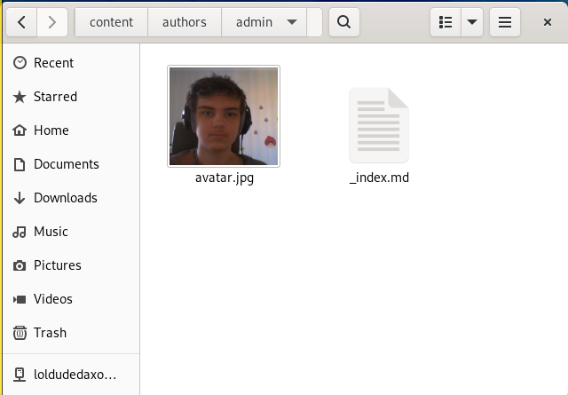{ #fig:001 width=70% }

## Разместить фотографию владельца сайта.
Далее выгружаю файлы в репозиторий. (рис. [-@fig:002])(рис. [-@fig:003]) (рис. [-@fig:004]) (рис. [-@fig:005])

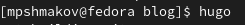{ #fig:002 width=70% }

## Разместить фотографию владельца сайта.
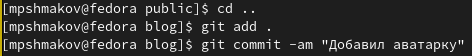{ #fig:003 width=70% }
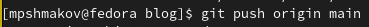{ #fig:004 width=70% }

## Разместить фотографию владельца сайта.
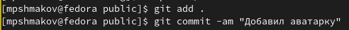{ #fig:005 width=70% }

## Разместить краткое описание владельца сайта (Biography). Добавить информацию об интересах (Interests). Добавить информацию от образовании (Education).
Зашел в по адресу content/authors/admin/_index.md и переписал все под себя. (рис. [-@fig:006])
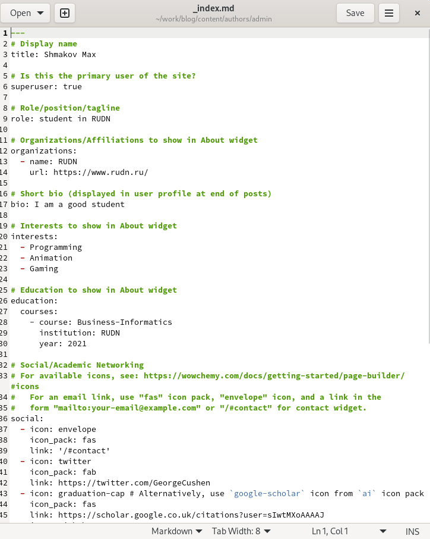{ #fig:006 width=70% }

## Разместить краткое описание владельца сайта (Biography). Добавить информацию об интересах (Interests). Добавить информацию от образовании (Education).
И выгружаю в репозиторий (рис. [-@fig:007]) (рис. [-@fig:008]) (рис. [-@fig:009])

{ #fig:007 width=70% }

## Разместить краткое описание владельца сайта (Biography). Добавить информацию об интересах (Interests). Добавить информацию от образовании (Education).
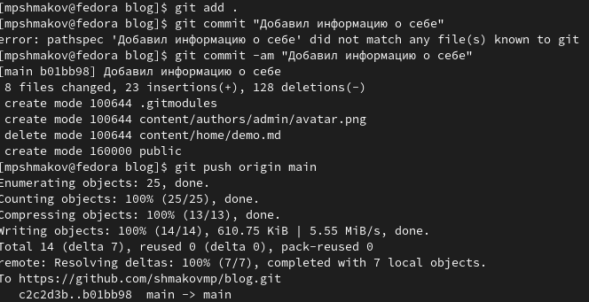{ #fig:008 width=70% }
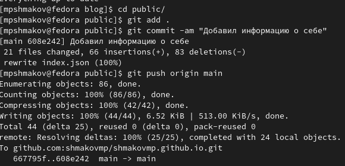{ #fig:009 width=70% }

## Сделать пост по прошедшей неделе. Добавить пост на тему по выбору: Управление версиями. Git.
Зашел по адресу content/post скопировал две новых папки и в них отредактировал  файлы index.md под темы. (рис. [-@fig:010]) (рис. [-@fig:011])
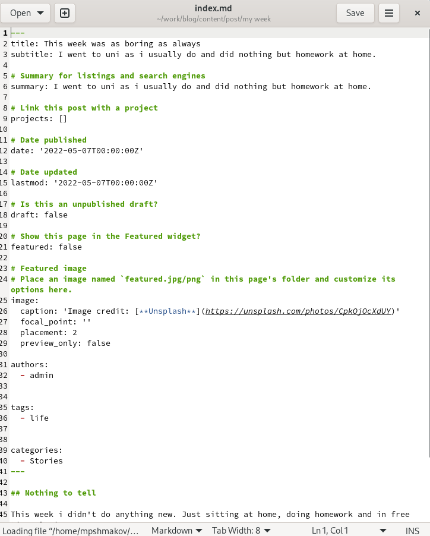{ #fig:010 width=70% }

## Сделать пост по прошедшей неделе. Добавить пост на тему по выбору: Управление версиями. Git.

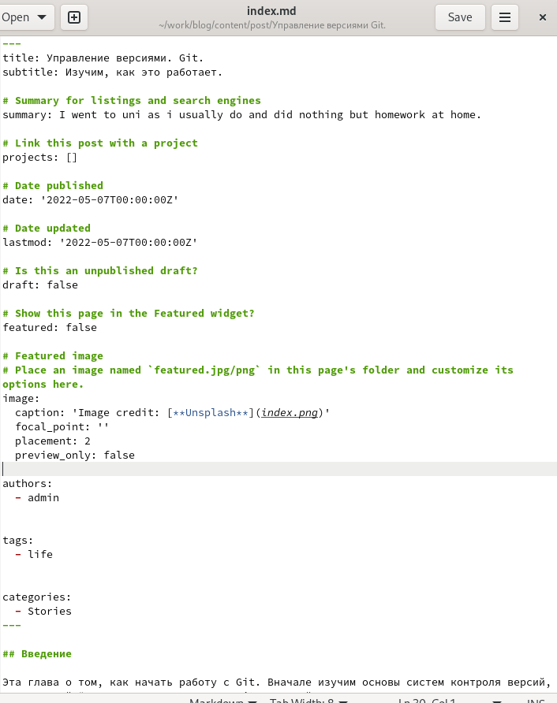{ #fig:011 width=70% }

## Сделать пост по прошедшей неделе. Добавить пост на тему по выбору: Управление версиями. Git.
И выгружаю в репозиторий (рис. [-@fig:012]) (рис. [-@fig:013])

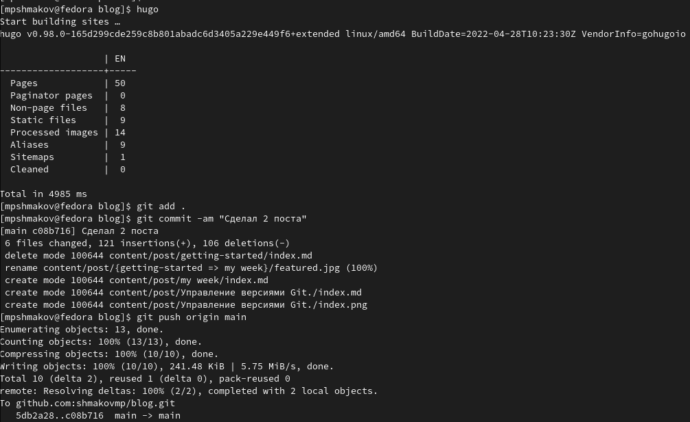{ #fig:012 width=70% }

## Сделать пост по прошедшей неделе. Добавить пост на тему по выбору: Управление версиями. Git.

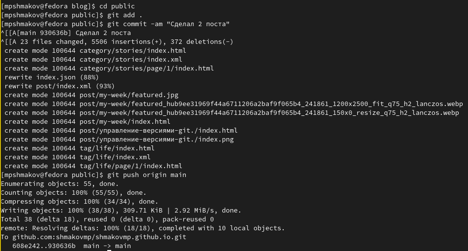{ #fig:013 width=70% }

## Вот таким получился мой сайт shmakovmp.github.io (рис. [-@fig:014]) (рис. [-@fig:015]) (рис. [-@fig:016]) (рис. [-@fig:017])

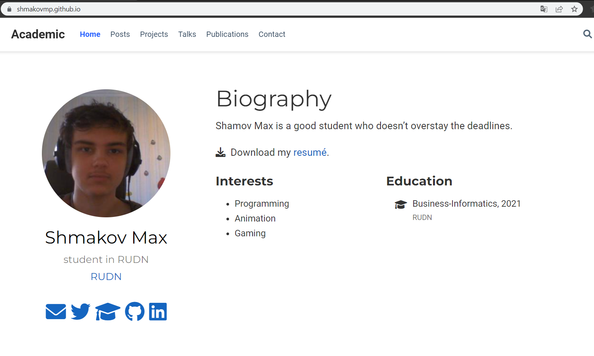{ #fig:014 width=70% }

## Вот таким получился мой сайт shmakovmp.github.io (рис. [-@fig:014]) (рис. [-@fig:015]) (рис. [-@fig:016]) (рис. [-@fig:017])

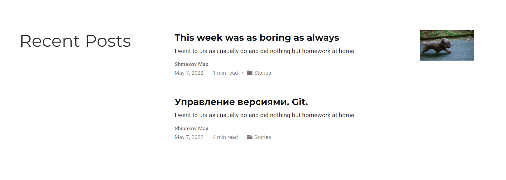{ #fig:015 width=70% }

## Вот таким получился мой сайт shmakovmp.github.io (рис. [-@fig:014]) (рис. [-@fig:015]) (рис. [-@fig:016]) (рис. [-@fig:017])

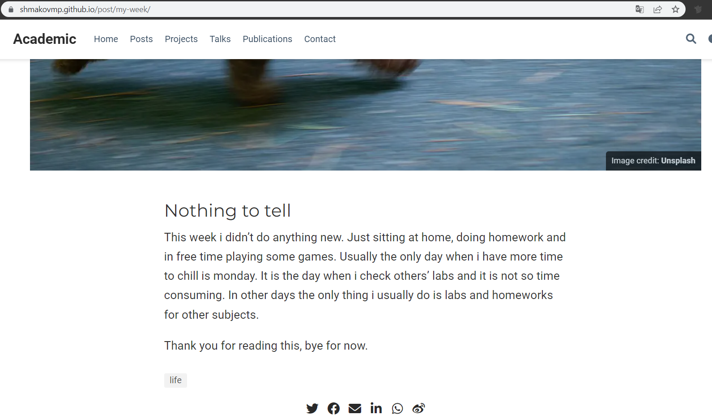{ #fig:016 width=70% }

## Вот таким получился мой сайт shmakovmp.github.io (рис. [-@fig:014]) (рис. [-@fig:015]) (рис. [-@fig:016]) (рис. [-@fig:017])

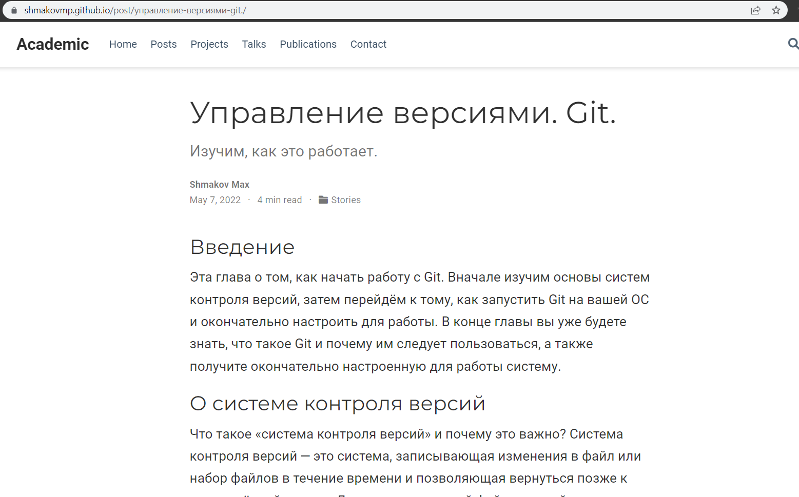{ #fig:017 width=70% }

# Выводы

В ходе работы я научился редактировать свой сайт и выкладывать новые посты.

