---
## Front matter
lang: ru-RU
title: Презентация по 3 этапу проекта
author: |
	Шмаков Максим\inst{1}
institute: |
	\inst{1}RUDN University, Moscow, Russian Federation
	
date: 2022, 14 Мая, Москва

## Formatting
toc: false
slide_level: 2
theme: metropolis
header-includes: 
 - \metroset{progressbar=frametitle,sectionpage=progressbar,numbering=fraction}
 - '\makeatletter'
 - '\beamer@ignorenonframefalse'
 - '\makeatother'
aspectratio: 43
section-titles: true
---

## Открываю каталог /blog/content/home в котором редактирую нужные мне файлы под себя. (рис. [-@fig:001])

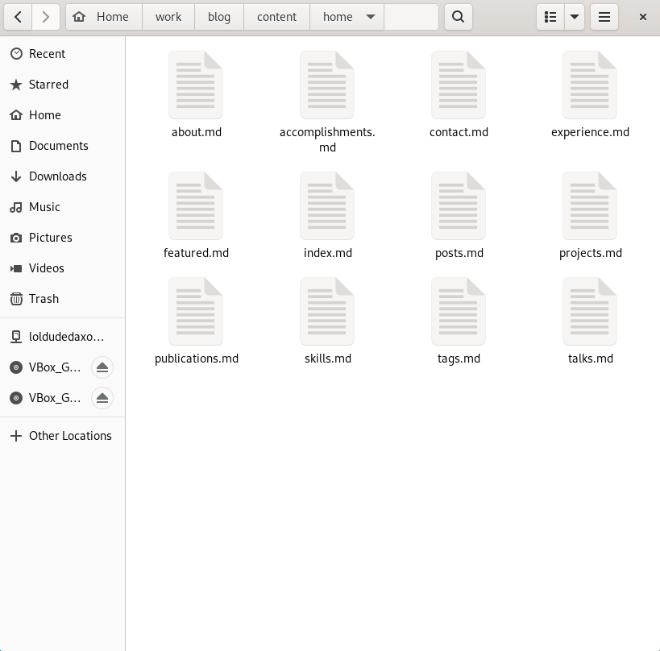{ #fig:001 width=70% }

## Начну с accomplishments. Открываю документ и переписываю все под себя. (рис. [-@fig:002])

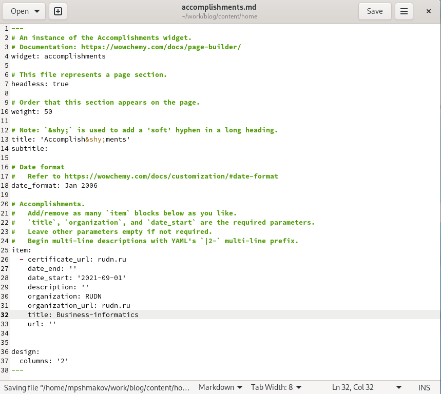{ #fig:002 width=70% }

## Далее skills. Редактирую всю информацию под себя и устанавливаю дополнительные иконки, которые помещаю в /blog/assets/media/icons/brands и указываю их названия в файле. (рис. [-@fig:003])

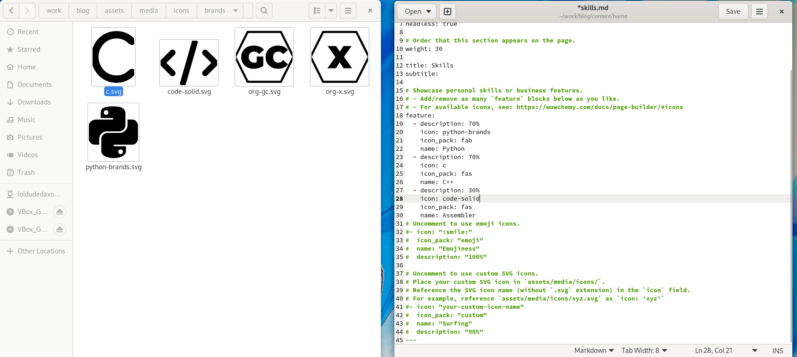{ #fig:003 width=70% }

## И финальный experience. Тоже скачиваю дополнительную иконку и меняю информацию под себя. (рис. [-@fig:004])

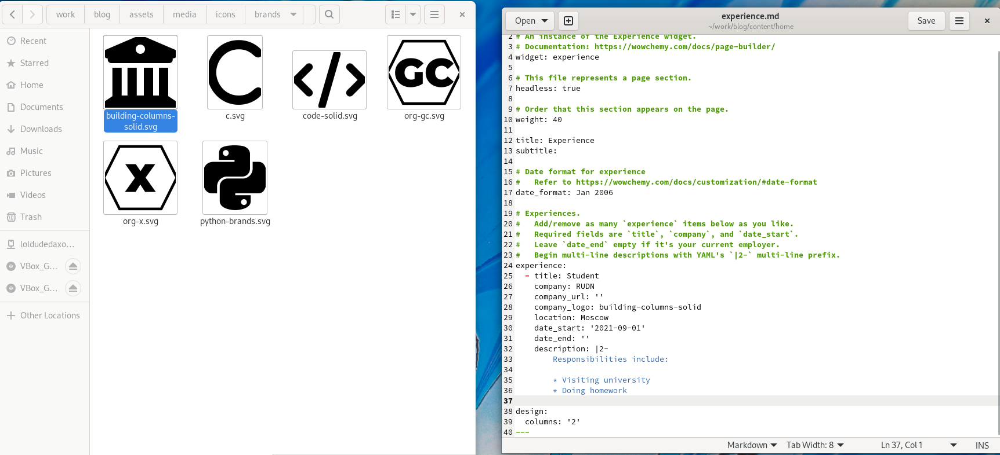{ #fig:004 width=70% }

## Создаю 2 новые папки с постами в каталоге /blog/content/post захожу в них и редактирую файлы _index.md (рис. [-@fig:005])

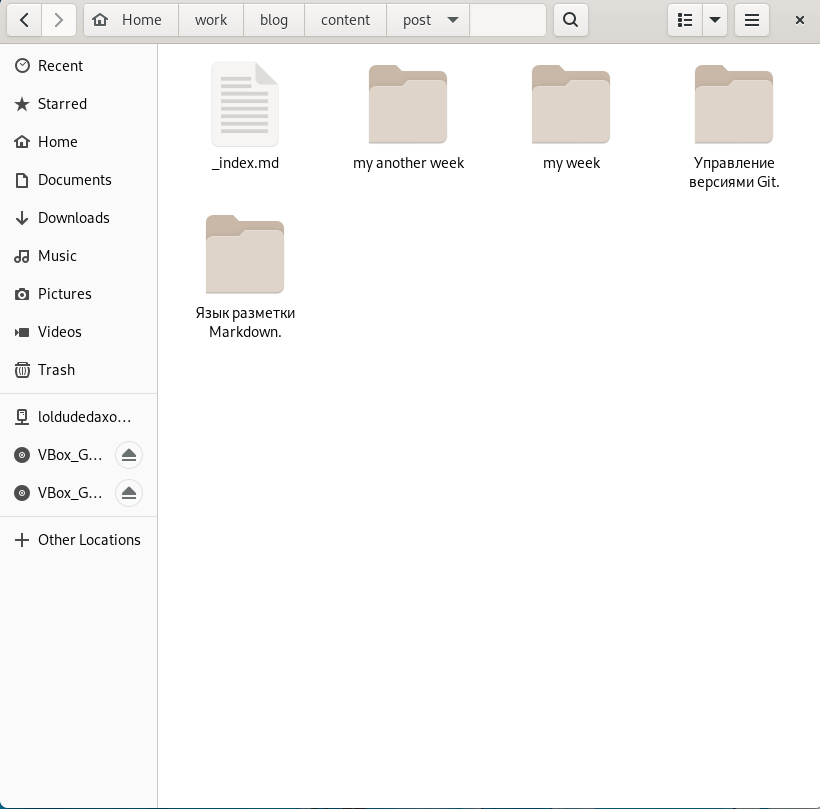{ #fig:005 width=70% }

## Сначала пишу пост про прошедшую неделю и ставлю новую картинку к нему. (рис. [-@fig:006])

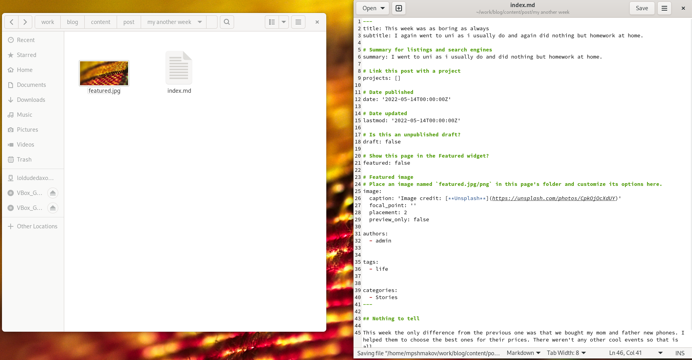{ #fig:006 width=70% }

## После пишу пост про лекговесные языки разметки и тоже вставляю новую картинку. (рис. [-@fig:007])

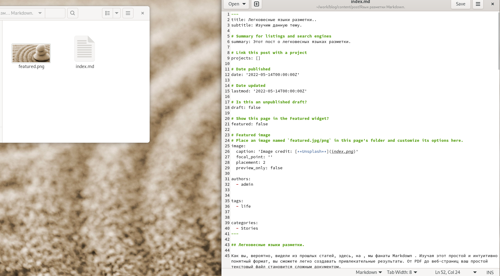{ #fig:007 width=70% }

## Далее выполняем уже знакомые нам действия: строим сайт и выгружаем все в репозитории. (рис. [-@fig:008]) (рис. [-@fig:009])

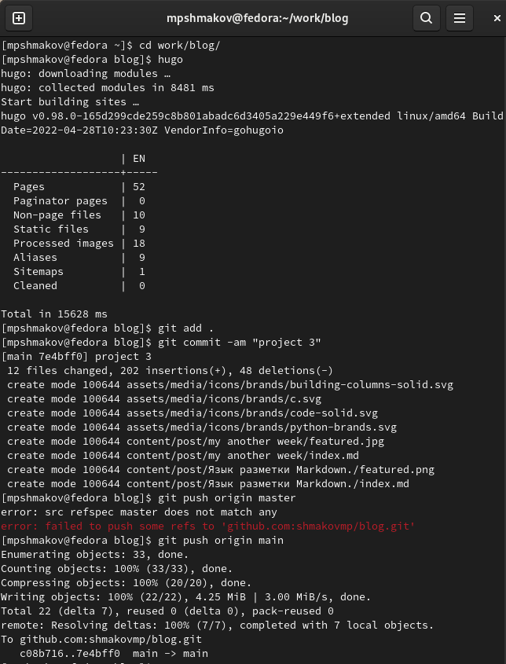{ #fig:008 width=70% }

## Далее выполняем уже знакомые нам действия: строим сайт и выгружаем все в репозитории. (рис. [-@fig:008]) (рис. [-@fig:009])

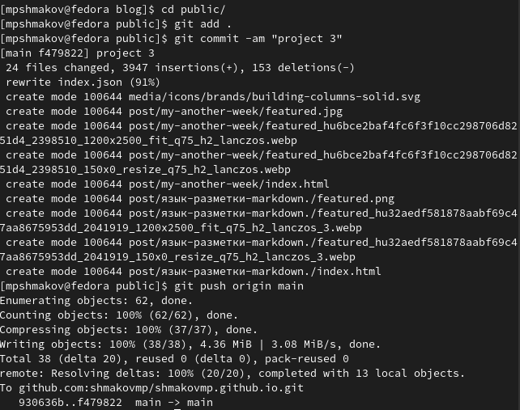{ #fig:009 width=70% }

## Смотрим какой получился сайт. (рис. [-@fig:010]) (рис. [-@fig:011])

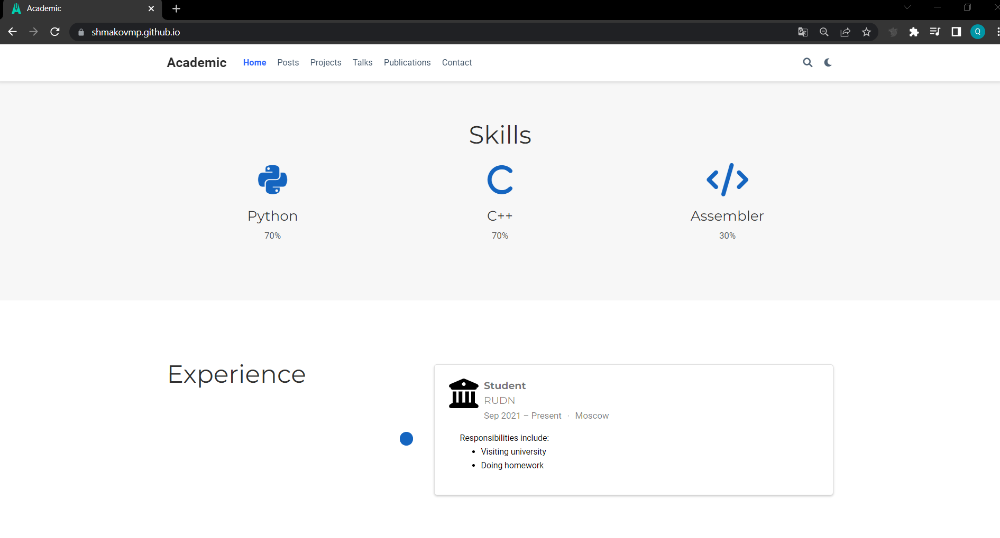{ #fig:010 width=70% }

## Смотрим какой получился сайт. (рис. [-@fig:010]) (рис. [-@fig:011])

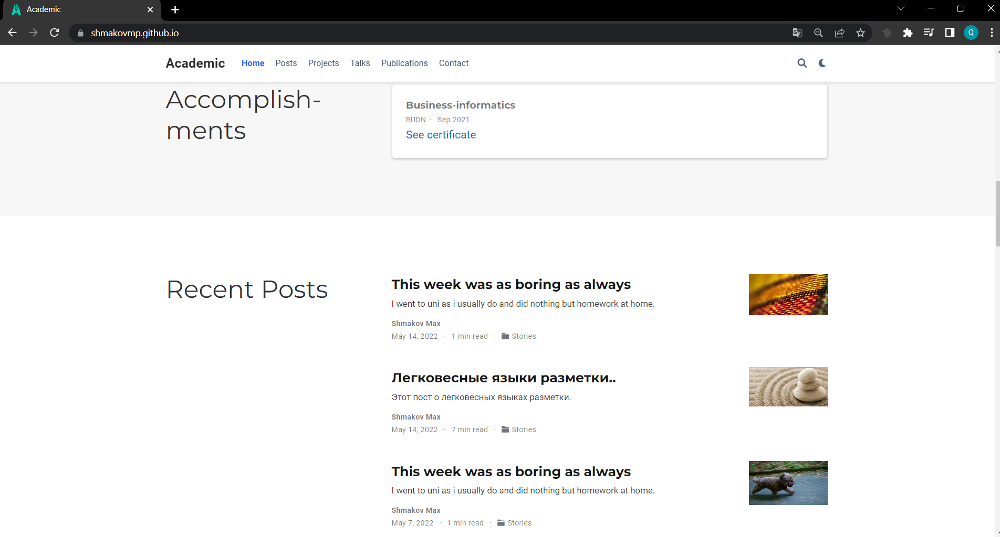{ #fig:011 width=70% }

# Выводы
## Выводы

В ходе работы я добавил еще 2 поста на свой сайт и отредактировал некоторые данные.

