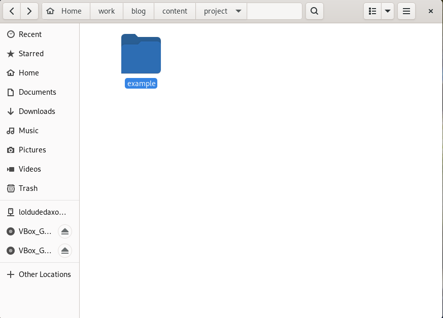
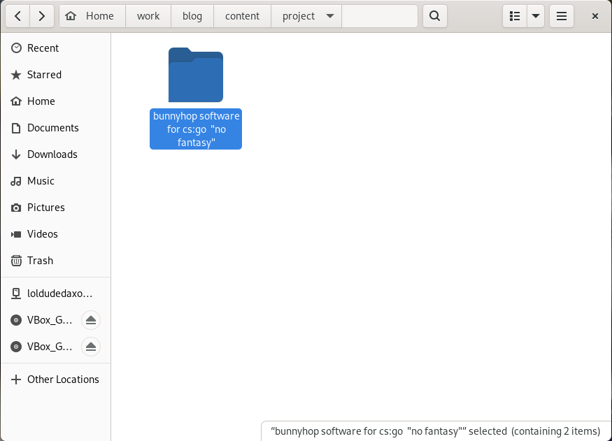
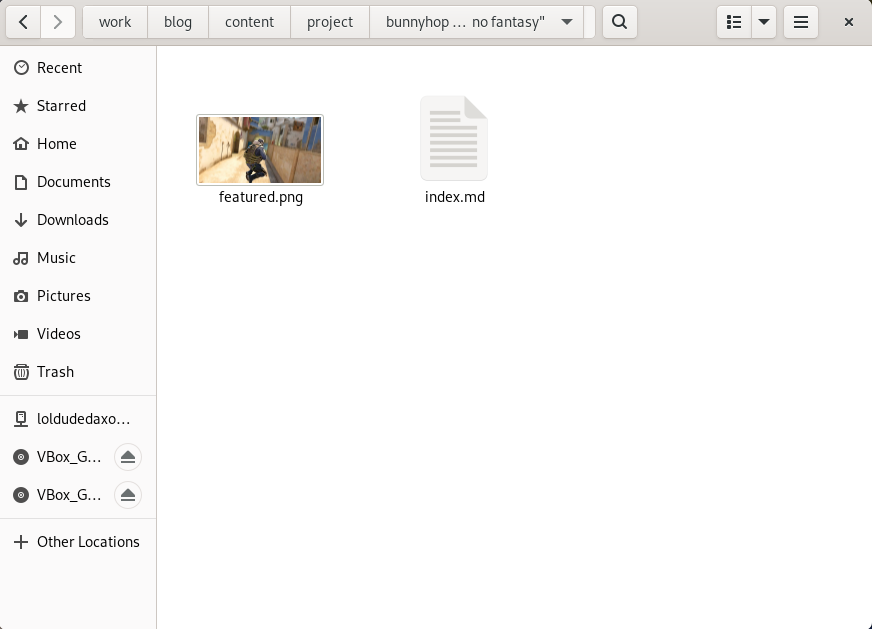
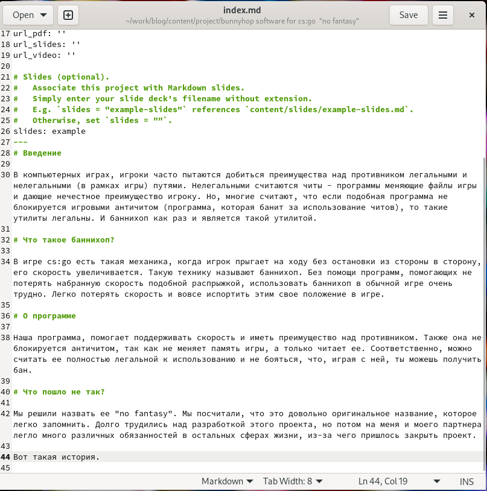
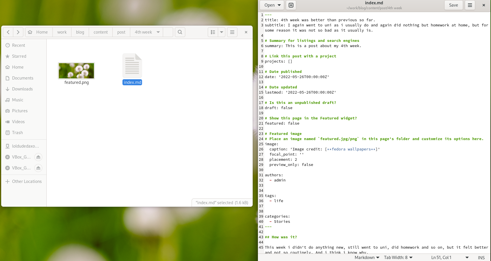
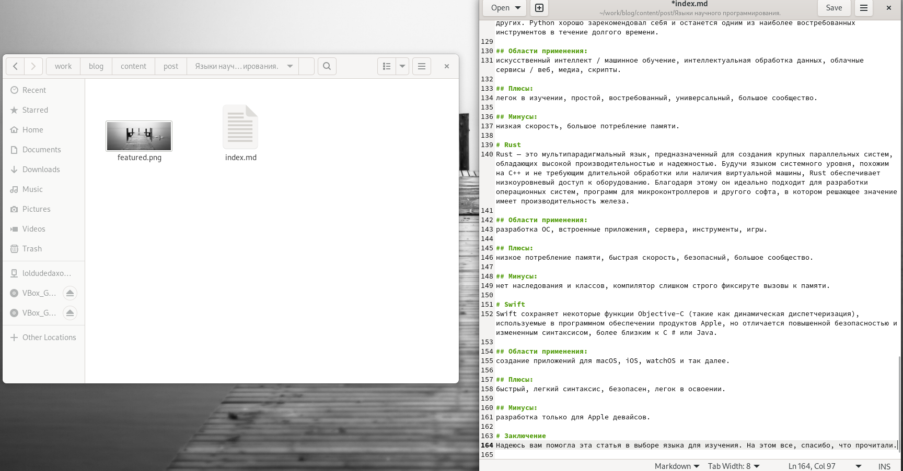
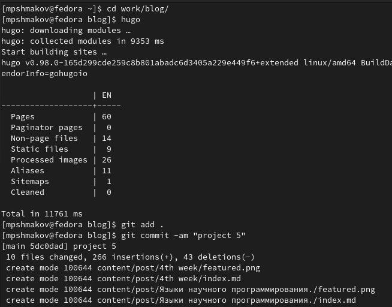
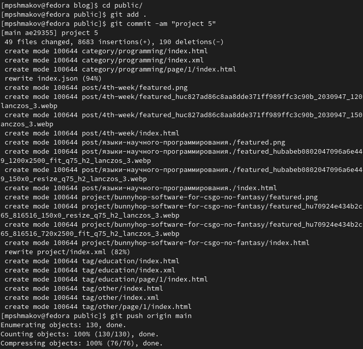
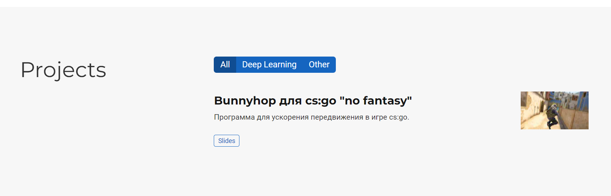
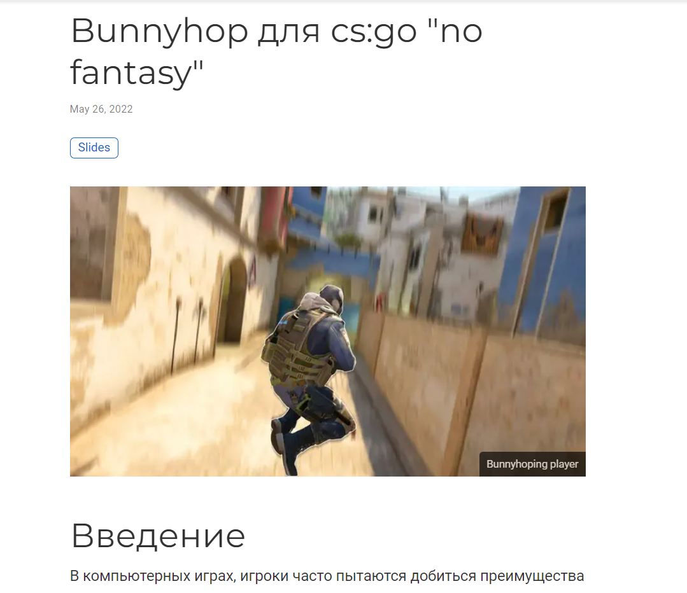

---
## Front matter
lang: ru-RU
title: Презентация по 5 этапу проекта
author: |
	Шмаков Максим\inst{1}
institute: |
	\inst{1}RUDN University, Moscow, Russian Federation
	
date: 2022, 26 Мая, Москва

## Formatting
toc: false
slide_level: 2
theme: metropolis
header-includes: 
 - \metroset{progressbar=frametitle,sectionpage=progressbar,numbering=fraction}
 - '\makeatletter'
 - '\beamer@ignorenonframefalse'
 - '\makeatother'
aspectratio: 43
section-titles: true
---

# Выполнение лабораторной работы

# Сделать записи для персональных проектов.

## Захожу в work/blog/content/project и переименовываю папку на название моего проекта. (рис. [-@fig:001]) (рис. [-@fig:002])

{ #fig:001 width=70% }

## Захожу в work/blog/content/project и переименовываю папку на название моего проекта. (рис. [-@fig:001]) (рис. [-@fig:002])

{ #fig:002 width=70% }

## Захожу в папку, меняю картинку и редактирую файл index.md, где я написал про свой проект.  (рис. [-@fig:003]) (рис. [-@fig:004])

{ #fig:003 width=70% }

## Захожу в папку, меняю картинку и редактирую файл index.md, где я написал про свой проект.  (рис. [-@fig:003]) (рис. [-@fig:004])

{ #fig:004 width=70% }

# Сделать пост по прошедшей неделе. Добавить пост на тему "Языки научного программирования".

Тут уже знакомый процесс.

## Захожу в work/blog/content/post, создаю 2 новых папки с постами, меняю картинки и редактирую файлы index.md.  (рис. [-@fig:005]) (рис. [-@fig:006])

{ #fig:005 width=70% }

## Захожу в work/blog/content/post, создаю 2 новых папки с постами, меняю картинки и редактирую файлы index.md.  (рис. [-@fig:005]) (рис. [-@fig:006])

{ #fig:006 width=70% }

## Строю сайт и выгружаю все файлы в репозиторий.  (рис. [-@fig:007]) (рис. [-@fig:008])

{ #fig:007 width=70% }

## Строю сайт и выгружаю все файлы в репозиторий.  (рис. [-@fig:007]) (рис. [-@fig:008])

{ #fig:008 width=70% }

## Таким в итоге получился сайт. (рис. [-@fig:009]) (рис. [-@fig:010]) (рис. [-@fig:011])

{ #fig:009 width=70% }

## Таким в итоге получился сайт. (рис. [-@fig:009]) (рис. [-@fig:010]) (рис. [-@fig:011])

{ #fig:010 width=70% }

## Таким в итоге получился сайт. (рис. [-@fig:009]) (рис. [-@fig:010]) (рис. [-@fig:011])

{ #fig:011 width=70% }

# Выводы

## Выводы

В ходе работы я выложил информацию о своем проекте на сайт и 2 новых поста.

