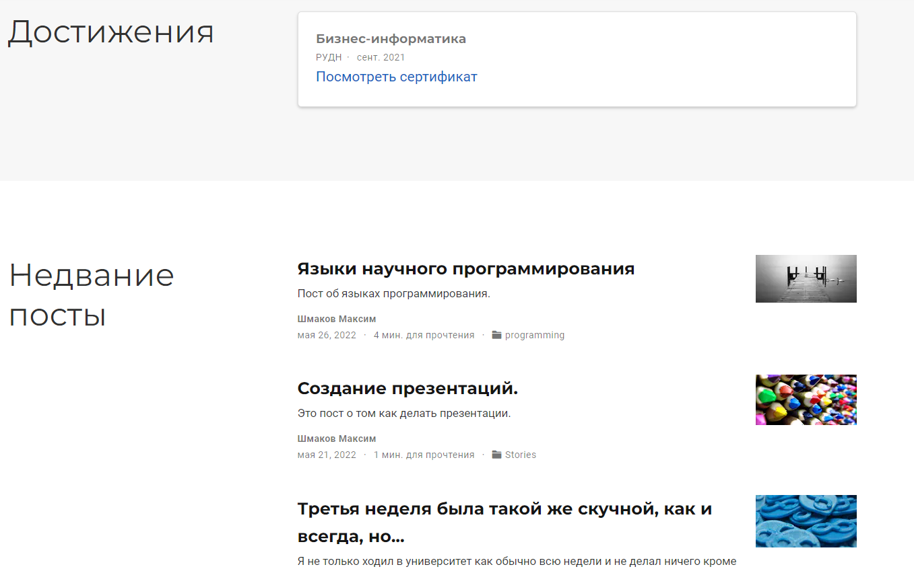
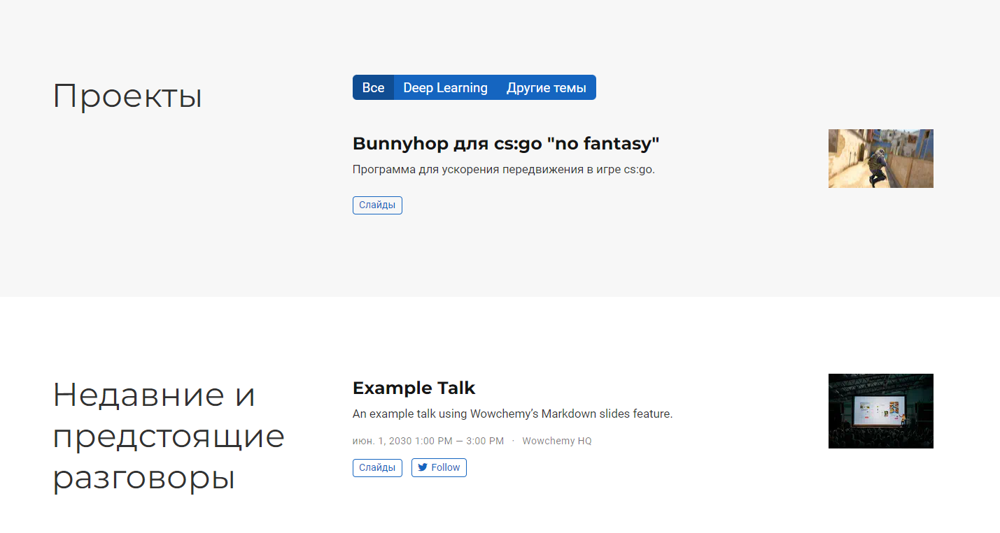

---
## Front matter
title: "Отчет по 6 этапу проекта"
subtitle: "Дисциплина: операционные системы"
author: "Шмаков Максим Павлович"

## Generic otions
lang: ru-RU
toc-title: "Содержание"

## Bibliography
bibliography: bib/cite.bib
csl: pandoc/csl/gost-r-7-0-5-2008-numeric.csl

## Pdf output format
toc: true # Table of contents
toc-depth: 2
lof: true # List of figures
lot: true # List of tables
fontsize: 12pt
linestretch: 1.5
papersize: a4
documentclass: scrreprt
## I18n polyglossia
polyglossia-lang:
  name: russian
  options:
	- spelling=modern
	- babelshorthands=true
polyglossia-otherlangs:
  name: english
## I18n babel
babel-lang: russian
babel-otherlangs: english
## Fonts
mainfont: PT Serif
romanfont: PT Serif
sansfont: PT Sans
monofont: PT Mono
mainfontoptions: Ligatures=TeX
romanfontoptions: Ligatures=TeX
sansfontoptions: Ligatures=TeX,Scale=MatchLowercase
monofontoptions: Scale=MatchLowercase,Scale=0.9
## Biblatex
biblatex: true
biblio-style: "gost-numeric"
biblatexoptions:
  - parentracker=true
  - backend=biber
  - hyperref=auto
  - language=auto
  - autolang=other*
  - citestyle=gost-numeric
## Pandoc-crossref LaTeX customization
figureTitle: "Рис."
tableTitle: "Таблица"
listingTitle: "Листинг"
lofTitle: "Список иллюстраций"
lotTitle: "Список таблиц"
lolTitle: "Листинги"
## Misc options
indent: true
header-includes:
  - \usepackage{indentfirst}
  - \usepackage{float} # keep figures where there are in the text
  - \floatplacement{figure}{H} # keep figures where there are in the text
---

# Задание

Размещение двуязычного сайта на Github.

Сделать поддержку английского и русского языков.
Разместить элементы сайта на обоих языках.
Разместить контент на обоих языках.
Сделать пост по прошедшей неделе.

# Выполнение лабораторной работы

Сначала зашел на сайт wowchemy, где прочитал документацию, как добавить язык на сайт.  (рис. [-@fig:001])

{ #fig:001 width=70% }

Зашел в work/blog/config/_default в файл languages.yaml, где добавил русский язык.  (рис. [-@fig:002])

{ #fig:002 width=70% }

Скачал с репозитория wowchemy файлы ru.yaml и en.yaml.  (рис. [-@fig:003])

{ #fig:003 width=70% }

Создал в work/blog/config/_default копию файла menus.yaml menus.ru.yaml, который я русифицировал. (рис. [-@fig:004])

{ #fig:004 width=70% }

Далее зашел в файл config.yaml и изменил example.com на свой сайт. (рис. [-@fig:005])

{ #fig:005 width=70% }

Далее зашел в папку content и создал две новые папки ru и en. Переместил в них содержимое content.(рис. [-@fig:006])

{ #fig:006 width=70% }

Зашел в папку ru и русифицировал все, что там было.

Создал пост о прошедшей неделе на обоих языках.(рис. [-@fig:007])

{ #fig:007 width=70% }

Выгружаю все в репозиторий и посмтрим каким получился сайт. (рис. [-@fig:008]) (рис. [-@fig:009]) (рис. [-@fig:010]) (рис. [-@fig:011]) (рис. [-@fig:012])

{ #fig:008 width=70% }

{ #fig:009 width=70% }

{ #fig:010 width=70% }

{ #fig:011 width=70% }

{ #fig:012 width=70% }

# Выводы

В ходе работы я узнал как добавить второй язык на свой сайт.

